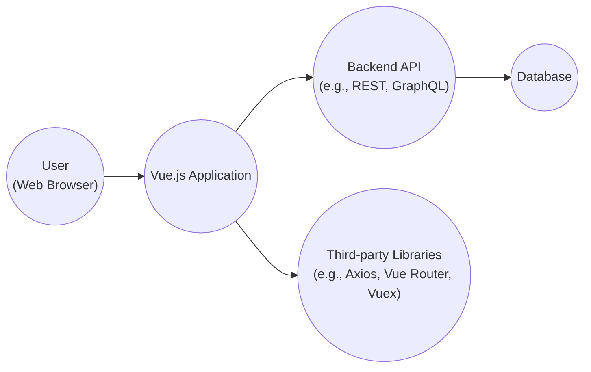
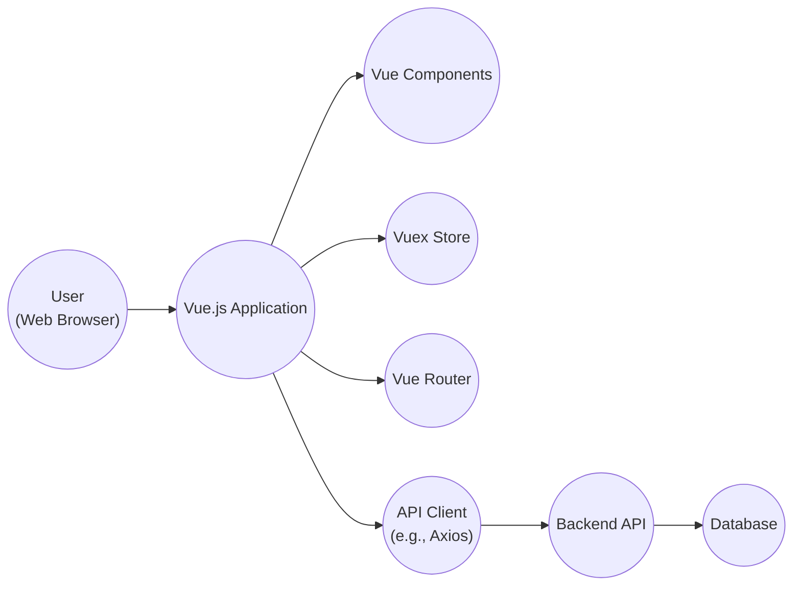
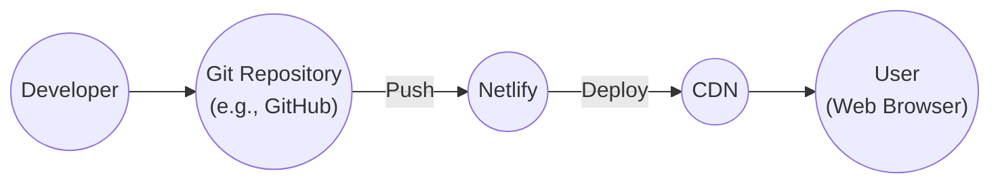
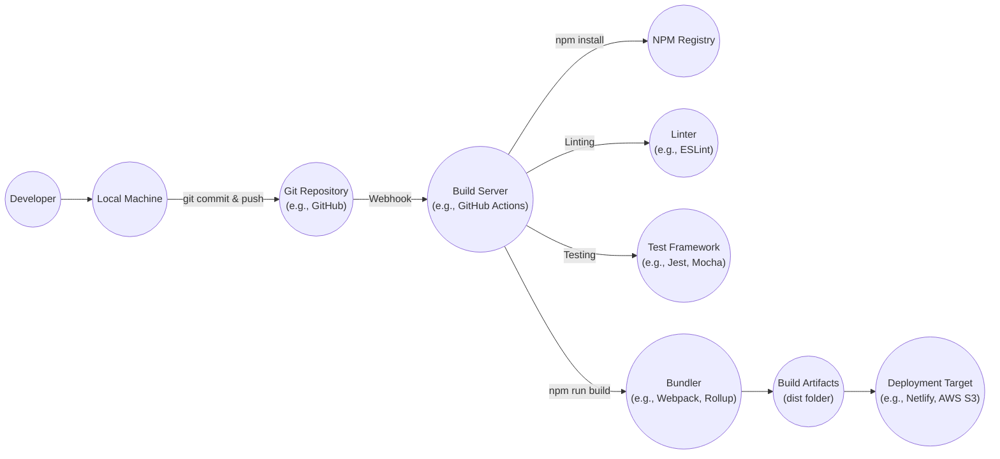

# BUSINESS POSTURE

Vue.js is a popular, open-source JavaScript framework for building user interfaces (UIs) and single-page applications (SPAs). Its core library focuses on the view layer only, making it easy to pick up and integrate with other libraries or existing projects. Vue.js is also perfectly capable of powering sophisticated SPAs when used in combination with modern tooling and supporting libraries.

Business Priorities:

- Maintainability: Ensure the framework remains easy to understand, modify, and extend.
- Performance: Provide a fast and efficient rendering engine for optimal user experience.
- Adoption: Encourage widespread use by developers and companies.
- Community: Foster a vibrant and supportive community around the framework.
- Compatibility: Ensure backward compatibility and smooth upgrades.
- Scalability: Enable the development of both small and large-scale applications.

Business Goals:

- Be a leading JavaScript framework for UI development.
- Provide a developer-friendly and productive environment.
- Offer a performant and scalable solution for building modern web applications.
- Maintain a strong and active community.

Most Important Business Risks:

- Loss of community trust due to unaddressed security vulnerabilities.
- Decreased adoption due to performance issues or instability.
- Inability to keep up with evolving web standards and browser technologies.
- Fragmentation of the ecosystem due to competing or incompatible extensions.
- Project abandonment or lack of maintainers.

# SECURITY POSTURE

Existing Security Controls:

- security control: Regular code reviews: The Vue.js core team and community contributors perform code reviews to identify and address potential security issues. Described in contribution guidelines.
- security control: Security audits: Vue.js has undergone security audits by third-party security researchers.
- security control: Vulnerability disclosure program: Vue.js has a vulnerability disclosure program that encourages responsible reporting of security vulnerabilities. Described in documentation.
- security control: Dependency management: Vue.js carefully manages its dependencies to minimize the risk of supply chain attacks. Described in documentation and build configuration.
- security control: Content Security Policy (CSP) compatibility: Vue.js is designed to be compatible with CSP, which helps mitigate cross-site scripting (XSS) attacks. Described in documentation.
- security control: Automated testing: Vue.js has an extensive suite of automated tests, including unit tests, integration tests, and end-to-end tests, which help identify and prevent regressions, including security-related ones. Described in contribution guidelines.

Accepted Risks:

- accepted risk: Reliance on community contributions: While community contributions are valuable, they also introduce a risk of malicious or unintentionally insecure code being introduced. This is mitigated by code reviews and automated testing.
- accepted risk: XSS vulnerabilities in user-provided templates: If users are allowed to provide their own Vue.js templates, there is a risk of XSS vulnerabilities. This is a fundamental risk of allowing user-generated content and should be addressed by sanitizing user input and educating users about the risks.

Recommended Security Controls:

- security control: Implement a regular static analysis (SAST) process to scan the codebase for potential vulnerabilities.
- security control: Implement dynamic application security testing (DAST) to identify vulnerabilities in running applications.
- security control: Conduct regular penetration testing to simulate real-world attacks and identify weaknesses.
- security control: Establish a security champions program to promote security awareness and best practices within the development team and community.

Security Requirements:

- Authentication: Not directly applicable to the core framework, as Vue.js is a front-end library. Authentication is typically handled on the server-side.
- Authorization: Not directly applicable to the core framework. Authorization is typically handled on the server-side.
- Input Validation:
    - Vue.js provides built-in directives and mechanisms for handling user input, such as `v-model`.
    - Developers should carefully validate and sanitize all user input, especially when rendering it directly in the DOM or using it in templates.
    - Avoid using `v-html` with untrusted user input, as this can lead to XSS vulnerabilities. Use `v-text` or other safer alternatives instead.
- Cryptography:
    - Vue.js does not provide any specific cryptographic functionality.
    - Cryptographic operations should be handled on the server-side or using dedicated libraries.
    - Sensitive data should be transmitted over secure channels (HTTPS).

# DESIGN

## C4 CONTEXT

- User:
  - Name: User
  - Type: Person
  - Description: A person interacting with the Vue.js application through a web browser.
  - Responsibilities:
    - Initiates requests to the application.
    - Views and interacts with the UI.
    - Provides input to the application.
  - Security controls:
    - Web browser security features (e.g., same-origin policy, CSP).
    - User education on safe browsing practices.

- Vue.js Application:
  - Name: Vue.js Application
  - Type: Software System
  - Description: The web application built using the Vue.js framework.
  - Responsibilities:
    - Renders the user interface.
    - Handles user interactions.
    - Manages application state.
    - Communicates with the backend API.
  - Security controls:
    - Input validation and sanitization.
    - CSP compatibility.
    - Secure coding practices.
    - Regular security audits and code reviews.

- Backend API:
  - Name: Backend API
  - Type: Software System
  - Description: The server-side API that the Vue.js application interacts with.
  - Responsibilities:
    - Provides data to the application.
    - Handles business logic.
    - Authenticates and authorizes users.
    - Interacts with the database.
  - Security controls:
    - Authentication and authorization mechanisms.
    - Input validation and sanitization.
    - Secure coding practices.
    - Regular security audits and penetration testing.
    - Secure communication (HTTPS).

- Third-party Libraries:
  - Name: Third-party Libraries
  - Type: Software System
  - Description: External libraries used by the Vue.js application, such as Axios for HTTP requests, Vue Router for routing, and Vuex for state management.
  - Responsibilities:
    - Provide specific functionalities to the application.
  - Security controls:
    - Careful selection of reputable libraries.
    - Regular updates to address security vulnerabilities.
    - Dependency management and vulnerability scanning.

- Database:
  - Name: Database
  - Type: Software System
  - Description: Stores data used by the application.
  - Responsibilities:
      - Persist data.
      - Provide data to backend API.
  - Security controls:
      - Access control.
      - Encryption at rest and in transit.
      - Regular backups and security audits.

## C4 CONTAINER

- User:
  - Name: User
  - Type: Person
  - Description: A person interacting with the Vue.js application through a web browser.
  - Responsibilities:
    - Initiates requests to the application.
    - Views and interacts with the UI.
    - Provides input to the application.
  - Security controls:
    - Web browser security features (e.g., same-origin policy, CSP).
    - User education on safe browsing practices.

- Vue.js Application:
  - Name: Vue.js Application
  - Type: Web Application
  - Description: The web application built using the Vue.js framework.
  - Responsibilities:
    - Renders the user interface.
    - Handles user interactions.
    - Manages application state.
    - Communicates with the backend API.
  - Security controls:
    - Input validation and sanitization.
    - CSP compatibility.
    - Secure coding practices.
    - Regular security audits and code reviews.

- Vue Components:
  - Name: Vue Components
  - Type: Container
  - Description: Reusable UI elements that encapsulate markup, logic, and styles.
  - Responsibilities:
    - Render specific parts of the UI.
    - Handle user interactions within their scope.
  - Security controls:
    - Input validation and sanitization within component logic.
    - Secure handling of props and emitted events.

- Vuex Store:
  - Name: Vuex Store
  - Type: Container
  - Description: Centralized state management for the application.
  - Responsibilities:
    - Manages the application's state.
    - Provides a predictable way to mutate the state.
  - Security controls:
    - Secure handling of sensitive data within the store.
    - Avoid storing secrets directly in the store.

- Vue Router:
  - Name: Vue Router
  - Type: Container
  - Description: Official router for Vue.js, handling navigation within the application.
  - Responsibilities:
    - Maps URLs to components.
    - Manages navigation history.
  - Security controls:
    - Secure handling of route parameters and query strings.
    - Protection against unauthorized navigation.

- API Client:
  - Name: API Client
  - Type: Container
  - Description: Handles communication with the backend API (e.g., using Axios).
  - Responsibilities:
    - Makes HTTP requests to the API.
    - Handles responses and errors.
  - Security controls:
    - Secure communication (HTTPS).
    - Proper handling of API keys and tokens.
    - Input validation and sanitization before sending requests.

- Backend API:
  - Name: Backend API
  - Type: Software System
  - Description: The server-side API that the Vue.js application interacts with.
  - Responsibilities:
    - Provides data to the application.
    - Handles business logic.
    - Authenticates and authorizes users.
    - Interacts with the database.
  - Security controls:
    - Authentication and authorization mechanisms.
    - Input validation and sanitization.
    - Secure coding practices.
    - Regular security audits and penetration testing.
    - Secure communication (HTTPS).

- Database:
  - Name: Database
  - Type: Software System
  - Description: Stores data used by the application.
  - Responsibilities:
      - Persist data.
      - Provide data to backend API.
  - Security controls:
      - Access control.
      - Encryption at rest and in transit.
      - Regular backups and security audits.

## DEPLOYMENT

Possible deployment solutions:

1.  Static Hosting (e.g., Netlify, AWS S3 + CloudFront, GitHub Pages): Suitable for purely client-side Vue.js applications without a dedicated backend.
2.  Server-Side Rendering (SSR) with Node.js (e.g., Nuxt.js on AWS EC2, Heroku, DigitalOcean): Required for applications needing SSR for SEO or performance benefits.
3.  Containerized Deployment (e.g., Docker with Kubernetes or AWS ECS): Ideal for complex applications with multiple services and scalability requirements.
4.  Serverless Deployment (e.g., AWS Lambda with API Gateway): Suitable for applications with event-driven architectures and microservices.

Chosen Solution: Static Hosting with Netlify

- Developer:
  - Name: Developer
  - Type: Person
  - Description: The person writing and deploying the Vue.js application code.
  - Responsibilities:
    - Develops the application code.
    - Commits and pushes code to the Git repository.
  - Security controls:
    - Secure coding practices.
    - Code reviews.
    - Use of strong authentication for Git access.

- Git Repository:
  - Name: Git Repository
  - Type: Code Repository
  - Description: Stores the application's source code (e.g., on GitHub, GitLab, Bitbucket).
  - Responsibilities:
    - Version control of the codebase.
  - Security controls:
    - Access control to the repository.
    - Branch protection rules.
    - Code scanning and vulnerability analysis.

- Netlify:
  - Name: Netlify
  - Type: Platform as a Service (PaaS)
  - Description: Provides hosting and continuous deployment services for web applications.
  - Responsibilities:
    - Builds the application from the Git repository.
    - Deploys the application to a CDN.
    - Manages SSL certificates.
  - Security controls:
    - Secure build environment.
    - Automatic HTTPS provisioning.
    - DDoS protection.
    - Access control and logging.

- CDN:
  - Name: CDN
  - Type: Content Delivery Network
  - Description: Distributes the application's static assets globally for faster delivery to users.
  - Responsibilities:
    - Caches and serves static assets.
    - Reduces latency for users.
  - Security controls:
    - DDoS protection.
    - Web application firewall (WAF) capabilities.

- User:
  - Name: User
  - Type: Person
  - Description: A person interacting with the deployed Vue.js application through a web browser.
  - Responsibilities:
      - Access application via web browser.
  - Security controls:
    - Web browser security features (e.g., same-origin policy, CSP).

## BUILD

- Developer writes code on their Local Machine.
- Developer commits and pushes code changes to a Git Repository (e.g., GitHub, GitLab).
- A webhook triggers the Build Server (e.g., GitHub Actions, Jenkins, CircleCI) on code push.
- Build Server clones the repository.
- Build Server runs `npm install` to install dependencies from the NPM Registry.
- Build Server runs a Linter (e.g., ESLint) to check code style and potential errors.
- Build Server runs a Test Framework (e.g., Jest, Mocha) to execute unit and integration tests.
- Build Server runs `npm run build` (or similar) to create a production build using a Bundler (e.g., Webpack, Rollup).
- The Bundler generates Build Artifacts (typically a `dist` folder containing optimized HTML, CSS, and JavaScript files).
- Build Artifacts are deployed to the Deployment Target (e.g., Netlify, AWS S3, a web server).

Security Controls:

- security control: Dependency management: Use of `package-lock.json` or `yarn.lock` to ensure consistent and reproducible builds.
- security control: Vulnerability scanning: Use of tools like `npm audit` or Snyk to identify and address vulnerabilities in dependencies.
- security control: Linting: Enforces code style and helps prevent common errors that could lead to security vulnerabilities.
- security control: Automated testing: Unit and integration tests help ensure code correctness and prevent regressions.
- security control: Secure build environment: Build servers should be configured securely, with limited access and regular security updates.
- security control: Artifact integrity: Build artifacts should be verified for integrity before deployment (e.g., using checksums or digital signatures).
- security control: Supply chain security: Consider using tools and techniques to mitigate supply chain attacks, such as software composition analysis (SCA) and software bill of materials (SBOM).

# RISK ASSESSMENT

Critical Business Processes:

- Continuous development and improvement of the Vue.js framework.
- Maintaining a healthy and active community.
- Ensuring the framework's performance, stability, and security.
- Providing adequate documentation and support.

Data to Protect and Sensitivity:

- Source code: Medium sensitivity. The code is publicly available, but unauthorized modifications could introduce vulnerabilities.
- Community data (e.g., forum posts, issue reports): Low to medium sensitivity. Contains user-generated content, which may include personal information or sensitive discussions.
- Contributor data (e.g., email addresses, GitHub profiles): Medium sensitivity. Requires protection to prevent doxxing or harassment.
- Usage statistics (if collected): Low sensitivity, if properly anonymized. Could be sensitive if it reveals personally identifiable information or business-sensitive data.
- Security vulnerability reports: High sensitivity. Requires careful handling to prevent premature disclosure and potential exploitation.

# QUESTIONS & ASSUMPTIONS

Questions:

- Are there any specific compliance requirements (e.g., GDPR, CCPA) that the framework or applications built with it need to adhere to?
- What is the process for handling security vulnerability reports?
- Are there any existing security policies or guidelines for contributors?
- What level of support is provided for older versions of Vue.js?
- Are there any plans to implement additional security features in the future?

Assumptions:

- BUSINESS POSTURE: The Vue.js core team prioritizes security and is committed to addressing vulnerabilities promptly.
- BUSINESS POSTURE: The community is actively involved in identifying and reporting security issues.
- SECURITY POSTURE: Developers using Vue.js are responsible for implementing appropriate security measures in their applications.
- SECURITY POSTURE: The framework itself does not handle sensitive data directly.
- DESIGN: The primary deployment model is static hosting, but other options are possible.
- DESIGN: The build process relies on standard Node.js tooling and practices.
- DESIGN: The project uses a Git-based workflow for version control and collaboration.