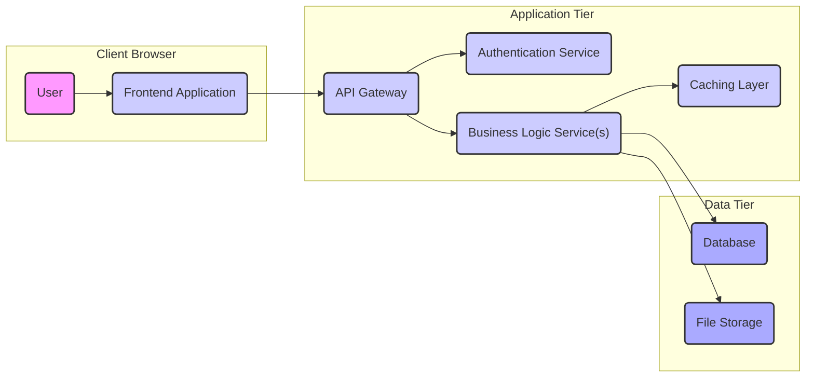
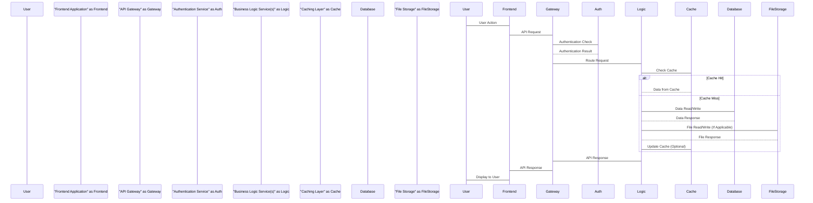
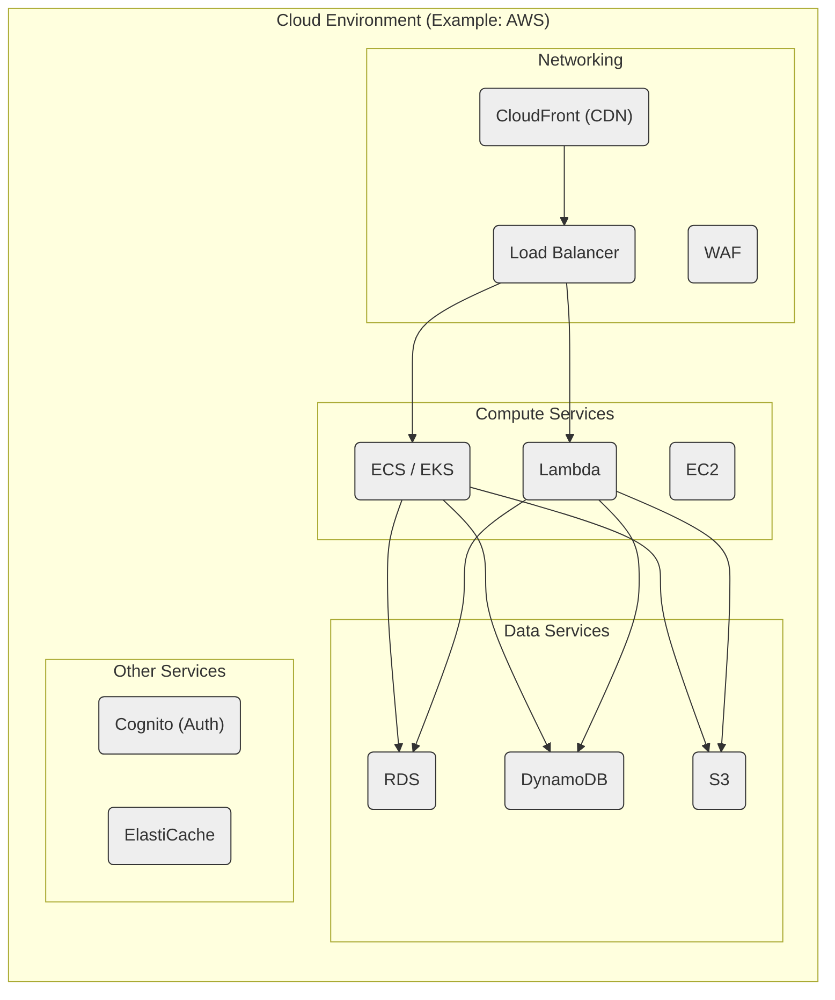

# Project Design Document: Modern Web Application

**Project Repository:** https://github.com/modernweb-dev/web

**Version:** 1.1
**Date:** October 26, 2023
**Author:** AI Software Architect

## 1. Project Overview

This document details the architectural design of a modern web application, based on the project repository [https://github.com/modernweb-dev/web](https://github.com/modernweb-dev/web). While the repository name provides a general indication, this document assumes a common three-tier architecture typical of modern web applications. The focus is on outlining the system's structure, component interactions, and data flow to facilitate effective threat modeling.

This design emphasizes the logical separation of concerns within the application, providing a clear blueprint for understanding its functionality and potential security vulnerabilities.

## 2. Goals and Objectives

*   To provide a clear and detailed architectural blueprint of the web application.
*   To identify and describe the key components and their specific responsibilities within the system.
*   To illustrate the flow of data through the application's various layers and components.
*   To highlight potential security considerations and vulnerabilities inherent in the design.
*   To serve as the primary reference document for subsequent threat modeling exercises.
*   To ensure a common understanding of the system's architecture among developers, security engineers, and stakeholders.

## 3. Target Audience

*   Security Engineers responsible for conducting threat modeling and security assessments.
*   Development Team members involved in building and maintaining the application.
*   Operations Team members responsible for deploying, managing, and monitoring the application.
*   Product Owners and other stakeholders requiring a technical understanding of the system's architecture.

## 4. System Architecture

The application adheres to a standard three-tier architecture, promoting separation of concerns:

*   **Presentation Tier (Frontend):**  Responsible for user interface rendering and handling user interactions.
*   **Application Tier (Backend/API):**  Handles business logic, request processing, and communication between the presentation and data tiers.
*   **Data Tier:**  Manages persistent data storage and retrieval.

## 5. Component Breakdown

### 5.1. Presentation Tier (Frontend)

*   **Frontend Application:**
    *   **Responsibility:** Renders the user interface in web browsers, handles user input, and communicates with the backend API.
    *   **Functionality:**  Displays data, allows user interaction (e.g., form submissions, navigation), and manages the user experience.
    *   **Possible Technologies:** React, Vue.js, Angular, HTML, CSS, JavaScript.

### 5.2. Application Tier (Backend/API)

*   **API Gateway:**
    *   **Responsibility:** Acts as a single entry point for all client requests, routing them to the appropriate backend services.
    *   **Functionality:**  Request routing, load balancing, authentication/authorization enforcement, rate limiting, and potentially request transformation.
    *   **Possible Technologies:**  NGINX, Kong, Tyk, AWS API Gateway.
*   **Authentication Service:**
    *   **Responsibility:** Verifies user identities and issues authentication tokens.
    *   **Functionality:** User registration, login, password management, token generation (e.g., JWT), and token verification.
    *   **Possible Technologies:**  Auth0, Keycloak, custom implementation using libraries like Passport.js.
*   **Business Logic Service(s):**
    *   **Responsibility:** Implements the core business logic and functionality of the application.
    *   **Functionality:** Processing user requests, performing data validation, orchestrating interactions with the data tier, and executing business rules. This may be further broken down into multiple microservices based on specific functionalities.
    *   **Possible Technologies:** Node.js (Express.js), Python (Django/Flask), Java (Spring Boot), Go.
*   **Caching Layer:**
    *   **Responsibility:** Stores frequently accessed data to improve performance and reduce load on the data tier.
    *   **Functionality:**  Storing and retrieving data based on keys, implementing cache invalidation strategies.
    *   **Possible Technologies:** Redis, Memcached.

### 5.3. Data Tier

*   **Database:**
    *   **Responsibility:** Persistently stores the application's structured data.
    *   **Functionality:**  Storing, retrieving, updating, and deleting data. Ensuring data integrity and consistency.
    *   **Possible Technologies:** PostgreSQL, MySQL, MongoDB, SQL Server.
*   **File Storage:**
    *   **Responsibility:** Stores unstructured data such as images, documents, and videos.
    *   **Functionality:**  Storing, retrieving, and managing files.
    *   **Possible Technologies:** AWS S3, Azure Blob Storage, Google Cloud Storage.

## 6. Data Flow

The typical flow of data within the application proceeds as follows:

1. **User Action:** A user interacts with the "Frontend Application".
2. **API Request:** The "Frontend Application" sends an API request to the "API Gateway".
3. **Authentication Check:** The "API Gateway" may forward the request to the "Authentication Service" for verification.
4. **Authentication Result:** The "Authentication Service" returns the authentication status to the "API Gateway".
5. **Route to Service:** The "API Gateway" routes the request to the appropriate "Business Logic Service(s)".
6. **Cache Check:** The "Business Logic Service(s)" may check the "Caching Layer" for the requested data.
7. **Data Retrieval/Update:**
    *   **Cache Hit:** If the data is in the cache, it's retrieved from the "Caching Layer".
    *   **Cache Miss:** If the data is not in the cache, the "Business Logic Service(s)" interacts with the "Database" or "File Storage" to retrieve or update the data.
8. **Data Response:** The "Database" or "File Storage" returns the requested data to the "Business Logic Service(s)".
9. **Cache Update (Optional):** The "Business Logic Service(s)" may update the "Caching Layer" with the retrieved data.
10. **API Response:** The "Business Logic Service(s)" sends a response back to the "API Gateway".
11. **Frontend Response:** The "API Gateway" forwards the response to the "Frontend Application".
12. **Display to User:** The "Frontend Application" updates the user interface with the received data.

## 7. Security Considerations

This section outlines potential security considerations based on the described architecture, providing a starting point for threat modeling.

*   **Presentation Tier (Frontend):**
    *   **Threats:** Cross-Site Scripting (XSS), Cross-Site Request Forgery (CSRF), insecure storage of sensitive data (e.g., in local storage).
    *   **Mitigations:** Input sanitization, output encoding, using frameworks with built-in security features, implementing CSRF tokens, avoiding storing sensitive data client-side.
*   **API Gateway:**
    *   **Threats:**  Denial of Service (DoS/DDoS), API abuse (e.g., unauthorized access, data exfiltration), man-in-the-middle attacks.
    *   **Mitigations:** Rate limiting, authentication and authorization enforcement, TLS encryption, input validation, Web Application Firewall (WAF).
*   **Authentication Service:**
    *   **Threats:** Brute-force attacks, credential stuffing, account takeover, insecure password storage, vulnerabilities in authentication protocols.
    *   **Mitigations:** Strong password policies, multi-factor authentication (MFA), rate limiting on login attempts, secure password hashing (e.g., bcrypt), secure token management (e.g., JWT with proper signing and expiration).
*   **Business Logic Service(s):**
    *   **Threats:** Injection attacks (e.g., SQL injection, NoSQL injection), insecure deserialization, business logic flaws, unauthorized access to internal APIs.
    *   **Mitigations:** Input validation, parameterized queries, secure coding practices, principle of least privilege for service-to-service communication, proper error handling to avoid information leakage.
*   **Caching Layer:**
    *   **Threats:**  Cache poisoning, information leakage through cached data, denial of service by filling the cache.
    *   **Mitigations:** Secure cache configuration, appropriate cache invalidation strategies, avoiding caching sensitive data without proper protection.
*   **Data Tier (Database & File Storage):**
    *   **Threats:** Data breaches, unauthorized access, SQL injection (for databases), insecure file uploads, data tampering.
    *   **Mitigations:** Strong access controls, encryption at rest and in transit, regular security audits, input validation, secure file upload mechanisms, principle of least privilege for database access.
*   **General Considerations:**
    *   **Threats:** Vulnerable dependencies, insecure configurations, insufficient logging and monitoring.
    *   **Mitigations:** Regular dependency updates and vulnerability scanning, secure configuration management, comprehensive logging and monitoring, security awareness training for developers.

## 8. Deployment Architecture

The application can be deployed using various strategies, with cloud-based and containerized deployments being common for modern web applications.

*   **Cloud-Based Deployment:**
    *   Leveraging cloud providers like AWS, Azure, or Google Cloud Platform.
    *   Utilizing services like EC2/Compute Engine for virtual machines, ECS/AKS/GKE for container orchestration, and serverless functions (Lambda/Azure Functions/Cloud Functions).
    *   Employing managed services for databases (RDS, Cloud SQL, Cosmos DB), storage (S3, Azure Blob Storage, Cloud Storage), and caching (ElastiCache, Azure Cache for Redis, Memorystore).
*   **Containerized Deployment:**
    *   Packaging application components into Docker containers for consistency and portability.
    *   Orchestrating containers using platforms like Kubernetes for scalability and management.
    *   Deploying containers to cloud-managed Kubernetes services or self-managed clusters.

## 9. Technologies Used (Assumptions)

Based on the context of "modern web development," the following technologies are likely to be used:

*   **Frontend:**
    *   JavaScript (ES6+)
    *   React, Vue.js, or Angular
    *   HTML5, CSS3
    *   npm or yarn for package management
*   **Backend:**
    *   Node.js with Express.js
    *   Python with Django or Flask
    *   Java with Spring Boot
    *   Go
*   **Database:**
    *   PostgreSQL
    *   MySQL
    *   MongoDB
*   **Caching:**
    *   Redis
    *   Memcached
*   **API Communication:**
    *   RESTful APIs (JSON)
*   **Containerization:**
    *   Docker
*   **Orchestration:**
    *   Kubernetes
*   **Cloud Provider (Likely):**
    *   AWS
    *   Azure
    *   Google Cloud Platform

## 10. Future Considerations

*   **Adopting a Microservices Architecture:**  Further decompose the "Business Logic Service(s)" into smaller, independent microservices for enhanced scalability, resilience, and independent deployments.
*   **Implementing Event-Driven Architecture:** Utilize message queues (e.g., Kafka, RabbitMQ) for asynchronous communication between services, improving decoupling and scalability.
*   **Exploring GraphQL APIs:** Consider using GraphQL as an alternative to REST for more efficient and flexible data fetching.
*   **Leveraging Serverless Functions:**  Utilize serverless functions for specific, event-driven backend tasks to reduce operational overhead.
*   **Enhancing Observability:** Implement comprehensive monitoring, logging, and tracing solutions for better insights into application performance and potential issues.
*   **Strengthening Security Posture:** Continuously evaluate and improve security measures, including penetration testing, security code reviews, and implementing DevSecOps practices.

This improved design document provides a more detailed and comprehensive overview of the modern web application's architecture, explicitly highlighting security considerations relevant for threat modeling.