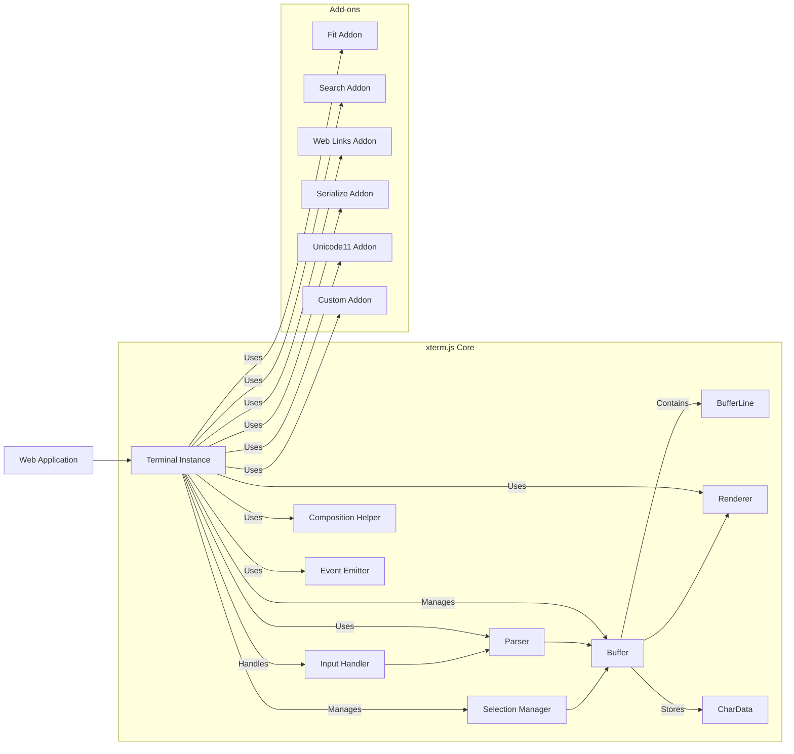
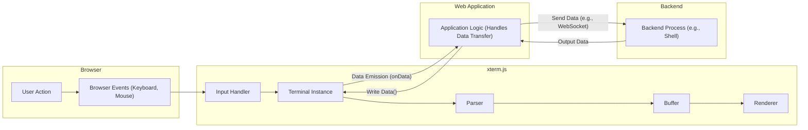

## Project Design Document: xterm.js (Improved)

**1. Introduction**

This document provides an enhanced and more detailed design overview of the xterm.js project, available at [https://github.com/xtermjs/xterm.js](https://github.com/xtermjs/xterm.js). This improved document aims to provide a stronger foundation for subsequent threat modeling activities by offering a deeper understanding of the system's components, interactions, and data flow.

**2. Project Goals and Overview**

xterm.js is a robust and feature-rich terminal emulator component implemented in JavaScript for web browsers. Its core objective is to deliver a high-fidelity terminal experience within web applications. Key features and goals include:

* **Precise Terminal Emulation:**  Faithfully replicating the behavior of standard terminal applications, including handling ANSI escape codes, terminal modes, and character sets.
* **Exceptional Performance:**  Achieving a fluid and responsive user interface, even when processing substantial amounts of terminal output and input.
* **Universal Accessibility:**  Adhering to established accessibility guidelines to ensure usability for individuals with disabilities.
* **Extensive Customization:**  Offering a versatile API that allows developers to tailor the terminal's appearance and behavior to suit specific application requirements.
* **Modular Add-on Architecture:**  Providing a well-defined mechanism for extending the core functionality through optional add-on modules.
* **Cross-Browser Compatibility:**  Ensuring consistent operation and appearance across a wide range of modern web browsers and operating systems.

**3. Architectural Overview**

xterm.js employs a modular and event-driven architecture. The core component provides the fundamental terminal emulation logic, while add-ons offer extended capabilities.

* **Core Component:** The central part of xterm.js, responsible for the core terminal emulation functionality:
    * **`Terminal` Class:** The main entry point and controller for a terminal instance. It manages the buffer, parser, renderer, and input handling.
    * **`Buffer` and `BufferLine`:**  Manages the terminal's display content, storing characters and their attributes (e.g., color, styling) in a two-dimensional grid. `BufferLine` represents a single line in the buffer.
    * **`Parser`:** Interprets incoming data streams, specifically looking for ANSI escape codes and other control sequences to update the terminal's state and buffer.
    * **`Renderer`:** Responsible for drawing the terminal content onto the screen. It can utilize either a Canvas-based renderer for performance or a DOM-based renderer for better accessibility and text selection in some scenarios.
    * **`CharData`:** A data structure representing a single character cell in the terminal buffer, storing the character code, foreground color, background color, and other attributes.
    * **`InputHandler`:** Processes user input from the browser (keyboard and mouse events), translating them into appropriate terminal input sequences.
    * **`SelectionManager`:** Handles text selection within the terminal, allowing users to copy and paste content.
    * **`CompositionHelper`:** Assists with input method editor (IME) composition for languages like Chinese, Japanese, and Korean.
    * **`EventEmitter`:**  A core utility for managing events within xterm.js, allowing different components to communicate and react to changes.

* **Add-ons:** Optional modules that extend the core functionality without bloating the base library:
    * **`fit` Addon:** Automatically resizes the terminal to fit its containing element.
    * **`search` Addon:** Implements in-terminal text search functionality.
    * **`web-links` Addon:** Detects and makes URLs clickable within the terminal.
    * **`serialize` Addon:** Enables saving and restoring the terminal's state (buffer content and cursor position).
    * **`unicode11` Addon:** Provides support for Unicode version 11.
    * **Custom Add-ons:** Developers can create their own add-ons to add specific features or integrations.

* **API:** xterm.js exposes a comprehensive JavaScript API for interacting with terminal instances:
    * **Terminal instantiation and destruction methods.**
    * **Methods for writing data to the terminal (`write()`).**
    * **Methods for reading data from the terminal (event listeners for `data`).**
    * **Configuration options for customizing terminal behavior and appearance.**
    * **Methods for managing add-ons (attaching, detaching).**
    * **Event listeners for various terminal events (e.g., `data`, `resize`, `key`).**
    * **Methods for programmatic control of the terminal (e.g., clearing the screen, moving the cursor).**

**4. Data Flow**

The data flow in xterm.js centers around the processing of user input and the rendering of terminal output.

* **Input Flow (User to Backend):**
    1. **User Interaction:** A user interacts with the terminal within the web browser (e.g., types characters, presses keys, clicks the mouse).
    2. **Browser Event Generation:** The browser generates corresponding DOM events (e.g., `keydown`, `keypress`, `keyup`, `mousedown`, `mouseup`).
    3. **Input Handler Processing:** xterm.js's `InputHandler` intercepts these browser events.
    4. **Translation to Terminal Input:** The `InputHandler` translates the browser events into terminal-compatible data, including character codes, control sequences (generated from key combinations), and mouse events encoded in terminal-specific formats.
    5. **Data Emission via API:** The processed input data is emitted through the `Terminal` instance's API, typically via an `onData` event listener.
    6. **Web Application Transmission:** The embedding web application listens for this `data` event and typically transmits the data to a backend process (e.g., a shell running on a server) using technologies like WebSockets or AJAX.

* **Output Flow (Backend to User):**
    1. **Backend Process Output:** A backend process (e.g., a shell, a server application) generates output data intended for the terminal. This data often includes text and ANSI escape codes for formatting and control.
    2. **Data Transmission to Web Application:** The backend process transmits this output data to the web application, usually over a persistent connection like a WebSocket or through repeated AJAX requests.
    3. **Data Reception by Web Application:** The web application receives the output data.
    4. **Writing Data to Terminal:** The web application uses the `Terminal` instance's `write()` method to feed the received data into xterm.js.
    5. **Parsing and Buffer Update:** The `Parser` interprets the incoming data stream, identifying text and control sequences. Based on these sequences, the `Buffer` is updated with the new characters and their attributes.
    6. **Rendering:** The `Renderer` reads the updated content from the `Buffer` and draws it onto the terminal's display area, either using the Canvas or DOM.

**5. Key Technologies**

xterm.js leverages the following core technologies:

* **JavaScript:** The primary programming language for the core terminal emulation logic and add-ons.
* **TypeScript:** Used for development to provide static typing, improved code organization, and enhanced maintainability.
* **HTML5 Canvas API:**  An option for high-performance rendering of the terminal content.
* **DOM (Document Object Model):**  An alternative rendering mechanism, offering better accessibility and text selection in some cases.
* **npm (Node Package Manager):** Used for dependency management and distribution of the library.
* **Bundlers (Webpack, Rollup, or similar):** Used to bundle the TypeScript/JavaScript modules into distributable files.
* **Unicode Support:**  Comprehensive support for various Unicode character sets and encodings.

**6. Deployment Model**

xterm.js is a client-side JavaScript library designed to be embedded within web applications. Common deployment scenarios include:

* **Web-based SSH Clients:** Providing secure shell access to remote servers directly within a web browser.
* **Cloud-Based Integrated Development Environments (IDEs):** Integrating terminal emulators into online coding platforms.
* **Container Management Dashboards:** Offering terminal access to containers running in cloud environments (e.g., Docker, Kubernetes).
* **Real-time Monitoring and Logging Dashboards:** Displaying streaming log output in a terminal-like interface.
* **Command-Line Interfaces (CLIs) in Web Applications:** Providing a web-based interface for interacting with backend processes using text-based commands.
* **Educational Platforms:**  Simulating terminal environments for learning command-line operations.

**7. Security Considerations (Detailed for Threat Modeling)**

This section expands on the initial security considerations, providing more specific examples and potential threats to guide the threat modeling process.

* **Input Sanitization and Validation:**
    * **Threat:** Malicious control sequences injected into the input stream could potentially manipulate the terminal's state in unintended ways, leading to information disclosure or even remote code execution if vulnerabilities exist in the parser or renderer.
    * **Considerations:**  Strictly validate and sanitize input data received from the web application before processing it. Be wary of unexpected or malformed ANSI escape codes.
* **Output Encoding and Handling:**
    * **Threat:** If terminal output is not properly encoded before being displayed or used elsewhere in the web application, it could lead to Cross-Site Scripting (XSS) vulnerabilities. Malicious output from the backend could inject scripts into the user's browser.
    * **Considerations:** Ensure proper encoding of terminal output, especially if it's being displayed outside the terminal context. Implement robust XSS prevention measures.
* **Add-on Security:**
    * **Threat:** Malicious or poorly written add-ons could introduce vulnerabilities, as they have access to the terminal's internal state and API.
    * **Considerations:**  Carefully evaluate the security of third-party add-ons. Implement a mechanism for sandboxing or restricting add-on capabilities if necessary.
* **Clipboard Interaction:**
    * **Threat:**  Sensitive information copied to the clipboard from the terminal could be accessed by other applications or scripts. Conversely, pasting untrusted content into the terminal could introduce malicious commands.
    * **Considerations:**  Be mindful of the security implications of clipboard integration. Consider providing warnings or restrictions on clipboard operations involving sensitive data.
* **Resource Exhaustion (Denial of Service):**
    * **Threat:**  Maliciously crafted output streams with excessive amounts of data or specific control sequences could potentially consume excessive client-side resources (CPU, memory), leading to a denial-of-service condition in the user's browser.
    * **Considerations:** Implement safeguards against excessive resource consumption, such as limiting the amount of data processed or rendered.
* **Dependency Vulnerabilities:**
    * **Threat:**  Vulnerabilities in the underlying JavaScript libraries and dependencies used by xterm.js could be exploited.
    * **Considerations:**  Maintain up-to-date dependencies and regularly scan for known vulnerabilities.
* **Content Security Policy (CSP):**
    * **Considerations:**  Leverage Content Security Policy (CSP) headers to restrict the capabilities of the xterm.js component within the browser, mitigating certain types of attacks (e.g., inline scripts).
* **Secure Defaults and Configuration:**
    * **Considerations:**  Ensure that default configurations are secure and encourage developers to follow security best practices when integrating xterm.js. Provide clear documentation on security considerations and configuration options.
* **Web Worker Security (If Applicable):**
    * **Considerations:** If web workers are used for performance optimization, ensure secure communication and data handling between the main thread and worker threads to prevent cross-site scripting or other vulnerabilities.

This improved design document provides a more in-depth understanding of xterm.js's architecture and data flow, offering a stronger foundation for identifying and mitigating potential security threats during the threat modeling process.