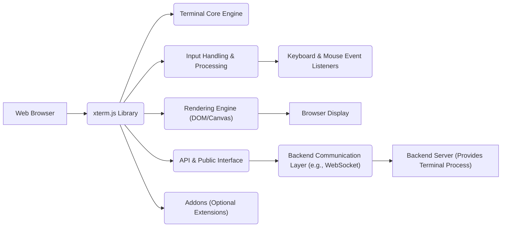
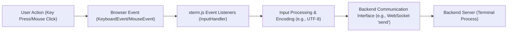
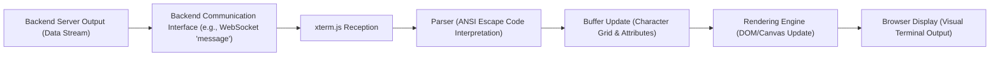

# Project Design Document: xterm.js

**Version:** 1.1
**Date:** October 26, 2023
**Prepared By:** Gemini (AI Language Model)

## 1. Introduction

This document provides a detailed design overview of the xterm.js project, a powerful front-end terminal emulator implemented in JavaScript for web browsers. This document aims to clearly articulate the system's architecture, key components, and data flow, serving as a foundational resource for subsequent threat modeling and security analysis.

## 2. Goals and Objectives

The core objective of xterm.js is to deliver a robust and feature-rich terminal experience directly within web applications. Key goals include:

*   **Precise Terminal Emulation:**  Faithfully replicate the behavior of traditional terminal interfaces, including accurate handling of ANSI escape codes for text formatting, cursor control, and other terminal functionalities.
*   **Performance and Responsiveness:** Ensure a smooth and lag-free user experience, even with high volumes of terminal output or rapid input.
*   **Flexible Integration API:** Offer a well-defined and adaptable API that allows seamless integration with diverse backend systems and web application frameworks.
*   **Broad Browser Compatibility:**  Maintain compatibility across modern web browsers, ensuring a consistent experience for a wide range of users.
*   **Extensibility through Addons:**  Provide a modular architecture that supports extending the core functionality through optional addons.
*   **Customization Options:** Offer configuration options to tailor the terminal's appearance and behavior to specific application needs.

## 3. System Architecture

xterm.js operates primarily on the client-side within a web browser. Its primary responsibilities are rendering terminal output visually and transmitting user input to a backend process. The actual terminal process and the handling of communication are the responsibility of the backend system integrating xterm.js.

### 3.1. High-Level Architecture

### 3.2. Detailed Architecture

The xterm.js library is composed of several interconnected modules and components:

*   **Terminal Core Engine:** This is the central component, responsible for managing the terminal's internal state. This includes:
    *   Maintaining the terminal buffer (the grid of characters displayed).
    *   Tracking the cursor position and attributes.
    *   Managing scrollback history.
    *   Orchestrating the interaction between other components.
*   **Input Handling & Processing:** This module manages user interactions:
    *   Captures keyboard events (key presses, key releases).
    *   Captures mouse events (clicks, movements, scrolling).
    *   Translates these events into data streams suitable for transmission to the backend, considering keyboard layouts and special key combinations.
*   **Rendering Engine (DOM/Canvas):** Responsible for the visual representation of the terminal:
    *   Offers different rendering strategies (typically DOM-based or Canvas-based).
    *   Draws characters and applies styling based on the terminal buffer and ANSI escape codes.
    *   Handles scrolling and viewport management.
*   **API & Public Interface:** Provides the methods and events that developers use to interact with xterm.js:
    *   Methods for writing data to the terminal.
    *   Methods for resizing the terminal.
    *   Events for receiving data from the terminal.
    *   Configuration options for customizing terminal behavior.
*   **Addons (Optional Extensions):**  Modular components that extend the core functionality. Examples include:
    *   `WebLinksAddon`: Detects and makes web links clickable.
    *   `SearchAddon`: Implements in-terminal text searching.
    *   `FitAddon`: Automatically adjusts the terminal size to fit its container.
*   **Buffer:**  Stores the lines of text and associated attributes (colors, styles) that are currently displayed or in the scrollback history. It efficiently manages adding, removing, and accessing lines.
*   **Parser (ANSI Escape Code Parser):**  Interprets the stream of characters received from the backend, specifically looking for ANSI escape sequences. These sequences instruct the terminal on how to format text, change colors, move the cursor, and perform other control operations.
*   **Selection Manager:**  Handles the logic for selecting text within the terminal using the mouse.
*   **Composition Manager:**  Manages the input method editor (IME) composition process for languages that require it, allowing users to input characters that are not directly available on the keyboard.

## 4. Key Components

*   **`Terminal` Class:** The primary class that developers instantiate to create a terminal emulator instance. It orchestrates the other components and provides the main API.
*   **`Buffer` Class:**  Represents the terminal's text buffer, holding lines of `BufferLine` objects.
*   **`BufferLine` Class:** Represents a single line in the terminal buffer, storing characters and their associated attributes.
*   **`Renderer` Interface (and Implementations: `DomRenderer`, `CanvasRenderer`):** Defines the interface for rendering the terminal, with concrete implementations using either DOM elements or a Canvas element.
*   **`InputHandler` Class:**  Handles browser input events and translates them into appropriate data for the backend.
*   **`Parser` Class:**  Parses the incoming data stream, identifying and processing ANSI escape codes.
*   **`EventEmitter` (or similar):**  A mechanism for managing events within xterm.js, allowing different components to communicate and react to changes.
*   **Addon Modules (e.g., `WebLinksAddon`, `SearchAddon`, `FitAddon`):**  Independent modules that extend the `Terminal` class with specific functionalities. These typically interact with the `Terminal` object through its API.

## 5. Data Flow

The following sections detail the flow of data into and out of the xterm.js component.

### 5.1. Input Flow (User to Backend)

*   **User Action:** The user interacts with the terminal interface by typing on the keyboard or using the mouse.
*   **Browser Event:** The web browser generates corresponding events, such as `keydown`, `keypress`, `keyup`, `click`, `mousemove`, etc.
*   **xterm.js Event Listeners:** The `InputHandler` within xterm.js has listeners attached to the terminal's DOM element to capture these browser events.
*   **Input Processing & Encoding:** The `InputHandler` processes the raw browser events, determining the appropriate data to send to the backend. This includes handling special keys (Ctrl, Shift, Alt), encoding the input (typically as UTF-8), and potentially applying keyboard mappings.
*   **Backend Communication Interface:** xterm.js uses a communication mechanism (often provided by the integrating application, such as a WebSocket connection) to send the processed input data.
*   **Backend Server:** The backend server receives the input data and feeds it to the associated terminal process (pty).

### 5.2. Output Flow (Backend to User)

*   **Backend Server Output:** The backend terminal process generates a stream of characters and control sequences (ANSI escape codes) as output.
*   **Backend Communication Interface:** The backend sends this output data to the browser using the established communication channel (e.g., WebSocket).
*   **xterm.js Reception:** xterm.js receives the data stream from the backend.
*   **Parser:** The `Parser` component analyzes the incoming data stream, identifying and interpreting ANSI escape codes. These codes dictate how the following characters should be rendered (e.g., color, bold, cursor movement).
*   **Buffer Update:** Based on the parsed data, the `Buffer` is updated with the new characters and their associated attributes. This involves potentially adding new lines, scrolling content, and modifying character styles.
*   **Rendering Engine:** The `Renderer` component takes the updated `Buffer` content and redraws the terminal on the screen, either by manipulating DOM elements or by drawing on a Canvas.
*   **Browser Display:** The user sees the updated terminal output rendered in their web browser.

## 6. Security Considerations (Detailed Overview)

Security is a critical aspect of any software, and xterm.js, as a component handling potentially sensitive data and interacting with backend systems, requires careful consideration of potential threats:

*   **Cross-Site Scripting (XSS):**
    *   **Threat:** If the backend sends malicious ANSI escape codes or character sequences that are not properly sanitized by xterm.js, they could be interpreted as HTML or JavaScript, leading to XSS attacks.
    *   **Mitigation:** Strict adherence to secure parsing practices and potentially sandboxing or filtering of certain escape sequences. Content Security Policy (CSP) on the embedding web application can also provide a layer of defense.
*   **Command Injection (Indirect):**
    *   **Threat:** While xterm.js itself doesn't execute commands, vulnerabilities in its input handling or the backend communication could be exploited to inject malicious commands that are then executed by the backend terminal process.
    *   **Mitigation:**  Robust input validation and sanitization on both the client (within xterm.js) and the server-side. Secure communication protocols to prevent tampering with data in transit.
*   **Denial of Service (DoS):**
    *   **Threat:** A malicious backend could send a large volume of data or a sequence of complex ANSI escape codes designed to overwhelm the rendering engine or consume excessive client-side resources, leading to a denial of service in the user's browser.
    *   **Mitigation:** Implementing rate limiting or throttling mechanisms on the backend. Optimizing the rendering engine for performance. Potentially imposing limits on the complexity of rendered output.
*   **Data Injection/Tampering:**
    *   **Threat:** If the communication channel between the client and server is not secure, an attacker could intercept and modify data being sent in either direction. This could lead to the terminal displaying incorrect information or the backend receiving malicious input.
    *   **Mitigation:**  Using secure communication protocols such as WSS (WebSocket Secure) or HTTPS for the initial page load and WebSocket handshake.
*   **Addon Security:**
    *   **Threat:**  Malicious or poorly written addons could introduce vulnerabilities, as they have access to the `Terminal` object's internal state and can manipulate its behavior.
    *   **Mitigation:**  Careful review and vetting of addons. Implementing a secure addon API with limited access to sensitive functionalities. Potentially using a permissions model for addons.
*   **Information Disclosure:**
    *   **Threat:**  Bugs in the rendering logic or buffer management could potentially expose sensitive information that was previously displayed in the terminal buffer.
    *   **Mitigation:**  Thorough testing and security audits of the rendering and buffer management components. Securely handling and clearing sensitive data in the buffer when it's no longer needed.

## 7. Deployment

xterm.js is a client-side JavaScript library that is typically deployed by including its files in a web application. The deployment process involves:

*   **Including xterm.js Files:**  Adding the necessary JavaScript and CSS files for xterm.js to the web application's codebase. This can be done through direct inclusion, package managers (like npm or yarn), or CDNs.
*   **Creating a Terminal Instance:**  Instantiating the `Terminal` class in the application's JavaScript code.
*   **Establishing Backend Communication:** Setting up a communication channel (e.g., WebSocket) between the client-side xterm.js instance and the backend server that provides the terminal process.
*   **Wiring Up Data Flow:** Implementing the logic to send user input from xterm.js to the backend and to receive and write backend output to the xterm.js instance.
*   **Integrating into the UI:**  Placing the DOM element created by xterm.js into the desired location within the web application's user interface.
*   **Configuration:**  Configuring xterm.js options (e.g., theme, font, cursor style) as needed.

## 8. Future Considerations

*   **Enhanced Performance Optimizations:**  Continued efforts to improve rendering performance, especially for complex terminal outputs and high-throughput scenarios. Exploring techniques like virtualized rendering.
*   **Improved Accessibility Features:**  Further enhancements to make xterm.js more accessible to users with disabilities, such as better screen reader support and keyboard navigation.
*   **Standardization Efforts:**  Contributing to and aligning with emerging web standards related to terminal emulation and console access in the browser.
*   **More Robust Addon API:**  Developing a more formalized and secure API for addons, allowing for greater extensibility while maintaining security.
*   **Regular Security Audits and Penetration Testing:**  Proactive security measures to identify and address potential vulnerabilities.
*   **Exploring WebGPU for Rendering:** Investigating the potential benefits of using WebGPU for improved rendering performance and capabilities.

This improved design document provides a more detailed and comprehensive overview of the xterm.js project, offering valuable insights for threat modeling and security analysis.
