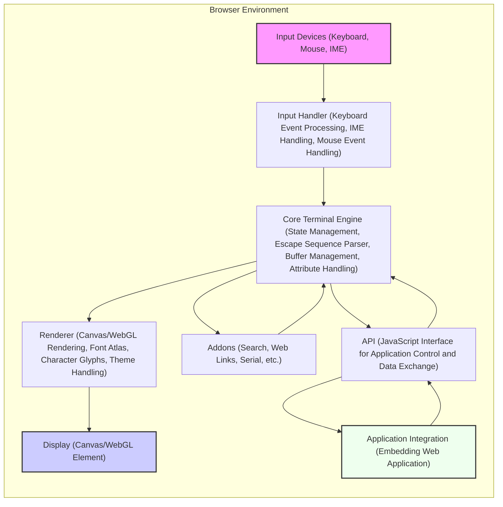
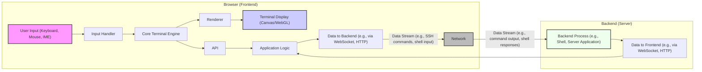

# Project Design Document: xterm.js for Threat Modeling (Improved)

## 1. Introduction

This document provides an enhanced design overview of the xterm.js project, a robust terminal emulator component written in JavaScript. It builds upon the previous version to offer a more detailed and security-focused perspective, specifically tailored for threat modeling. This document serves as a comprehensive resource for understanding the system's architecture, components, data flow, and external interfaces, enabling effective threat identification and mitigation strategies.

xterm.js is widely adopted across diverse web applications, providing interactive terminal experiences directly within the browser. Its common use cases include:

*   Web-based Integrated Development Environments (IDEs) and code editors (e.g., VS Code, Eclipse Che)
*   Cloud platforms and container management dashboards (e.g., Kubernetes dashboards, cloud provider consoles)
*   Remote access and administration tools (e.g., web-based SSH clients)
*   Monitoring and logging dashboards requiring real-time text output
*   Any web application needing terminal-like interaction for command-line interfaces or console access

This improved document aims to provide a deeper understanding of xterm.js's architecture and security-relevant aspects for thorough threat analysis.

## 2. Goals and Objectives

The primary goals of xterm.js are to deliver:

*   **High Performance:**  Ensure efficient and responsive terminal emulation within the resource-constrained browser environment, crucial for a smooth user experience.
*   **Broad Compatibility:**  Achieve extensive support for terminal features and ANSI/VT escape sequences, aiming for near-perfect compatibility with established terminal standards like `xterm`, `vt100`, and `vt220` to support a wide range of terminal applications.
*   **Extensibility via Addons:**  Offer a flexible addon system that empowers developers to extend the core functionality with optional features such as search, hyperlink detection, serial port communication, and more, catering to diverse application needs.
*   **Extensive Customization:**  Provide rich customization options for appearance (themes, fonts, colors) and behavior (keybindings, cursor styles) to seamlessly integrate into various application contexts and user preferences.
*   **Security as a Critical Consideration:** While not explicitly stated as the *primary* goal in all contexts, security is recognized as a paramount concern. This document explicitly emphasizes security considerations and aims to facilitate proactive threat modeling and secure development practices for xterm.js and its embedding applications.  The objective is to minimize potential vulnerabilities and ensure a secure terminal emulation experience.

## 3. Target Audience

This design document is primarily intended for:

*   **Security Engineers and Security Architects:** To gain a deep understanding of xterm.js's architecture and data flow for comprehensive threat modeling, vulnerability assessments, and penetration testing.
*   **Software Developers Integrating xterm.js:** To acquire in-depth knowledge of the component's internal workings, API, and security considerations when embedding it within their web applications, promoting secure integration practices.
*   **xterm.js Maintainers and Contributors:** To provide a clear, structured, and security-focused overview of the system architecture for ongoing development, security enhancements, vulnerability remediation, and informed decision-making.
*   **Project Stakeholders and Decision Makers:** To understand the security posture of xterm.js and its implications for applications relying on it, enabling informed risk management and resource allocation for security improvements.

## 4. System Architecture

### 4.1. High-Level Architecture Diagram

### 4.2. Component Description

*   **Input Devices ("Input Devices (Keyboard, Mouse, IME)")**: Represents all user input sources within the browser, including:
    *   Physical keyboard input.
    *   Mouse interactions (clicks, movements, scrolling).
    *   Input Method Editors (IMEs) for handling complex character input (e.g., Chinese, Japanese, Korean).
*   **Input Handler ("Input Handler (Keyboard Event Processing, IME Handling, Mouse Event Handling)")**:  Processes raw input events from the browser, performing critical tasks:
    *   **Keyboard Event Processing:** Translates keyboard events (keydown, keyup, keypress) into character codes, control characters, and escape sequences, considering keyboard layouts, modifiers (Ctrl, Shift, Alt), and special keys.
    *   **IME Handling:** Manages input from Input Method Editors to correctly handle multi-byte characters and complex text input scenarios.
    *   **Mouse Event Handling:** Interprets mouse events for cursor positioning, text selection, scrolling, and potentially mouse reporting (in terminal modes that support it).
    *   **Input Sanitization (Initial Stage):** Performs initial sanitization and encoding of input to prevent obvious injection attempts before passing it to the core engine.
*   **Core Terminal Engine ("Core Terminal Engine (State Management, Escape Sequence Parser, Buffer Management, Attribute Handling)")**: The central and most critical component, responsible for:
    *   **State Management:** Maintains the complete terminal state, including the screen buffer (character grid), cursor position, text attributes (colors, styles, font variations), terminal modes (e.g., VT100, VT220 modes), and terminal settings.
    *   **Escape Sequence Parser:**  Parses incoming data streams for ANSI/VT escape sequences. This parser is responsible for interpreting control codes that dictate terminal behavior, text formatting, cursor manipulation, and other terminal functionalities. **This is a critical security component as vulnerabilities in parsing can lead to exploits.**
    *   **Buffer Management:** Manages the terminal buffer, efficiently storing and updating character data and associated attributes for the visible terminal screen and scrollback buffer.
    *   **Attribute Handling:** Applies character attributes (colors, bold, italics, underline, etc.) based on parsed escape sequences and terminal state, ensuring correct visual representation of text.
    *   **API Exposure:** Provides internal APIs for other components (Renderer, Addons, API) to access and manipulate the terminal state.
*   **Renderer ("Renderer (Canvas/WebGL Rendering, Font Atlas, Character Glyphs, Theme Handling)")**:  Handles the visual representation of the terminal state:
    *   **Canvas/WebGL Rendering:** Utilizes either Canvas 2D API or WebGL for rendering the terminal output, choosing the optimal rendering method based on performance and browser capabilities.
    *   **Font Atlas and Character Glyphs:** Manages font loading, character glyph rendering, and potentially font atlases for efficient text rendering.
    *   **Theme Handling:** Applies terminal themes (colors, background, foreground) to customize the visual appearance.
    *   **Performance Optimization:** Implements optimizations for smooth scrolling, fast updates, and efficient rendering to ensure a responsive terminal experience.
*   **Display ("Display (Canvas/WebGL Element)")**: The actual HTML Canvas or WebGL element in the browser's Document Object Model (DOM) where the rendered terminal output is displayed to the user.
*   **Addons ("Addons (Search, Web Links, Serial, etc.)")**:  Optional extensions that enhance xterm.js functionality:
    *   **Examples:** Search functionality, web link detection and handling, serial port communication, Unicode input, image support, and more.
    *   **Extensibility Mechanism:** Addons can interact with the Core Terminal Engine, Renderer, and API to extend or modify behavior.
    *   **Security Note:** Addons represent a potential extension of the attack surface and should be carefully reviewed for security implications.
*   **API ("API (JavaScript Interface for Application Control and Data Exchange)")**:  The JavaScript API exposed by xterm.js for external interaction:
    *   **Data Input/Output:** Allows embedding applications to send data to the terminal (simulating backend output) and receive data from the terminal (representing user input or terminal output).
    *   **Terminal Control:** Provides methods to control terminal settings (e.g., font size, theme, cursor style), resize the terminal, clear the screen, and manage terminal state.
    *   **Addon Management:** Enables applications to load, unload, and interact with addons.
    *   **Event Handling:** Exposes events for terminal data output, cursor position changes, and other terminal events, allowing applications to react to terminal activity.
*   **Application Integration ("Application Integration (Embedding Web Application)")**: Represents the web application that embeds and utilizes xterm.js:
    *   **Context Provider:** The application provides the context in which xterm.js operates, including communication with backend processes, user authentication, and overall application security.
    *   **API Consumer:** The application uses the xterm.js API to manage the terminal, send and receive data, and integrate terminal functionality into its user interface.
    *   **Security Responsibility:** The embedding application shares responsibility for the overall security of the system, including secure communication with backends and proper handling of data exchanged with xterm.js.

## 5. Data Flow

### 5.1. Data Flow Diagram

### 5.2. Data Flow Description

The data flow within and around xterm.js involves the following stages:

1.  **User Input Acquisition ("User Input (Keyboard, Mouse, IME)") to Input Handler ("Input Handler"):** User interactions (keystrokes, mouse actions, IME input) are captured by the browser and transmitted as events to the **Input Handler**.  Data type: Browser events (KeyboardEvent, MouseEvent, InputEvent).
2.  **Input Handler ("Input Handler") Processing and Transmission to Core Terminal Engine ("Core Terminal Engine"):** The **Input Handler** processes these raw events, converting them into:
    *   **Character Data:**  For printable characters, encoded in UTF-8 or other appropriate encoding.
    *   **Control Characters:**  ASCII control characters (e.g., Ctrl+C, Ctrl+D).
    *   **ANSI Escape Sequences:**  For special key combinations or functions (e.g., arrow keys, function keys, potentially crafted sequences).
    *   **Mouse Escape Sequences:**  For mouse events in terminal modes that support mouse reporting.
    This processed input is then passed to the **Core Terminal Engine**. Data type: String (containing characters, control codes, escape sequences). **Security Note:** Maliciously crafted input at this stage could attempt to inject escape sequences or control characters to exploit vulnerabilities in the Core Terminal Engine.
3.  **Core Terminal Engine ("Core Terminal Engine") Processing and State Update:** The **Core Terminal Engine** receives the input stream and performs critical operations:
    *   **Escape Sequence Parsing:**  Parses ANSI escape sequences to interpret formatting commands, cursor movements, color changes, and other terminal control functions. **Security Note:** Vulnerabilities in the escape sequence parser are a major security concern. Improper parsing can lead to buffer overflows, command injection, or denial-of-service.
    *   **Terminal State Update:** Updates the internal terminal state (buffer, cursor position, attributes) based on the parsed input and escape sequences.
    *   **Data Storage in Buffer:** Stores character data and associated attributes in the terminal buffer. Data type: Internal data structures representing terminal state (character grid, attribute maps).
4.  **Core Terminal Engine ("Core Terminal Engine") to Renderer ("Renderer"):** The **Core Terminal Engine** provides the updated terminal state data to the **Renderer**. This data includes:
    *   Character data to be rendered.
    *   Character attributes (colors, styles).
    *   Cursor position and style.
    *   Scrolling information.
    Data type:  Structured data representing the terminal screen content and rendering instructions.
5.  **Renderer ("Renderer") to Terminal Display ("Terminal Display (Canvas/WebGL)")**: The **Renderer** uses the received data to visually render the terminal output on the **Terminal Display** (Canvas or WebGL element). Data type: Rendered pixels on the Canvas/WebGL element. **Security Note:** While less direct, rendering vulnerabilities could theoretically be exploited, although this is less common in text-based terminal emulation.
6.  **Core Terminal Engine ("Core Terminal Engine") to API ("API"):**  The **Core Terminal Engine** makes output data (representing the terminal's output stream) available through the **API**. This data is typically the raw character data that would be printed to the terminal. Data type: String (terminal output data).
7.  **API ("API") to Application Logic ("Application Logic"):** The embedding **Application Logic** uses the xterm.js **API** to receive this output data. Data type: String (terminal output data).
8.  **Application Logic ("Application Logic") to Backend ("Data to Backend (e.g., via WebSocket, HTTP)"):** The **Application Logic** is responsible for transmitting this output data to the **Backend Process**. The communication channel and protocol are application-specific (e.g., WebSockets for real-time communication, HTTP for request/response). Data type: String (terminal output data, potentially encapsulated in a protocol-specific message format). **Security Note:** The security of this communication channel is critical. Insecure channels can lead to eavesdropping or man-in-the-middle attacks.
9.  **Backend Process ("Backend Process (e.g., Shell, Server Application)") Processing and Response Generation:** The **Backend Process** (e.g., a shell, server application, container runtime) processes the received data (e.g., executes commands) and generates a response or output. Data type: String (backend process output, potentially containing ANSI escape sequences).
10. **Backend ("Data to Frontend (e.g., via WebSocket, HTTP)") to Application Logic ("Application Logic"):** The **Backend Process** sends its output data back to the **Application Logic** through the established communication channel. Data type: String (backend process output, potentially encapsulated in a protocol-specific message format).
11. **Application Logic ("Application Logic") to API ("API"):** The **Application Logic** uses the xterm.js **API** to send this backend output data back into the terminal, simulating input from the backend. Data type: String (backend process output).
12. **API ("API") to Core Terminal Engine ("Core Terminal Engine"):** The data sent via the API is received by the **Core Terminal Engine** and processed as input (step 3 onwards), completing the data flow cycle.

## 6. Key Components in Detail

### 6.1. Core Terminal Engine

*   **Functionality:**
    *   **ANSI Escape Sequence Parsing:**  Interprets and processes ANSI/VT escape sequences for text formatting, cursor control, mode setting, and other terminal operations. Supports a wide range of escape sequences defined by terminal standards.
    *   **Terminal Buffer Management:**  Maintains a two-dimensional array (or similar data structure) representing the terminal screen buffer. Manages character storage, line wrapping, scrolling, and scrollback buffer.
    *   **State Management:** Tracks and updates the terminal's internal state, including cursor position (x, y coordinates), text attributes (foreground/background colors, bold, italics, underline, etc.), terminal modes (e.g., VT100, VT220 modes, cursor modes, keypad modes), and terminal settings.
    *   **Character Attribute Handling:**  Associates attributes with each character in the terminal buffer, allowing for rich text formatting and styling.
    *   **API for Component Interaction:** Provides internal APIs for the Renderer, Addons, and external API to access and manipulate the terminal state and buffer.
*   **Security Relevance:**
    *   **ANSI Escape Sequence Parsing Vulnerabilities:**  The escape sequence parser is a critical attack surface.
        *   **Buffer Overflows:**  Improperly handled escape sequences could potentially cause buffer overflows in the parser or buffer management logic, leading to crashes or arbitrary code execution.
        *   **Command Injection:**  Although less direct in a terminal emulator, vulnerabilities in escape sequence handling could, in theory, be chained with other application vulnerabilities to achieve command injection in the backend system if the terminal output is not properly handled by the embedding application.
        *   **Denial of Service (DoS):**  Maliciously crafted escape sequences could consume excessive resources (CPU, memory) during parsing or rendering, leading to denial of service.
        *   **State Corruption:**  Incorrect parsing or state updates could lead to corruption of the terminal state, causing unexpected behavior, rendering errors, or potentially exploitable conditions.
    *   **State Management Issues:**  Bugs in state management logic could lead to inconsistencies, race conditions, or unexpected behavior that might be exploitable.
    *   **Input Injection via API:** If the API is not used securely by the embedding application, it could be possible to inject malicious data or escape sequences directly into the terminal engine, bypassing input sanitization in the Input Handler.

### 6.2. Input Handler

*   **Functionality:**
    *   **Browser Event Handling:**  Receives and processes keyboard events (keydown, keyup, keypress), mouse events (mousedown, mouseup, mousemove, wheel), and IME events from the browser.
    *   **Keyboard Input Translation:**  Translates keyboard events into character codes, control characters, and escape sequences based on keyboard layout, modifiers (Ctrl, Shift, Alt), and special keys. Handles different keyboard layouts and input methods.
    *   **Mouse Event Interpretation:**  Interprets mouse events for cursor positioning, text selection, scrolling, and potentially generates mouse reporting escape sequences in terminal modes that support mouse reporting (e.g., X10, VT200 mouse modes).
    *   **Input Buffering and Queuing:**  Buffers incoming input events and manages input queues to ensure smooth and responsive input handling, especially during periods of high input rate.
    *   **Initial Input Sanitization:** Performs basic input sanitization and encoding to prevent obvious injection attempts before passing data to the Core Terminal Engine. This might include encoding special characters or filtering out certain control characters.
*   **Security Relevance:**
    *   **Input Injection Attacks:**  The Input Handler is the first line of defense against input-based attacks.
        *   **Escape Sequence Injection:**  Vulnerabilities in input translation or sanitization could allow attackers to inject malicious ANSI escape sequences by crafting specific keyboard input or IME input.
        *   **Control Character Injection:**  Injection of unexpected control characters could disrupt terminal behavior or potentially be exploited in conjunction with other vulnerabilities.
        *   **IME Input Exploits:**  Improper handling of IME input could potentially lead to vulnerabilities if malicious input can be crafted through IME mechanisms.
    *   **Input Handling Logic Bugs:**  Errors in input translation, buffering, or queuing logic could lead to unexpected behavior or denial-of-service conditions.
    *   **Cross-Site Scripting (XSS) via Input (Indirect):** While xterm.js itself primarily handles text, if the embedding application improperly handles or reflects terminal output without proper sanitization, vulnerabilities in input handling could indirectly contribute to XSS vulnerabilities in the application.

### 6.3. Output Renderer

*   **Functionality:**
    *   **Terminal Buffer Rendering:**  Renders the terminal buffer onto the display (Canvas or WebGL) based on character data and attributes.
    *   **Character Glyph Rendering:**  Retrieves and renders character glyphs from fonts, handling different character sets and Unicode support.
    *   **Attribute Application:**  Applies character attributes (colors, styles) during rendering, ensuring correct visual representation of text formatting.
    *   **Scrolling and Viewport Management:**  Handles terminal scrolling and manages the visible viewport within the terminal display.
    *   **Performance Optimization:**  Optimizes rendering performance for smooth updates, scrolling, and efficient resource utilization, potentially using techniques like font atlases, caching, and optimized rendering algorithms.
*   **Security Relevance:**
    *   **Rendering Logic Bugs:**  Vulnerabilities in the rendering logic, especially if using WebGL, could potentially be exploited.
        *   **WebGL Vulnerabilities:**  Bugs in WebGL rendering code or shaders could lead to crashes, memory corruption, or potentially even arbitrary code execution in the browser's graphics context (though less likely in typical text rendering scenarios).
        *   **Canvas Rendering Issues:**  While generally safer than WebGL, vulnerabilities in Canvas 2D rendering logic are also possible, though less common.
        *   **Denial of Service (DoS) via Rendering:**  Maliciously crafted terminal output or escape sequences could potentially trigger resource-intensive rendering operations, leading to denial of service.
    *   **Output Sanitization (Limited Relevance):**  In typical terminal emulation scenarios, output sanitization is less critical for direct XSS prevention because xterm.js primarily renders text. However, in specific contexts where terminal output is processed or reflected by the embedding application, output sanitization might become relevant to prevent indirect XSS vulnerabilities in the application.

### 6.4. Addons

*   **Functionality:**
    *   **Feature Extension:**  Extend xterm.js with optional features beyond the core terminal emulation functionality.
    *   **API Integration:**  Addons can interact with the Core Terminal Engine, Renderer, and API to access and modify terminal behavior and data.
    *   **Diverse Functionality:**  Addons can implement a wide range of features, including search, web link detection, serial port communication, Unicode input methods, image support, and custom terminal commands.
*   **Security Relevance:**
    *   **Increased Attack Surface:** Addons significantly expand the attack surface of xterm.js. Vulnerabilities in addons can directly compromise the security of xterm.js and the embedding application.
    *   **Third-Party Code Risks:**  Addons, especially from third-party or untrusted sources, introduce risks associated with running external code within the xterm.js environment.
    *   **Vulnerability Propagation:**  Vulnerabilities in addons can propagate to the core xterm.js component if addons have access to sensitive internal APIs or data.
    *   **Lack of Security Review:**  Addons may not undergo the same level of security review and testing as the core xterm.js component, increasing the risk of vulnerabilities.
    *   **Example Addon Vulnerabilities:**
        *   **XSS in Web Link Addons:**  Web link detection addons could be vulnerable to XSS if they improperly handle or render detected links, especially if links are dynamically generated from terminal output.
        *   **Command Injection in Custom Command Addons:**  Addons that introduce custom terminal commands could be vulnerable to command injection if they improperly handle user input or backend interactions.
        *   **Buffer Overflows or Memory Corruption in Native Addons (if any):** If addons use native code (less common in web-based xterm.js), they could introduce vulnerabilities like buffer overflows or memory corruption.

### 6.5. API

*   **Functionality:**
    *   **Application Control:**  Provides a JavaScript interface for embedding applications to control xterm.js behavior, settings, and state.
    *   **Data Exchange:**  Enables applications to send data to the terminal (input simulation) and receive data from the terminal (output stream).
    *   **Addon Management:**  Allows applications to load, unload, and interact with addons.
    *   **Event Handling:**  Exposes events for terminal data output, cursor changes, and other terminal events, allowing applications to react to terminal activity.
*   **Security Relevance:**
    *   **API Misuse by Embedding Applications:**  Improper or insecure use of the API by embedding applications can introduce vulnerabilities.
        *   **Unintended Data Injection:**  Applications might unintentionally inject malicious data or escape sequences into the terminal if they do not properly sanitize or validate data before sending it via the API.
        *   **Insecure Configuration:**  Applications might configure xterm.js with insecure settings through the API, potentially weakening security.
        *   **Exposure of Sensitive Information:**  Applications might inadvertently expose sensitive information through the terminal if they do not properly handle or filter terminal output received via the API.
    *   **API Design Vulnerabilities:**  Although less likely, vulnerabilities could exist in the API design itself.
        *   **API Methods with Unintended Side Effects:**  API methods might have unintended side effects that could be exploited.
        *   **Authorization or Access Control Issues:**  If the API has any form of access control (less common in client-side libraries), vulnerabilities could arise from improper authorization mechanisms.
    *   **API as a Vector for Addon Exploits:**  Malicious addons could potentially use the API to bypass security measures or exploit vulnerabilities in the core xterm.js component or the embedding application.

## 7. External Interfaces

### 7.1. Browser Environment

*   **Interaction:** xterm.js operates entirely within the browser environment and relies on browser APIs for:
    *   **DOM API:**  For creating and manipulating HTML elements (Canvas, WebGL elements, container elements) to display the terminal.
    *   **JavaScript APIs:**  For core JavaScript functionality, event handling (keyboard, mouse, DOM events), timers, asynchronous operations, and other browser-provided functionalities.
    *   **Canvas 2D API / WebGL API:** For rendering the terminal output.
    *   **Web APIs:**  Potentially for accessing other browser features, depending on addons or application integration (e.g., WebSockets, Web Storage, Clipboard API).
*   **Security Considerations:**
    *   **Browser Security Sandbox:** xterm.js operates within the browser's security sandbox, which provides a degree of isolation and protection. However, vulnerabilities in the browser itself or in browser APIs could still affect xterm.js.
    *   **Browser Vulnerabilities:**  Vulnerabilities in the browser engine (e.g., JavaScript engine, rendering engine, DOM implementation) could potentially be exploited through xterm.js, although this is less direct.
    *   **Cross-Site Scripting (XSS) Context:**  xterm.js runs within the context of the embedding web page. XSS vulnerabilities in the embedding application can directly impact xterm.js and its security. An attacker who can inject JavaScript into the embedding page can manipulate xterm.js, its API, and its environment.
    *   **Content Security Policy (CSP):**  The embedding application's Content Security Policy can affect xterm.js's ability to load resources (fonts, scripts for addons) and execute code. A restrictive CSP can enhance security but might require careful configuration to allow xterm.js to function correctly.
    *   **Subresource Integrity (SRI):**  Using SRI for loading xterm.js and its dependencies (including addons) can help ensure that the loaded code has not been tampered with.

### 7.2. Application Integration

*   **Interaction:** xterm.js is designed to be embedded within web applications. The embedding application is responsible for:
    *   **Instantiation and Management:** Creating and managing xterm.js instances, configuring settings, and handling lifecycle events.
    *   **Backend Communication:** Establishing and managing communication channels with backend processes (e.g., servers, shells, containers) using protocols like WebSockets, HTTP, SSH, or custom protocols.
    *   **Data Bridging:** Using the xterm.js API to bridge data between the terminal and the backend, sending user input to the backend and displaying backend output in the terminal.
    *   **User Authentication and Authorization:** Implementing user authentication and authorization mechanisms to control access to backend resources accessed through the terminal.
    *   **Security Context:** Providing the overall security context for xterm.js, including handling user sessions, managing permissions, and enforcing security policies.
*   **Security Considerations:**
    *   **Backend Communication Security:** The security of the communication channel between the embedding application and the backend is paramount. Insecure channels (e.g., unencrypted HTTP, unauthenticated WebSockets) can expose sensitive data to eavesdropping or man-in-the-middle attacks. Secure protocols like HTTPS and WSS should be used.
    *   **Backend Vulnerabilities:** Vulnerabilities in the backend process itself (e.g., shell command injection, server-side vulnerabilities) can be exploited through the terminal interface if input is not properly validated and sanitized on both the frontend and backend.
    *   **Authentication and Authorization Weaknesses:** Weak or missing authentication and authorization mechanisms in the embedding application or backend can allow unauthorized access to backend resources through the terminal.
    *   **Data Handling Security:**  The embedding application must securely handle data exchanged with xterm.js and the backend. Sensitive data should be properly encrypted in transit and at rest, and access to sensitive data should be restricted.
    *   **Session Management:** Secure session management is crucial to prevent session hijacking or unauthorized access to terminal sessions.

### 7.3. Network Communication (Indirect)

*   **Interaction:** xterm.js itself does not directly initiate or manage network communication. Network communication is handled by the embedding application to connect to backend processes. However, addons *could* potentially introduce direct network communication.
*   **Security Considerations:**
    *   **Network Protocol Security:** The choice of network protocol (WebSocket, HTTP, SSH, etc.) and its security configuration directly impacts the overall security. Secure protocols and configurations should be used.
    *   **Network Attack Vectors:**  Network communication introduces potential attack vectors, including:
        *   **Man-in-the-Middle (MITM) Attacks:** If communication is not encrypted (e.g., using HTTPS/WSS), attackers could intercept and modify data in transit.
        *   **Eavesdropping:** Unencrypted communication allows attackers to eavesdrop on sensitive data exchanged between the frontend and backend.
        *   **Replay Attacks:**  Attackers could capture and replay network requests to gain unauthorized access or perform actions on behalf of legitimate users.
        *   **Denial of Service (DoS) Attacks:**  Network communication channels can be targeted for DoS attacks, disrupting terminal functionality.
    *   **Addon-Introduced Network Risks:** If addons introduce network communication capabilities, they can introduce new network-related security risks. Addons should be carefully reviewed for secure network communication practices.
    *   **Firewall and Network Security Configuration:**  Proper firewall configuration and network security measures are essential to protect the backend systems accessed through the terminal.

## 8. Security Considerations and Potential Threats (Expanded)

This section expands on the preliminary security considerations and outlines potential threats based on the design overview.

### 8.1. Security Best Practices and Recommendations

*   **Input Sanitization and Validation:**
    *   **Frontend Input Sanitization (Input Handler):** Implement robust input sanitization in the Input Handler to filter or encode potentially malicious input before it reaches the Core Terminal Engine. Focus on preventing escape sequence injection and control character injection.
    *   **Backend Input Validation (Application Logic and Backend Process):**  Perform thorough input validation on the backend to prevent command injection, shell escape vulnerabilities, and other backend-specific attacks. Do not rely solely on frontend sanitization.
*   **ANSI Escape Sequence Parsing Security:**
    *   **Secure Parser Implementation:**  Implement the ANSI escape sequence parser with a strong focus on security. Regularly review and update the parser logic to address potential vulnerabilities, including buffer overflows, DoS vulnerabilities, and state corruption issues.
    *   **Fuzzing and Security Testing:**  Employ fuzzing techniques and security testing specifically targeting the escape sequence parser to identify potential vulnerabilities.
    *   **Limit Parser Complexity:**  Consider limiting the complexity of supported escape sequences to reduce the attack surface and parsing complexity.
*   **Output Encoding and Handling:**
    *   **Output Encoding:** Ensure proper output encoding (e.g., UTF-8) to prevent character encoding issues and potential vulnerabilities related to character set handling.
    *   **Context-Aware Output Handling (Embedding Application):**  If the embedding application processes or reflects terminal output, perform context-aware output encoding and sanitization to prevent XSS vulnerabilities in the application.
*   **Addon Security Management:**
    *   **Addon Review and Auditing:**  Implement a process for reviewing and auditing addons for security vulnerabilities before they are made available or used.
    *   **Addon Sandboxing or Isolation (if feasible):**  Explore mechanisms to sandbox or isolate addons to limit their access to sensitive resources and prevent vulnerabilities in addons from compromising the core xterm.js component or the embedding application.
    *   **Addon Permission Model (if applicable):**  Consider implementing a permission model for addons to control their access to APIs and functionalities.
    *   **User Awareness and Control:**  Provide users with clear information about the addons they are using and allow them to control which addons are enabled.
*   **API Security:**
    *   **Secure API Design:** Design the API with security in mind. Clearly document secure usage patterns and potential security implications of API methods.
    *   **API Usage Guidelines:**  Provide clear guidelines and best practices for embedding applications on how to use the API securely.
    *   **Rate Limiting and Input Validation (API Input):**  If API methods accept user-controlled input, implement rate limiting and input validation to prevent abuse and injection attacks.
*   **Regular Security Audits and Penetration Testing:**
    *   **Periodic Security Audits:** Conduct regular security audits of xterm.js and its addons by security experts to identify potential vulnerabilities.
    *   **Penetration Testing:** Perform penetration testing to simulate real-world attacks and assess the security posture of xterm.js in different usage scenarios.
*   **Dependency Management and Updates:**
    *   **Keep Dependencies Up-to-Date:**  Maintain up-to-date dependencies and promptly apply security patches for known vulnerabilities in dependencies.
    *   **Dependency Vulnerability Scanning:**  Use dependency vulnerability scanning tools to automatically detect and alert on known vulnerabilities in dependencies.
    *   **Subresource Integrity (SRI) for Dependencies:**  Use SRI to ensure the integrity of loaded dependencies.
*   **Content Security Policy (CSP) and Subresource Integrity (SRI) (Embedding Application):**
    *   **Implement a Strong CSP:**  The embedding application should implement a strong Content Security Policy to mitigate XSS risks and restrict the capabilities of malicious scripts.
    *   **Use SRI for xterm.js and Dependencies:**  Use Subresource Integrity (SRI) to ensure that xterm.js and its dependencies are loaded from trusted sources and have not been tampered with.
*   **Secure Backend Communication (Embedding Application):**
    *   **Use HTTPS/WSS:**  Always use HTTPS for HTTP communication and WSS for WebSocket communication to encrypt data in transit and prevent eavesdropping and MITM attacks.
    *   **Authentication and Authorization:** Implement robust authentication and authorization mechanisms for backend access to control who can access terminal sessions and backend resources.
    *   **Input Validation and Output Sanitization (Backend):**  Perform thorough input validation and output sanitization on the backend to prevent backend-specific vulnerabilities and protect against attacks originating from the terminal.

### 8.2. Potential Threats

*   **ANSI Escape Sequence Injection Attacks:** Attackers could inject malicious ANSI escape sequences through user input or API input to exploit vulnerabilities in the escape sequence parser, potentially leading to:
    *   **Denial of Service (DoS):**  Causing excessive resource consumption or crashes.
    *   **State Corruption:**  Disrupting terminal behavior or causing rendering errors.
    *   **(Indirect) Command Injection:** In combination with other application vulnerabilities, potentially leading to command injection in the backend.
*   **Input Injection Attacks (Control Characters, Malformed Input):** Attackers could inject unexpected control characters or malformed input to disrupt terminal behavior or exploit input handling vulnerabilities.
*   **Addon Vulnerabilities:** Vulnerabilities in addons could be exploited to compromise xterm.js or the embedding application, potentially leading to:
    *   **Cross-Site Scripting (XSS):**  Especially in addons that handle web links or dynamic content.
    *   **Command Injection:**  In addons that introduce custom commands or interact with backend systems.
    *   **Data Exfiltration:**  Malicious addons could potentially exfiltrate sensitive data from the terminal or the embedding application.
    *   **Denial of Service (DoS):**  Addons could introduce DoS vulnerabilities.
*   **API Misuse Vulnerabilities:**  Improper use of the API by embedding applications could introduce vulnerabilities, such as unintended data injection or insecure configuration.
*   **Backend Communication Security Issues:** Insecure backend communication channels (e.g., unencrypted HTTP/WebSocket) could expose sensitive data to eavesdropping or MITM attacks.
*   **Browser-Based Attacks (Less Direct):** While less direct, vulnerabilities in the browser itself or in browser APIs could potentially be exploited through xterm.js.
*   **Denial of Service (DoS) Attacks:** Various components could be targeted for DoS attacks, including the escape sequence parser, rendering engine, and network communication channels.
*   **Cross-Site Scripting (XSS) in Embedding Application (Indirect):** While xterm.js itself is not directly prone to XSS in typical terminal emulation scenarios, vulnerabilities in input handling or improper output handling by the embedding application could indirectly contribute to XSS vulnerabilities in the application.

This improved design document provides a more comprehensive and security-focused foundation for threat modeling xterm.js. By understanding the architecture, data flow, key components, external interfaces, and potential threats outlined in this document, security engineers and developers can conduct more effective threat modeling exercises and implement appropriate security measures to mitigate risks associated with using xterm.js.