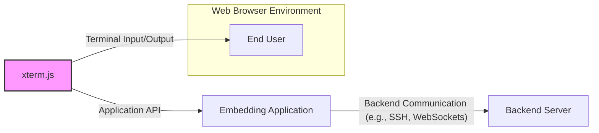
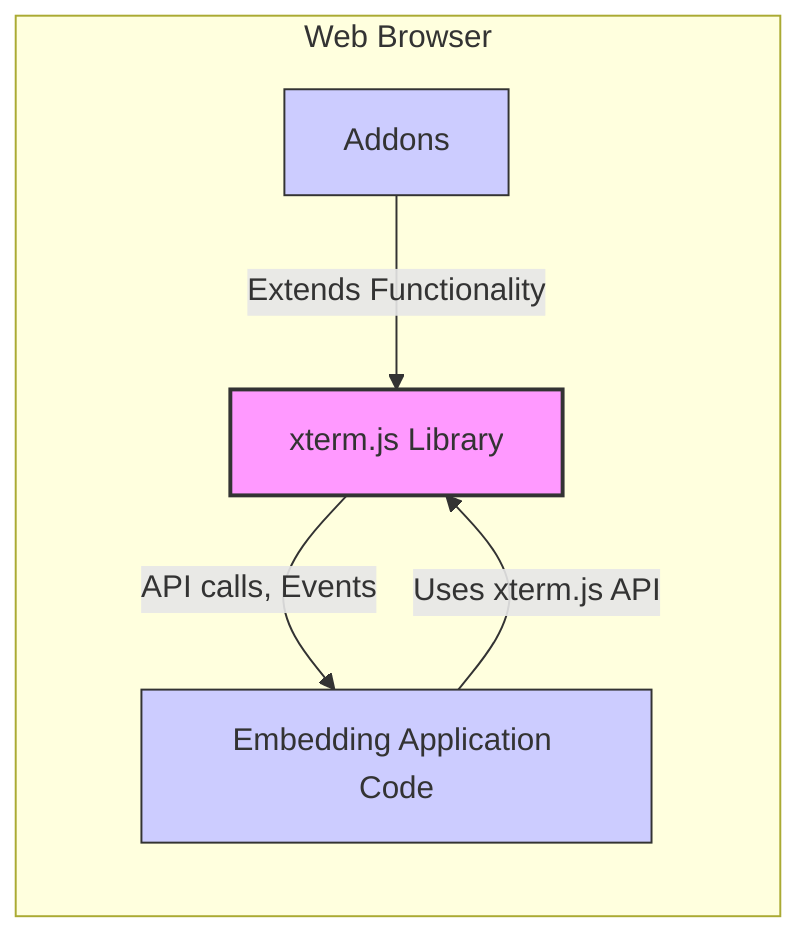
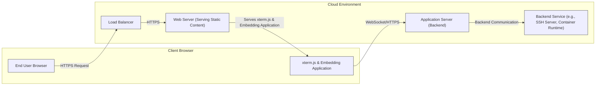

# BUSINESS POSTURE

This project, xterm.js, provides a terminal emulator component for web applications. It enables developers to integrate fully featured terminals into browser-based tools and applications.

Business Priorities and Goals:
- Provide a stable and reliable terminal emulation experience in web browsers.
- Offer high performance to ensure a responsive and user-friendly terminal interface.
- Maintain broad compatibility across different browsers and operating systems.
- Be easily integrable into various web applications and frameworks.
- Ensure security to protect users and applications that embed xterm.js from potential vulnerabilities.
- Foster an active open-source community to drive development and address issues.

Most Important Business Risks:
- Vulnerabilities in xterm.js could be exploited by malicious actors to gain unauthorized access or execute arbitrary code within applications that use it.
- Performance issues or instability could negatively impact user experience and the reputation of applications embedding xterm.js.
- Lack of compatibility with certain browsers or operating systems could limit the reach and usability of applications using xterm.js.
- Difficult integration could deter developers from adopting xterm.js.
- Security breaches could lead to data leaks, system compromise, and reputational damage for both xterm.js and its users.
- A decline in community support could slow down development, bug fixes, and security updates, increasing risks over time.

# SECURITY POSTURE

Existing Security Controls:
- security control: Code review process for contributions (location: likely GitHub pull request reviews, details not explicitly provided).
- security control: Unit and integration testing (location: project repository, details not explicitly provided).
- security control: Use of TypeScript for type safety (location: project codebase).
- accepted risk: Reliance on browser security model for isolation (location: inherent to web browser environment).
- accepted risk: Vulnerabilities in dependencies (location: inherent to npm ecosystem, mitigation strategies not explicitly provided).

Recommended Security Controls:
- recommended security control: Implement automated Static Application Security Testing (SAST) in the CI/CD pipeline to identify potential vulnerabilities in the code.
- recommended security control: Implement automated Dependency Scanning to identify and manage vulnerabilities in third-party libraries.
- recommended security control: Conduct regular Dynamic Application Security Testing (DAST) on applications embedding xterm.js to identify runtime vulnerabilities.
- recommended security control: Establish a clear vulnerability disclosure and response process.
- recommended security control: Perform penetration testing on applications embedding xterm.js to simulate real-world attacks.
- recommended security control: Implement Content Security Policy (CSP) in applications embedding xterm.js to mitigate cross-site scripting (XSS) risks.
- recommended security control: Security focused code review guidelines and training for developers.

Security Requirements:
- Authentication:
    - requirement: xterm.js itself does not handle user authentication. Applications embedding xterm.js are responsible for implementing appropriate authentication mechanisms to verify user identities before granting access to terminal functionalities.
- Authorization:
    - requirement: xterm.js itself does not handle authorization. Applications embedding xterm.js are responsible for implementing authorization controls to ensure users only have access to permitted commands and resources within the terminal environment.
- Input Validation:
    - requirement: xterm.js must rigorously validate and sanitize all input received from the terminal, including user input and control sequences, to prevent command injection, escape sequences vulnerabilities, and other input-related attacks.
    - requirement: Input validation should be applied at multiple layers, including client-side (within xterm.js) and server-side (in the backend application processing terminal input).
- Cryptography:
    - requirement: xterm.js itself may not directly implement cryptography, but if it handles sensitive data or communication, it should leverage secure cryptographic libraries and protocols provided by the browser environment (e.g., Web Crypto API, HTTPS).
    - requirement: Applications embedding xterm.js should use HTTPS to secure communication between the browser and backend servers, especially when transmitting sensitive terminal data.

# DESIGN

## C4 CONTEXT

Context Diagram Elements:

- Element:
    - Name: End User
    - Type: Person
    - Description: Users who interact with web applications that embed xterm.js. They use the terminal interface provided by xterm.js to interact with the application or backend systems.
    - Responsibilities: Provide input to the terminal, view output from the terminal.
    - Security controls: User authentication and authorization are handled by the Embedding Application and Backend Server, not directly by the End User. End users are expected to use secure devices and networks.

- Element:
    - Name: xterm.js
    - Type: Software System
    - Description: A JavaScript library that provides a terminal emulator component for web applications. It handles terminal rendering, input processing, and communication with the embedding application.
    - Responsibilities: Emulate a terminal interface in the browser, handle user input and display output, provide an API for embedding applications to interact with the terminal.
    - Security controls: Input validation, output sanitization, adherence to browser security model, potentially CSP integration in embedding applications.

- Element:
    - Name: Embedding Application
    - Type: Software System
    - Description: A web application that integrates xterm.js to provide terminal functionality. This could be an IDE, a cloud console, or any other web-based tool requiring a terminal interface.
    - Responsibilities: Integrate xterm.js into its user interface, manage communication between xterm.js and backend servers, implement application-specific logic and security controls.
    - Security controls: User authentication, authorization, session management, input validation (application-level), output handling, CSP, secure communication with backend servers.

- Element:
    - Name: Backend Server
    - Type: Software System
    - Description: A server-side system that the Embedding Application communicates with, often via the terminal interface provided by xterm.js. This could be a shell server, a container runtime, or any other backend service.
    - Responsibilities: Execute commands received from the terminal, provide output to the terminal, manage resources and data.
    - Security controls: Server-side input validation, command authorization, access control, secure communication protocols (e.g., SSH, WebSockets with TLS), system hardening, monitoring and logging.

## C4 CONTAINER

Container Diagram Elements:

- Element:
    - Name: xterm.js Library
    - Type: Library (JavaScript)
    - Description: The core xterm.js library, responsible for terminal emulation logic, rendering, input processing, and API exposure.
    - Responsibilities: Terminal emulation, input/output handling, API for embedding applications, core security functions like input validation and output sanitization.
    - Security controls: Input validation, output sanitization, adherence to browser security model, code review, unit testing, SAST.

- Element:
    - Name: Addons
    - Type: Library (JavaScript)
    - Description: Optional addons that extend the functionality of xterm.js, such as web links, search, or image support.
    - Responsibilities: Provide additional features to xterm.js, integrate with the core library.
    - Security controls: Addons should undergo security review, input validation within addons, adherence to xterm.js security principles.

- Element:
    - Name: Embedding Application Code
    - Type: Application Code (JavaScript)
    - Description: The JavaScript code of the web application that embeds and utilizes the xterm.js library.
    - Responsibilities: Integrate xterm.js into the application UI, handle communication with backend servers, implement application-specific logic and security controls, manage user authentication and authorization.
    - Security controls: Application-level input validation, authorization, session management, secure communication with backend servers, CSP, integration with xterm.js security features.

## DEPLOYMENT

Deployment Scenario: Web Application in Cloud Environment

Deployment Diagram Elements:

- Element:
    - Name: End User Browser
    - Type: Client Device
    - Description: The web browser running on the end user's device, where the xterm.js library and embedding application are executed.
    - Responsibilities: Rendering the web application, executing JavaScript code, providing user interface, communicating with web servers.
    - Security controls: Browser security features (sandboxing, same-origin policy, etc.), user-installed security software.

- Element:
    - Name: xterm.js & Embedding Application
    - Type: Software Component (JavaScript)
    - Description: The xterm.js library and the embedding application code running within the user's browser.
    - Responsibilities: Terminal emulation, application logic, communication with backend servers.
    - Security controls: Browser security model, CSP, input validation, output sanitization.

- Element:
    - Name: Load Balancer
    - Type: Network Device
    - Description: Distributes incoming HTTPS requests across multiple Web Servers for scalability and availability.
    - Responsibilities: Load balancing, SSL termination, traffic routing.
    - Security controls: SSL/TLS encryption, DDoS protection, access control lists.

- Element:
    - Name: Web Server (Serving Static Content)
    - Type: Server
    - Description: Web servers responsible for serving static content, including HTML, CSS, JavaScript files (including xterm.js and the embedding application).
    - Responsibilities: Serving static files, handling HTTPS requests.
    - Security controls: HTTPS configuration, access controls, security hardening, regular patching.

- Element:
    - Name: Application Server (Backend)
    - Type: Server
    - Description: Application servers running the backend logic of the embedding application, handling communication with xterm.js and backend services.
    - Responsibilities: Application logic, session management, communication with backend services, processing terminal commands.
    - Security controls: Server-side input validation, authorization, secure communication protocols (e.g., WebSockets with TLS), access control, security hardening, regular patching, monitoring and logging.

- Element:
    - Name: Backend Service (e.g., SSH Server, Container Runtime)
    - Type: Server/Service
    - Description: Backend services that the application server interacts with, providing the actual terminal environment (e.g., SSH server for remote shell access, container runtime for container interaction).
    - Responsibilities: Executing terminal commands, managing resources, providing access to underlying systems.
    - Security controls: Service-specific security controls (e.g., SSH key management, container security), access control, security hardening, regular patching, monitoring and logging.

## BUILD

```mermaid
flowchart LR
    A["Developer"] --> B["Code Repository (GitHub)"];
    B --> C["CI/CD Pipeline (GitHub Actions)"];
    C --> D["Build Process (npm install, compile, test)"];
    D --> E["Security Checks (SAST, Dependency Scan, Linting)"];
    E --> F["Build Artifacts (npm package)"];
    F --> G["Package Registry (npm registry)"];
    style A fill:#eef,stroke:#333,stroke-width:1px
    style B fill:#eef,stroke:#333,stroke-width:1px
    style C fill:#eef,stroke:#333,stroke-width:1px
    style D fill:#eef,stroke:#333,stroke-width:1px
    style E fill:#eef,stroke:#333,stroke-width:1px
    style F fill:#eef,stroke:#333,stroke-width:1px
    style G fill:#eef,stroke:#333,stroke-width:1px
    linkStyle 0,1,2,3,4,5 stroke:#333,stroke-width:1px
```

Build Process Description:

The build process for xterm.js is likely automated using a CI/CD pipeline, such as GitHub Actions, triggered by code changes pushed to the GitHub repository.

Build Process Steps and Security Controls:

- Developer:
    - Description: Developers write code, commit changes, and push them to the code repository.
    - Security controls: Developer workstations should be secured, developers should follow secure coding practices, code reviews are performed before merging code.

- Code Repository (GitHub):
    - Description: Hosts the source code of xterm.js, including code history and collaboration features.
    - Security controls: Access control to the repository, branch protection, audit logging, vulnerability scanning of repository configurations.

- CI/CD Pipeline (GitHub Actions):
    - Description: Automates the build, test, and release process.
    - Security controls: Secure pipeline configuration, access control to pipeline definitions, secret management for credentials used in the pipeline, pipeline code review.

- Build Process (npm install, compile, test):
    - Description: Steps involved in building xterm.js from source code, including installing dependencies, compiling TypeScript code, running unit and integration tests.
    - Security controls: Use of trusted build environments, verification of dependencies (e.g., using lock files), build process isolation.

- Security Checks (SAST, Dependency Scan, Linting):
    - Description: Automated security checks integrated into the build process to identify potential vulnerabilities and code quality issues. Includes Static Application Security Testing (SAST), Dependency Scanning to identify vulnerable dependencies, and code linting for code style and potential errors.
    - Security controls: Configuration of security scanning tools, regular updates of scanning tools and vulnerability databases, fail-build policies based on security scan results.

- Build Artifacts (npm package):
    - Description: The packaged output of the build process, typically an npm package ready for distribution.
    - Security controls: Signing of build artifacts, integrity checks (e.g., checksums), secure storage of build artifacts.

- Package Registry (npm registry):
    - Description: Public registry where the xterm.js npm package is published and distributed.
    - Security controls: Package signing, vulnerability scanning of published packages, access control to publishing accounts, monitoring for malicious packages.

# RISK ASSESSMENT

Critical Business Processes:
- Embedding terminal functionality into web applications.
- Providing a reliable and secure terminal experience for end users of these applications.
- Maintaining the reputation and trust of the xterm.js project and its maintainers.

Data to Protect and Sensitivity:
- Terminal Input and Output Data: Sensitivity depends on the context of the embedding application. It can range from non-sensitive commands to highly sensitive data like passwords, API keys, or confidential information displayed or entered in the terminal.
- Source Code: Sensitive as it contains the intellectual property and logic of xterm.js. Compromise could lead to malicious modifications and supply chain attacks.
- Build Pipeline and Release Infrastructure: Sensitive as compromise could lead to the distribution of malicious versions of xterm.js.
- Developer Credentials and Access Keys: Sensitive as they can be used to compromise the code repository, build pipeline, and release process.

# QUESTIONS & ASSUMPTIONS

Questions:
- What are the most common use cases for xterm.js? Understanding the use cases will help prioritize security requirements and threat modeling scenarios.
- What are the typical backend systems that xterm.js-based terminals interact with? (e.g., SSH servers, container runtimes, cloud APIs). This will inform the context diagram and identify relevant attack vectors.
- Are there specific security requirements or compliance standards that xterm.js needs to adhere to? (e.g., OWASP, PCI DSS, HIPAA).
- What is the process for handling vulnerability reports and security patches in xterm.js?
- Are there any specific addons or integrations that are considered high-risk from a security perspective?
- What is the expected risk appetite for applications embedding xterm.js? (e.g., startup vs. Fortune 500 company).

Assumptions:
- BUSINESS POSTURE: The primary business goal is to provide a secure, stable, and performant terminal emulator for web applications. Security is a high priority due to the potential impact of vulnerabilities.
- SECURITY POSTURE: While some basic security controls are likely in place (code review, testing), there is room for improvement in automated security testing, dependency management, and formal vulnerability response processes. The project relies heavily on the browser security model.
- DESIGN: xterm.js is primarily a client-side JavaScript library. Security responsibilities are shared between xterm.js, embedding applications, and backend systems. Secure communication and input validation are critical security aspects. The build process is assumed to be automated and hosted on GitHub Actions.