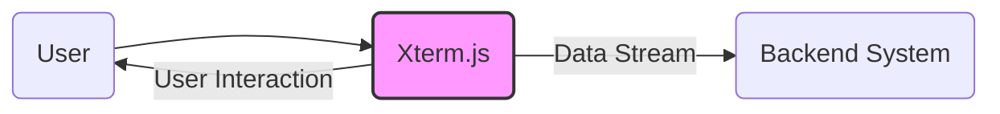
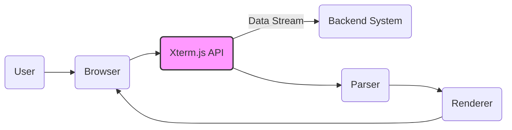
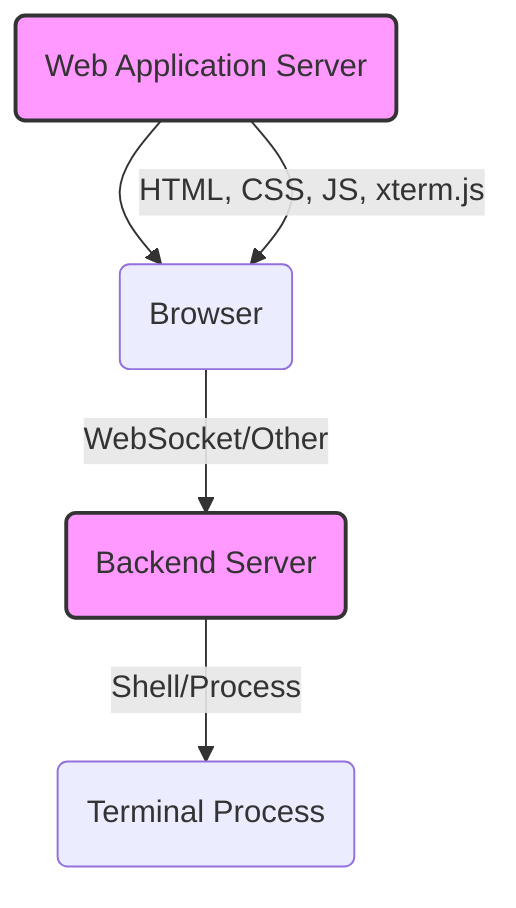
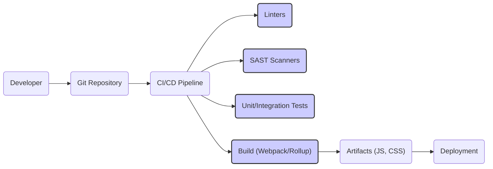

# Project Design Document: xterm.js

## BUSINESS POSTURE

Xterm.js is a front-end component that provides a terminal emulator in the browser. It's widely used in web applications that require terminal-like functionality, such as online IDEs, web-based SSH clients, and container management dashboards.

Priorities:

*   Provide a fast and reliable terminal emulator in the browser.
*   Support a wide range of terminal features and escape sequences.
*   Maintain compatibility with various browsers and operating systems.
*   Ensure the security of the terminal emulator, especially when used in sensitive contexts.
*   Provide a well-documented and easy-to-use API.
*   Maintain an active and responsive open-source community.

Goals:

*   Be the leading browser-based terminal emulator.
*   Enable developers to easily integrate terminal functionality into their web applications.
*   Provide a user experience comparable to native terminal applications.

Business Risks:

*   Security vulnerabilities in the terminal emulator could be exploited to gain unauthorized access to the host system or the application using it. This is the most critical risk.
*   Performance issues or bugs could lead to a poor user experience and damage the reputation of the project.
*   Lack of compatibility with certain browsers or operating systems could limit the adoption of the project.
*   Failure to keep up with evolving terminal standards and features could make the project obsolete.
*   Inability to maintain an active open-source community could slow down development and bug fixing.

## SECURITY POSTURE

Existing Security Controls:

*   security control: Input sanitization: The project appears to implement input sanitization to prevent injection of malicious escape sequences or control characters. (Described in documentation and code).
*   security control: Regular expressions to handle escape sequences: Xterm.js uses regular expressions to parse and handle escape sequences, which can be a potential source of vulnerabilities if not carefully crafted. (Described in code).
*   security control: Limited access to browser APIs: Xterm.js operates within the constraints of the browser's security model, limiting its access to system resources. (Implicit in browser-based execution).
*   security control: Community code review: As an open-source project, xterm.js benefits from community code review, which can help identify and address security vulnerabilities. (Implicit in open-source nature).
*   security control: Issue tracking and vulnerability reporting: The project uses GitHub Issues for tracking bugs and security vulnerabilities, allowing for public disclosure and collaborative resolution. (Described in GitHub repository).

Accepted Risks:

*   accepted risk: Reliance on browser security model: Xterm.js relies on the underlying security of the browser and its JavaScript engine. Vulnerabilities in the browser could potentially compromise the terminal emulator.
*   accepted risk: Potential for denial-of-service: Malicious input or excessive data could potentially cause performance issues or crashes in the terminal emulator, leading to a denial-of-service.
*   accepted risk: Complexity of terminal emulation: The complexity of terminal emulation and the wide range of supported escape sequences create a large attack surface, making it challenging to guarantee complete security.

Recommended Security Controls:

*   security control: Implement a robust Content Security Policy (CSP): A well-defined CSP can help mitigate the risk of cross-site scripting (XSS) and other injection attacks.
*   security control: Conduct regular security audits and penetration testing: Periodic security assessments can help identify and address potential vulnerabilities before they are exploited.
*   security control: Consider using a WebAssembly (Wasm) based approach for performance-critical and security-sensitive parts of the code: Wasm can provide better performance and a more secure execution environment.
*   security control: Implement fuzz testing: Fuzz testing can help identify unexpected behavior and potential vulnerabilities by providing random or malformed input to the terminal emulator.
*   security control: Provide clear security guidelines and best practices for developers using xterm.js: This can help developers avoid introducing security vulnerabilities in their applications.

Security Requirements:

*   Authentication: Not directly applicable to xterm.js itself, as it's a front-end component. Authentication is the responsibility of the application using xterm.js.
*   Authorization: Not directly applicable to xterm.js itself. Authorization is the responsibility of the application using xterm.js.
*   Input Validation:
    *   Strictly validate and sanitize all input received from the user and from the connected terminal/process.
    *   Implement a whitelist-based approach for allowed escape sequences and control characters.
    *   Reject any input that does not conform to the expected format.
*   Cryptography: Not directly applicable to xterm.js itself, as it primarily deals with text rendering. Cryptography (e.g., for secure connections like SSH) is the responsibility of the application using xterm.js or underlying protocols.
*   Output Encoding:
    *   Ensure that all output rendered in the terminal is properly encoded to prevent XSS vulnerabilities.
    *   Consider using a contextual output encoding library to automatically handle different encoding contexts.

## DESIGN

### C4 CONTEXT

Element Description:

*   Element:
    *   Name: User
    *   Type: Person
    *   Description: Represents a user interacting with the terminal emulator.
    *   Responsibilities: Provides input to the terminal, views output from the terminal.
    *   Security controls: None (relies on browser security and application-level security).

*   Element:
    *   Name: Xterm.js
    *   Type: Software System
    *   Description: The xterm.js library, a front-end terminal emulator component.
    *   Responsibilities: Renders terminal output, handles user input, manages terminal state, processes escape sequences.
    *   Security controls: Input sanitization, regular expressions for escape sequence handling, limited access to browser APIs, community code review, issue tracking and vulnerability reporting.

*   Element:
    *   Name: Backend System
    *   Type: Software System
    *   Description: A backend system that provides data to and receives data from xterm.js. This could be a shell, a remote server via SSH, or any other process that interacts with a terminal.
    *   Responsibilities: Executes commands, provides output to xterm.js, receives input from xterm.js.
    *   Security controls: Dependent on the specific backend system (e.g., SSH security, shell access controls).

### C4 CONTAINER

Element Description:

*   Element:
    *   Name: User
    *   Type: Person
    *   Description: Represents a user interacting with the terminal emulator.
    *   Responsibilities: Provides input to the terminal, views output from the terminal.
    *   Security controls: None (relies on browser security and application-level security).

*   Element:
    *   Name: Browser
    *   Type: Web Browser
    *   Description: The web browser that hosts the xterm.js component.
    *   Responsibilities: Provides the execution environment for xterm.js, handles rendering, manages user interaction.
    *   Security controls: Browser security model, sandboxing, same-origin policy.

*   Element:
    *   Name: Xterm.js API
    *   Type: API
    *   Description: The public API of the xterm.js library.
    *   Responsibilities: Provides methods for creating and interacting with terminal instances, handling events, and configuring options.
    *   Security controls: Input validation, API design to limit access to sensitive functionality.

*   Element:
    *   Name: Backend System
    *   Type: Software System
    *   Description: A backend system that provides data to and receives data from xterm.js.
    *   Responsibilities: Executes commands, provides output to xterm.js, receives input from xterm.js.
    *   Security controls: Dependent on the specific backend system.

*   Element:
    *   Name: Parser
    *   Type: Component
    *   Description: Parses incoming data streams, including escape sequences and control characters.
    *   Responsibilities: Interprets escape sequences, updates terminal state, handles character encoding.
    *   Security controls: Input sanitization, robust parsing logic to prevent vulnerabilities related to malformed input.

*   Element:
    *   Name: Renderer
    *   Type: Component
    *   Description: Renders the terminal output in the browser.
    *   Responsibilities: Draws characters, handles colors and styles, manages the display buffer.
    *   Security controls: Output encoding to prevent XSS.

### DEPLOYMENT

Possible Deployment Solutions:

1.  **Embedded in a Web Application:** Xterm.js is typically embedded directly within a web application. The application serves the HTML, CSS, and JavaScript files, including xterm.js.
2.  **CDN:** Xterm.js can be included from a Content Delivery Network (CDN), which can improve loading times and reduce server load.
3.  **NPM Package:** Xterm.js is available as an NPM package, allowing developers to easily integrate it into their projects using package managers like npm or yarn.

Chosen Deployment Solution (Embedded in a Web Application):

Element Description:

*   Element:
    *   Name: Web Application Server
    *   Type: Server
    *   Description: The server that hosts the web application containing xterm.js.
    *   Responsibilities: Serves static files (HTML, CSS, JavaScript, xterm.js), handles application logic.
    *   Security controls: Standard web server security measures (e.g., HTTPS, firewalls, input validation).

*   Element:
    *   Name: Browser
    *   Type: Web Browser
    *   Description: The user's web browser.
    *   Responsibilities: Executes the web application, renders xterm.js, handles user interaction.
    *   Security controls: Browser security model, sandboxing, same-origin policy.

*   Element:
    *   Name: Backend Server
    *   Type: Server
    *   Description: The server that hosts the backend process (e.g., shell, SSH server) that xterm.js connects to.
    *   Responsibilities: Manages the terminal process, handles communication with xterm.js.
    *   Security controls: Dependent on the specific backend system (e.g., SSH security, shell access controls).

*   Element:
    *   Name: Terminal Process
    *   Type: Process
    *   Description: The actual terminal process (e.g., bash, zsh) running on the backend server.
    *   Responsibilities: Executes commands, provides output.
    *   Security controls: Operating system security, user permissions.

### BUILD

Build Process Description:

1.  **Developer:** Developers write code and commit it to the Git repository.
2.  **Git Repository:** The code is stored in a Git repository (GitHub).
3.  **CI/CD Pipeline:** A CI/CD pipeline (e.g., GitHub Actions, Travis CI) is triggered on each commit.
4.  **Linters:** Linters (e.g., ESLint) are run to check for code style and potential errors.
5.  **SAST Scanners:** Static Application Security Testing (SAST) scanners (e.g., SonarQube) are run to identify potential security vulnerabilities in the code.
6.  **Unit/Integration Tests:** Unit and integration tests are executed to ensure the code functions correctly.
7.  **Build (Webpack/Rollup):** A build tool (e.g., Webpack, Rollup) bundles the JavaScript and CSS files into optimized artifacts.
8.  **Artifacts (JS, CSS):** The build process produces the final JavaScript and CSS files that are deployed.
9.  **Deployment:** The artifacts are deployed to the web application server.

Security Controls in Build Process:

*   security control: Code review: All code changes are reviewed by other developers before being merged.
*   security control: Linting: Linters enforce code style and help prevent common errors.
*   security control: SAST scanning: SAST scanners automatically identify potential security vulnerabilities.
*   security control: Automated testing: Unit and integration tests ensure code quality and prevent regressions.
*   security control: Dependency management: Dependencies are carefully managed and checked for known vulnerabilities.
*   security control: Build automation: The build process is fully automated, reducing the risk of manual errors.

## RISK ASSESSMENT

Critical Business Processes:

*   Providing a reliable and secure terminal emulation experience within web applications.
*   Enabling developers to integrate terminal functionality into their applications seamlessly.
*   Maintaining the reputation and trust of the xterm.js project.

Data to Protect:

*   User input: Sensitivity: High (could contain sensitive commands, passwords, or other confidential information).
*   Terminal output: Sensitivity: Variable (depends on the context; could contain sensitive data from the backend system).
*   Application data: Sensitivity: Variable (depends on the application using xterm.js; xterm.js itself does not store application data).
*   Source code: Sensitivity: Medium (contains the logic of the terminal emulator, including potential vulnerabilities).

## QUESTIONS & ASSUMPTIONS

Questions:

*   What specific backend systems will xterm.js be used with? (This will affect the security considerations for the backend integration.)
*   What level of terminal emulation fidelity is required? (Supporting more advanced features increases the attack surface.)
*   What are the specific security requirements of the applications that will be using xterm.js?
*   Are there any specific compliance requirements (e.g., PCI DSS, HIPAA) that need to be considered?
*   What is the expected user base and usage patterns? (This can help prioritize performance and scalability considerations.)

Assumptions:

*   BUSINESS POSTURE: The primary use case for xterm.js is to provide a terminal-like experience within web applications, and security is a high priority.
*   SECURITY POSTURE: The development team is committed to following secure coding practices and addressing security vulnerabilities promptly.
*   DESIGN: Xterm.js will be primarily used with trusted backend systems, although the potential for untrusted connections exists. The browser's security model provides a baseline level of protection. The build process includes security checks.