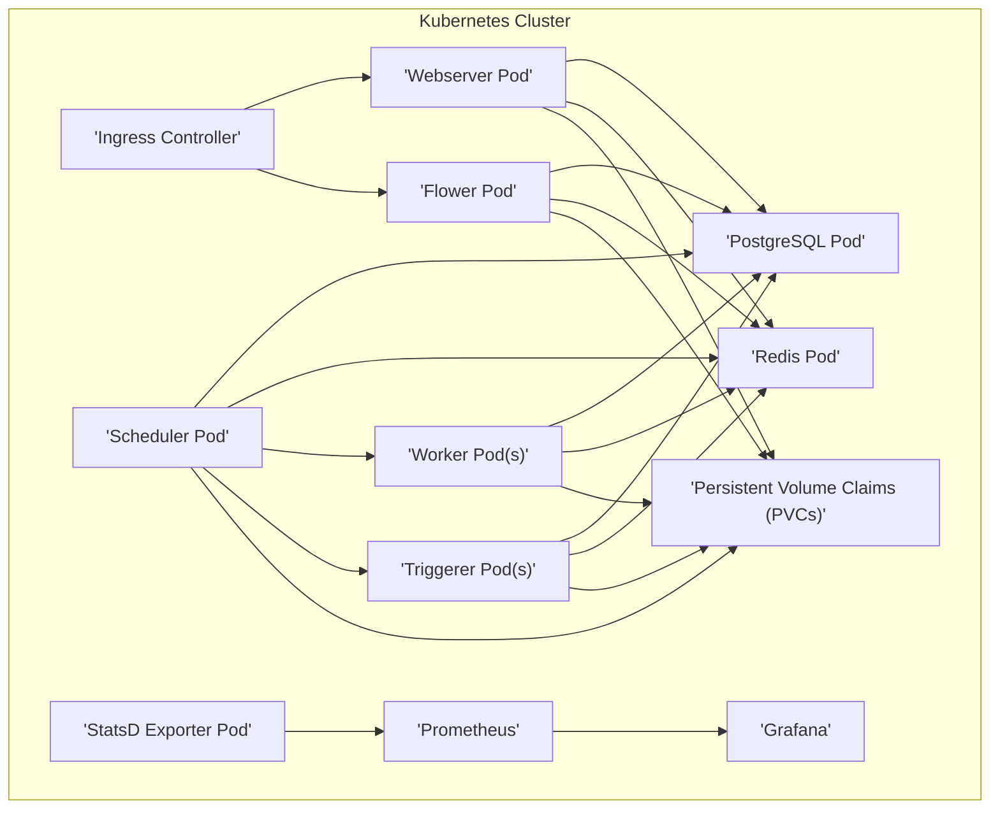

# Project Design Document: Airflow Helm Charts

**Version:** 1.1
**Date:** October 26, 2023
**Author:** AI Software Architect

## 1. Introduction

This document details the design of the Airflow Helm Charts project, available at [https://github.com/airflow-helm/charts](https://github.com/airflow-helm/charts). These Helm charts provide a standardized and configurable method for deploying Apache Airflow on a Kubernetes cluster. This design document serves as a foundation for understanding the system's architecture and will be used for subsequent threat modeling. The goal is to provide a clear understanding of the deployed components, their interactions, and potential security considerations.

## 2. Goals and Objectives

The primary objectives of the Airflow Helm Charts are to:

* **Simplified Deployment:** Offer a straightforward and repeatable process for deploying production-ready Airflow on Kubernetes using Helm.
* **Configuration Flexibility:** Enable extensive customization of the Airflow deployment to meet diverse requirements and environments.
* **Dependency Management:** Automate the deployment and management of necessary dependencies like PostgreSQL and Redis.
* **Kubernetes Best Practices:** Promote the adoption of Kubernetes best practices for deploying and managing stateful applications like Airflow.
* **Streamlined Upgrades:** Facilitate easier management and upgrading of Airflow deployments through Helm's capabilities.

## 3. Overall Architecture

The Airflow Helm Charts deploy a distributed system within a Kubernetes cluster, orchestrating the standard Airflow components as pods and services.



**Key Architectural Elements:**

* **Kubernetes Foundation:** The underlying container orchestration platform providing resource management and scalability.
* **Helm Packaging:**  Utilizing Helm to package and manage the deployment of all Airflow components and their dependencies.
* **Core Airflow Services:** Deployment of the essential Airflow components: Webserver, Scheduler, and Workers.
* **Supporting Services:** Inclusion of necessary infrastructure like PostgreSQL for metadata and Redis for message brokering.
* **Optional Monitoring:** Integration options for monitoring using Prometheus and Grafana.

## 4. Component Design

This section provides a detailed breakdown of the components deployed by the Helm charts.

### 4.1. Core Airflow Components

* **Webserver:**
    * **Description:** The user interface for Airflow, providing a visual representation of DAGs, task status, logs, and administrative functions.
    * **Kubernetes Resource:** Typically deployed as a `Deployment` or `StatefulSet`.
    * **Functionality:** Serves the Airflow UI, handles user authentication (configurable through various backend options), and interacts with the metadata database (PostgreSQL). It also exposes metrics for monitoring.
    * **Configuration:** Configurable through Helm values for replica count, resource requests/limits, authentication settings, and UI customizations.
* **Scheduler:**
    * **Description:** The brain of Airflow, responsible for parsing DAG files, scheduling tasks based on defined schedules and dependencies, and triggering task execution.
    * **Kubernetes Resource:** Usually deployed as a single replica `Deployment` or `StatefulSet` for leader election.
    * **Functionality:** Continuously monitors DAG definitions, updates task states in the metadata database, and communicates with workers to execute tasks.
    * **Configuration:** Configurable through Helm values for resource requests/limits, scheduler-specific settings, and DAG synchronization parameters.
* **Worker(s):**
    * **Description:** Executes the individual tasks defined within DAGs. Workers pull tasks from a queue (e.g., Celery) or are directly invoked by the scheduler (e.g., Kubernetes Executor).
    * **Kubernetes Resource:** Deployed as a `Deployment` or `StatefulSet`, scalable based on workload demands.
    * **Functionality:** Receives task execution requests, executes the defined operations, and reports task status back to the scheduler.
    * **Configuration:** Highly configurable through Helm values for replica count, resource requests/limits, executor type (Celery, Kubernetes), and worker-specific settings.
* **Triggerer(s) (Optional):**
    * **Description:** A separate service for handling asynchronous events and triggering DAG runs based on external triggers, decoupling trigger logic from the scheduler.
    * **Kubernetes Resource:** Deployed as a `Deployment` or `StatefulSet` when enabled.
    * **Functionality:** Listens for external events (e.g., sensor updates, API calls) and signals the scheduler to initiate DAG runs.
    * **Configuration:** Enabled and configured through Helm values, including resource allocation and trigger-specific settings.
* **Flower (Optional):**
    * **Description:** A web-based tool for monitoring and managing Celery workers when using the Celery Executor.
    * **Kubernetes Resource:** Deployed as a `Deployment` when enabled.
    * **Functionality:** Provides real-time monitoring of Celery queues, worker status, and task execution details.
    * **Configuration:** Enabled and configured through Helm values, including resource allocation and access settings.

### 4.2. Supporting Infrastructure

* **PostgreSQL:**
    * **Description:** The metadata database for Airflow, storing critical information about DAGs, tasks, runs, connections, and user configurations.
    * **Kubernetes Resource:** Typically deployed as a `StatefulSet` to ensure data persistence.
    * **Functionality:** Provides persistent and reliable storage for Airflow's operational data.
    * **Configuration:** Configurable through Helm values for resource requests/limits, persistence settings (e.g., storage class), and PostgreSQL-specific configurations.
* **Redis:**
    * **Description:** Used as a message broker for communication between Airflow components, particularly when using the Celery Executor. It facilitates task queuing and communication.
    * **Kubernetes Resource:** Can be deployed as a `Deployment` or `StatefulSet`, depending on persistence requirements.
    * **Functionality:** Provides a reliable message queue for distributing tasks to workers.
    * **Configuration:** Configurable through Helm values for resource requests/limits, persistence settings, and Redis-specific configurations.
* **Ingress Controller:**
    * **Description:** Manages external access to the Airflow webserver, allowing users to access the UI from outside the Kubernetes cluster.
    * **Kubernetes Resource:** An `Ingress` resource is defined, relying on an existing Ingress Controller in the cluster.
    * **Functionality:** Routes external HTTP/HTTPS traffic to the webserver service, often handling SSL termination.
    * **Configuration:** Configurable through Helm values for hostname, TLS settings, and annotations specific to the Ingress Controller.
* **Persistent Volume Claims (PVCs):**
    * **Description:** Requests for persistent storage for components requiring data persistence, such as PostgreSQL and potentially for storing logs or DAG files.
    * **Kubernetes Resource:** `PersistentVolumeClaim` resources are created based on the configuration.
    * **Functionality:** Abstract the underlying storage implementation, allowing components to request storage without needing to know the specifics of the storage provider.
    * **Configuration:** Configurable through Helm values for storage size, access modes, and storage class.
* **StatsD Exporter (Optional):**
    * **Description:** Exposes Airflow metrics in the StatsD format, making them accessible to monitoring systems like Prometheus.
    * **Kubernetes Resource:** Deployed as a `Deployment` when enabled.
    * **Functionality:** Collects metrics from Airflow components and forwards them to a StatsD endpoint.
    * **Configuration:** Enabled and configured through Helm values, including resource allocation and the StatsD endpoint.
* **Prometheus (Optional):**
    * **Description:** A powerful monitoring and alerting system that can scrape metrics exposed by Airflow components (via the StatsD exporter or Prometheus exporter).
    * **Kubernetes Resource:** Typically deployed separately within the cluster, and the Helm chart provides configuration for integration.
    * **Functionality:** Collects time-series data, allowing for visualization, alerting, and analysis of Airflow's performance and health.
    * **Configuration:** Integration is configured through Helm values, specifying service discovery mechanisms and scrape configurations.
* **Grafana (Optional):**
    * **Description:** A data visualization and dashboarding tool used to create insightful dashboards from metrics collected by Prometheus, providing a visual overview of Airflow's operation.
    * **Kubernetes Resource:** Typically deployed separately, and the Helm chart may provide example dashboards or configuration hints.
    * **Functionality:** Allows users to create custom dashboards to monitor key Airflow metrics and identify potential issues.
    * **Configuration:** Integration involves configuring Prometheus as a data source within Grafana, often done outside the Helm chart itself.

## 5. Data Flow

This section illustrates the key data flows within the deployed Airflow environment.

```mermaid
graph LR
    subgraph "Airflow Operations"
        direction LR
        A["'User'"]
        B["'Webserver'"]
        C["'Scheduler'"]
        D["'Worker'"]
        E["'PostgreSQL'"]
        F["'Redis'"]
        G["'DAG Files (Persistent Volume)'"]
        H["'Task Logs (Persistent Volume)'"]

        A -- \"View UI, Trigger DAGs\" --> B
        B -- \"Read/Write Metadata\" --> E
        C -- \"Read DAGs\" --> G
        C -- \"Schedule Tasks\" --> E
        C -- \"Queue Tasks (Celery)\" --> F
        C -- \"Direct Task Execution (Kubernetes Executor)\" --> D
        D -- \"Execute Tasks\" --> I["External Systems"]
        D -- \"Write Logs\" --> H
        D -- \"Update Task Status\" --> E
    end
```

**Key Data Flows:**

* **DAG Definition and Loading:** DAG files are typically stored in a persistent volume accessible by the scheduler, which parses them to understand the workflow.
* **User Interaction and Control:** Users interact with the webserver to view DAGs, trigger runs, manage connections, and monitor task status.
* **Scheduling and Task Assignment:** The scheduler reads DAG definitions, schedules tasks based on dependencies and schedules, and updates the metadata database. It then assigns tasks to workers (via Redis for Celery or directly for Kubernetes Executor).
* **Task Execution:** Workers receive task execution requests and execute the defined operations, interacting with external systems as needed.
* **Metadata Management:** All core Airflow state, including DAG definitions, task status, and connection details, is stored and managed in the PostgreSQL database.
* **Logging and Monitoring:** Task logs are written to a persistent volume for auditing and debugging. Metrics are collected by Prometheus (potentially via the StatsD exporter) for monitoring and alerting.

## 6. Security Considerations

This section highlights crucial security considerations for the Airflow deployment using these Helm charts, forming the basis for threat modeling.

* **Authentication and Authorization:**
    * **Webserver Authentication:**  Implementing robust authentication mechanisms for the Airflow webserver, such as using Flask-AppBuilder with appropriate authentication backends (e.g., database authentication, OAuth 2.0, OpenID Connect).
    * **Kubernetes RBAC:**  Strictly defining and enforcing Role-Based Access Control (RBAC) policies within the Kubernetes cluster to limit the permissions of Airflow components and other applications.
    * **Database Access Control:** Securing access to the PostgreSQL database by using strong passwords, network policies, and potentially connection pooling.
    * **Redis Security:**  Securing the Redis instance, potentially using authentication and network segmentation.
* **Network Security:**
    * **Kubernetes Network Policies:** Implementing Network Policies to restrict network traffic between pods and namespaces, limiting potential attack surfaces.
    * **Ingress Security:**  Securing the Ingress resource with TLS/SSL certificates (using HTTPS), implementing authentication at the Ingress level (if needed), and protecting against common web vulnerabilities.
    * **Service Exposure Minimization:**  Avoiding unnecessary exposure of internal services and carefully considering the security implications of any exposed services.
* **Secrets Management:**
    * **Secure Secret Storage:**  Utilizing Kubernetes Secrets, HashiCorp Vault, or other secure secret management solutions to store sensitive information like database passwords, API keys, and connection strings. Avoid storing secrets directly in Helm values or environment variables.
    * **Principle of Least Privilege for Secrets:**  Granting only the necessary permissions to access secrets to specific components.
* **Data Security:**
    * **Encryption at Rest:**  Encrypting data stored in persistent volumes used by PostgreSQL and potentially for logs, using Kubernetes Secret Encryption or cloud provider encryption features.
    * **Encryption in Transit:**  Ensuring all communication between components and external access uses TLS/SSL encryption.
* **Dependency and Image Security:**
    * **Regular Image Updates:** Regularly updating the base container images used for Airflow components to patch known vulnerabilities.
    * **Dependency Scanning:**  Implementing processes to scan Python dependencies for vulnerabilities and update them proactively.
    * **Supply Chain Security:**  Verifying the integrity and authenticity of container images and dependencies.
* **Airflow Configuration Hardening:**
    * **Reviewing Default Settings:**  Reviewing and hardening default Airflow configurations, such as disabling insecure features and setting appropriate security headers.
    * **Leveraging Airflow Security Features:**  Utilizing Airflow's built-in security features, such as the Fernet key for encrypting connections and sensitive data.
* **Resource Limits and Quotas:**
    * **Preventing Resource Exhaustion:** Setting appropriate resource limits and requests for pods to prevent denial-of-service attacks and resource contention.
    * **Namespace Quotas:**  Utilizing namespace quotas to limit resource consumption within the Airflow namespace.
* **Pod Security Standards:**
    * **Enforcing Security Best Practices:**  Utilizing Kubernetes Pod Security Admission (replacing Pod Security Policies) to enforce security best practices for pods, such as restricting privileged containers and enforcing read-only root filesystems.

## 7. Deployment Considerations

* **Helm Value Customization:**  Leveraging the extensive configurable parameters within the Helm chart to tailor the deployment to specific needs, including resource allocation, security settings, and feature flags.
* **Namespace Isolation:**  Deploying Airflow in a dedicated Kubernetes namespace to provide logical isolation and improve security.
* **Persistent Storage Configuration:**  Properly configuring persistent volume provisioning and storage classes for stateful components like PostgreSQL and Redis.
* **Executor Selection and Configuration:**  Carefully choosing the appropriate Airflow executor (e.g., Sequential, Local, Celery, Kubernetes) based on workload requirements and infrastructure constraints, and configuring it accordingly.
* **Monitoring and Logging Integration:**  Planning for integration with existing monitoring and logging infrastructure, configuring Prometheus scraping and log forwarding.
* **Upgrade Strategy and Rollbacks:**  Developing a clear strategy for upgrading Airflow versions and the underlying infrastructure, including procedures for rolling back in case of issues.

## 8. Future Considerations

* **Advanced Security Integrations:** Exploring integrations with advanced security tools and services, such as service meshes for enhanced network security and observability platforms for deeper security insights.
* **Enhanced Authentication and Authorization Options:**  Investigating and implementing more sophisticated authentication and authorization mechanisms for the Airflow UI and API.
* **Support for Multi-Tenancy:**  Exploring options for supporting multi-tenancy within the Airflow deployment, ensuring proper isolation and resource management.
* **Automated Security Scanning and Compliance:**  Integrating automated security scanning tools into the CI/CD pipeline for the Helm charts and ensuring compliance with relevant security standards.
* **Improved Observability and Auditing:**  Enhancing observability through more detailed metrics and tracing, and implementing comprehensive auditing of user actions and system events.

This improved design document provides a more detailed and comprehensive overview of the Airflow Helm Charts project. It offers a clearer understanding of the system's architecture, components, data flow, and security considerations, making it a valuable resource for threat modeling and ongoing development.