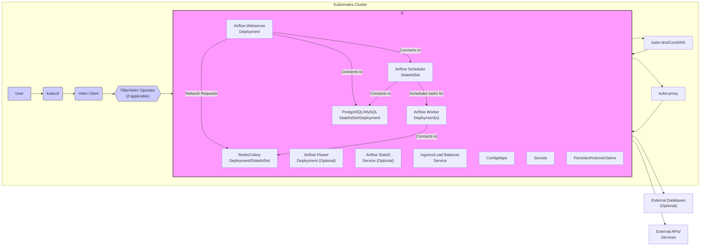
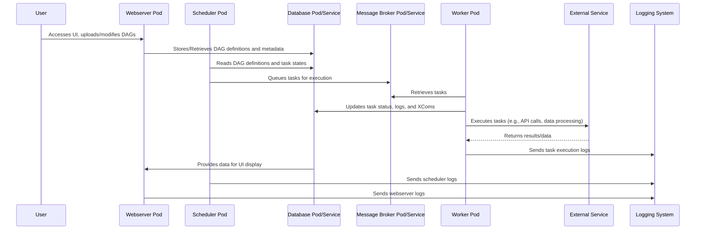

# Project Design Document: Airflow Helm Charts

**Version:** 1.1
**Date:** October 26, 2023
**Author:** AI Software Architecture Expert

## 1. Introduction

This document provides an enhanced architectural design of the Airflow Helm Charts project, located at [https://github.com/airflow-helm/charts](https://github.com/airflow-helm/charts). This design document aims to offer a more detailed and comprehensive understanding of the project's structure, components, and their interactions, specifically for use in subsequent threat modeling activities. The focus remains on the architecture and components as defined *within* these Helm charts, detailing how they facilitate the deployment and configuration of Apache Airflow on Kubernetes. This document does not delve into the internal workings of Apache Airflow itself, but rather how the charts orchestrate its deployment within a Kubernetes environment.

## 2. Goals and Scope

The primary goal of the `airflow-helm/charts` project is to offer a robust, flexible, and well-defined method for deploying Apache Airflow on Kubernetes leveraging Helm, the Kubernetes package manager. This design document specifically scopes to the architectural elements and components defined and managed by these Helm charts. It provides a detailed breakdown of the core Airflow components and their deployment configurations as implemented by the charts. The scope includes the Kubernetes resources created and managed by the charts but excludes the internal logic and code of the Apache Airflow application itself.

## 3. Target Audience

This document is primarily intended for:

*   Security engineers and architects responsible for conducting threat modeling exercises.
*   Developers and operators involved in deploying, managing, and troubleshooting Airflow instances using these Helm charts.
*   Individuals seeking an in-depth understanding of the architectural design and deployment patterns facilitated by the Airflow Helm Charts project.

## 4. System Overview

The Airflow Helm Charts project provides a curated collection of Helm charts designed to streamline the deployment of various Apache Airflow components within a Kubernetes cluster. The fundamental principle is to encapsulate the necessary Kubernetes resources (Deployments, Services, StatefulSets, ConfigMaps, Secrets, etc.) and their configurations into reusable and customizable chart packages.

Here's a more detailed architectural diagram illustrating the relationships between components:

**Key Components:**

*   **User:** The individual or automated system initiating interactions with the Helm charts (e.g., deploying, upgrading, managing).
*   **kubectl:** The Kubernetes command-line interface used to communicate with the Kubernetes API server.
*   **Helm Client:** The command-line tool used by the user to interact with Helm.
*   **Tiller/Helm Operator (if applicable):** In Helm v2, Tiller ran inside the cluster. Helm v3 and later are client-only, but a Helm Operator might be used for GitOps workflows.
*   **Kubernetes Cluster:** The underlying container orchestration platform where the Airflow components are deployed and managed.
*   **Airflow Namespace:** A dedicated logical namespace within the Kubernetes cluster to isolate the Airflow deployment.
*   **Airflow Webserver Deployment:** Manages the deployment of the Airflow webserver pods, responsible for providing the user interface for monitoring and managing workflows.
*   **Airflow Scheduler StatefulSet:** Manages the deployment of the Airflow scheduler pod, responsible for parsing DAGs, scheduling tasks, and triggering workflow runs. The use of a StatefulSet ensures stable identity and persistent storage if needed.
*   **Airflow Worker Deployment(s):** Manages the deployment of Airflow worker pods, which execute the individual tasks defined in the DAGs. Multiple worker deployments might exist for different queues or resource requirements.
*   **Airflow Flower Deployment (Optional):** Deploys Flower, a web-based real-time monitor for Celery workers, providing insights into task execution.
*   **Airflow StatsD Service (Optional):** Provides a service endpoint for collecting Airflow metrics using the StatsD protocol.
*   **PostgreSQL/MySQL StatefulSet/Deployment:** Deploys the metadata database (typically PostgreSQL or MySQL) required by Airflow to store DAG definitions, task history, and other operational data. The charts support deploying this within the cluster or connecting to an external database.
*   **Redis/Celery Deployment/StatefulSet:** Deploys the message broker (typically Redis or RabbitMQ when using CeleryExecutor) used for task queuing and communication between the scheduler and workers.
*   **Ingress/Load Balancer Service:** Exposes the Airflow webserver to external users via an Ingress resource or a LoadBalancer service, providing routing and external access.
*   **ConfigMaps:** Kubernetes resources used to inject configuration data into containers as files, environment variables, or command-line arguments.
*   **Secrets:** Kubernetes resources used to securely store and manage sensitive information like database credentials, API keys, and other secrets.
*   **PersistentVolumeClaims (PVCs):** Requests for persistent storage, often used for the Airflow database, logs, and potentially for sharing data between tasks.
*   **kube-dns/CoreDNS:** The DNS service within the Kubernetes cluster, allowing components to discover each other via service names.
*   **kube-proxy:** A network proxy that runs on each node in the cluster, implementing the Kubernetes Service concept.
*   **External Databases (Optional):** Databases running outside the Kubernetes cluster that Airflow might connect to.
*   **External APIs/Services:** External services that Airflow tasks might interact with.

## 5. Component Details

This section provides a more granular description of the key components within the Airflow Helm Charts and the Kubernetes resources they manage.

*   **Helm Charts Structure:**
    *   The charts are organized into a main chart and potentially sub-charts for individual components (e.g., `webserver`, `scheduler`, `workers`, `postgresql`, `redis`).
    *   Each chart contains:
        *   `Chart.yaml`: Metadata about the chart.
        *   `values.yaml`: Default configuration values that can be overridden during deployment.
        *   `templates/`: A directory containing YAML templates that define the Kubernetes resources to be created. These templates use the Go templating language and access values from `values.yaml`.
        *   `requirements.yaml` or `Chart.lock`: Defines dependencies on other charts.
    *   The `values.yaml` file is crucial for customizing the deployment, including resource requests, replica counts, image versions, and security settings.

*   **Kubernetes Resource Details:**
    *   **Deployments:**
        *   Used for stateless components like the `webserver`, `workers`, and `flower`.
        *   Define the desired number of replicas, update strategy (e.g., RollingUpdate), and container specifications (image, ports, environment variables, volume mounts).
        *   Leverage ReplicaSets to manage the lifecycle of the pods.
    *   **StatefulSets:**
        *   Used for stateful components like the `scheduler` and the database (`postgresql`/`mysql`) when deployed within the cluster.
        *   Provide stable network identities (persistent hostnames) and ordered, graceful deployment and scaling.
        *   Typically associated with PersistentVolumeClaims to provide persistent storage for data.
    *   **Services:**
        *   Provide a stable abstraction for accessing applications running in pods.
        *   Different types are used:
            *   `ClusterIP`: Exposes the service on an internal IP address within the cluster, making it reachable only from within the cluster. Used for internal communication between Airflow components.
            *   `NodePort`: Exposes the service on each Node's IP at a static port.
            *   `LoadBalancer`: Provisions an external load balancer in cloud environments to expose the service externally. Typically used for the Airflow webserver.
    *   **ConfigMaps:**
        *   Used to inject non-sensitive configuration data into pods.
        *   The charts use ConfigMaps to manage Airflow configuration files (`airflow.cfg`), initialization scripts, and environment variables.
    *   **Secrets:**
        *   Used to manage sensitive information like database passwords, broker credentials, and API keys.
        *   The charts often rely on Kubernetes Secrets for managing these credentials. Best practices involve using SealedSecrets or external secret management for enhanced security.
    *   **PersistentVolumeClaims (PVCs):**
        *   Requests for persistent storage, dynamically provisioned by a PersistentVolume provisioner in the cluster.
        *   Used for the Airflow database to ensure data persistence across pod restarts. May also be used for worker logs or shared data volumes.
    *   **Ingress:**
        *   Manages external access to services within the cluster, typically for the Airflow webserver.
        *   Allows routing based on hostnames or paths.
        *   Often used in conjunction with TLS/SSL certificates for secure access.

*   **Airflow Components (as deployed by the charts):**
    *   **Webserver:** Serves the Airflow UI, allowing users to manage DAGs, monitor tasks, and view logs. Configuration options include authentication methods, UI settings, and resource limits.
    *   **Scheduler:** Responsible for scheduling and triggering DAG runs based on defined schedules and dependencies. Configuration includes scheduler settings, resource allocation, and executor type.
    *   **Worker:** Executes the individual tasks defined in the DAGs. The number of workers can be scaled based on workload. Configuration includes executor settings, resource limits, and dependencies.
    *   **Flower (Optional):** Provides a real-time monitoring interface for Celery workers, showing active tasks, worker status, and task history.
    *   **StatsD (Optional):** Collects and exposes Airflow metrics in the StatsD format, which can be consumed by monitoring systems.
    *   **Init Containers:** Run before the main application containers to perform initialization tasks, such as database migrations, setting up file permissions, or downloading dependencies.

*   **Dependencies (as managed by the charts):**
    *   **Database (PostgreSQL/MySQL):** The charts provide options to deploy a PostgreSQL or MySQL database within the cluster using StatefulSets or connect to an externally managed database. Configuration includes database credentials, resource requests, and persistence settings.
    *   **Message Broker (Redis/Celery):** The charts support deploying Redis or using Celery's built-in broker for task queuing. Configuration includes connection details and persistence settings for Redis.

## 6. Data Flow

The following sequence diagram provides a more detailed illustration of the data flow within an Airflow deployment managed by these Helm charts, including interactions with external services and logging:

**Key Data Flows:**

*   **DAG Definition and Management:** Users interact with the webserver UI to create, update, and manage DAG definitions. These definitions are persisted in the metadata database.
*   **Task Scheduling and Queuing:** The scheduler periodically parses DAGs from the database. Based on defined schedules and dependencies, it queues tasks for execution by placing messages in the message broker.
*   **Task Execution and State Updates:** Worker pods retrieve tasks from the message broker, execute the defined operations, and update the task status, logs, and XCom (cross-communication) values in the metadata database.
*   **Interaction with External Services:** Worker pods often interact with external services (databases, APIs, cloud storage) as part of task execution.
*   **Logging and Monitoring:** Various components (webserver, scheduler, workers) generate logs, which are typically sent to a centralized logging system for monitoring and analysis.
*   **UI Data Retrieval:** The webserver retrieves data from the metadata database to display the status of DAGs, tasks, and logs to the user.

## 7. Security Considerations

This section provides a more detailed breakdown of security considerations relevant to the architecture defined by the Airflow Helm Charts.

*   **Kubernetes Security Best Practices:**
    *   **RBAC (Role-Based Access Control):** Properly configure RBAC to restrict access to the Airflow namespace and its resources based on the principle of least privilege. Define specific roles for different users and service accounts.
    *   **Network Policies:** Implement network policies to segment network traffic within the cluster, limiting communication between pods and namespaces. This can restrict the blast radius of a potential compromise.
    *   **Pod Security Admission (formerly Pod Security Policies):** Enforce security policies at the pod level to restrict container capabilities, prevent privilege escalation, and control access to host resources.
    *   **Resource Quotas and Limits:** Set appropriate resource quotas and limits for the Airflow namespace to prevent resource exhaustion and denial-of-service attacks.

*   **Secrets Management:**
    *   **Kubernetes Secrets:** While Kubernetes Secrets provide basic encryption at rest, consider using more robust solutions for sensitive data.
    *   **Sealed Secrets:** Encrypt Secrets that can be safely stored in Git repositories.
    *   **External Secret Management (e.g., HashiCorp Vault, AWS Secrets Manager):** Integrate with external secret management systems to securely store and manage credentials, injecting them into pods at runtime. Avoid hardcoding secrets in `values.yaml`.

*   **Airflow Specific Security:**
    *   **Webserver Authentication and Authorization:** Configure strong authentication mechanisms for the Airflow webserver (e.g., OAuth, OpenID Connect, Kerberos). Implement proper authorization to control access to different features and DAGs.
    *   **Connections Management:** Securely manage Airflow connections, which store credentials for external systems. Consider using environment variables or secret backends for connection details.
    *   **DAG Security:** Implement controls to manage who can create, modify, and trigger DAGs.
    *   **Executor Security:** The choice of executor (e.g., CeleryExecutor, KubernetesExecutor) impacts security. KubernetesExecutor offers better isolation by running tasks in separate pods.

*   **Network Security:**
    *   **TLS/SSL Encryption:** Ensure TLS/SSL is enabled for the Ingress controller to encrypt traffic to the Airflow webserver. Consider using cert-manager for automated certificate management.
    *   **Mutual TLS (mTLS):** For sensitive internal communication between Airflow components, consider implementing mTLS.
    *   **Firewall Rules:** Configure firewall rules at the Kubernetes node level or using a service mesh to restrict network access.

*   **Image Security:**
    *   **Trusted Base Images:** Use official and trusted base images for Airflow and its dependencies.
    *   ** নিয়মিত Vulnerability Scanning:** Regularly scan container images for vulnerabilities using tools like Trivy or Clair and update images as needed.
    *   **Minimize Image Layers:** Keep container images lean by removing unnecessary packages to reduce the attack surface.

*   **Logging and Auditing:**
    *   **Centralized Logging:** Implement a centralized logging system to collect logs from all Airflow components for monitoring and security analysis.
    *   **Audit Logging:** Enable audit logging at the Kubernetes API server level to track API calls and identify potential security breaches.

*   **Supply Chain Security:**
    *   **Chart Provenance:** Verify the provenance and integrity of the Helm charts.
    *   **Dependency Management:** Carefully manage dependencies and ensure they are from trusted sources.

## 8. Assumptions and Constraints

*   The underlying Kubernetes cluster is assumed to be configured according to security best practices.
*   The default configurations provided by the Helm charts may need to be adjusted to meet specific security requirements.
*   Users are responsible for securely managing their Kubernetes cluster and the underlying infrastructure.
*   Configuration options within the `values.yaml` file directly impact the security posture and must be reviewed carefully.
*   Specific security configurations (e.g., authentication methods, TLS certificates) may require manual configuration or integration with external services.

## 9. Future Considerations

*   Enhanced integration with external secret management solutions and secret rotation mechanisms.
*   Improved support for fine-grained authorization and access control within Airflow.
*   Automated security scanning and vulnerability assessment of deployed components.
*   More comprehensive monitoring and alerting dashboards with security-focused metrics.
*   Strengthening supply chain security through chart signing and verification.
*   Simplified configuration options for implementing mutual TLS between Airflow components.

This enhanced document provides a more detailed and comprehensive architectural overview of the Airflow Helm Charts project, specifically tailored for threat modeling activities. It delves deeper into the Kubernetes resources, data flows, and security considerations, offering a more robust foundation for identifying potential vulnerabilities.