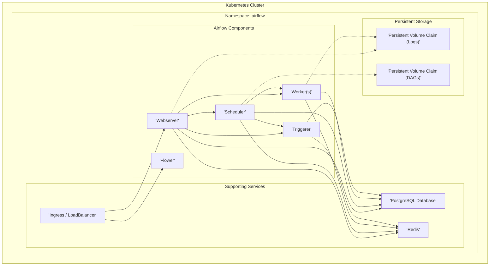

# Project Design Document: Airflow Helm Charts Deployment (Improved)

## 1. Introduction

This document provides an enhanced design overview of a system deployed using the Airflow Helm Charts project from [https://github.com/airflow-helm/charts](https://github.com/airflow-helm/charts). Building upon the initial design, this improved version offers greater detail and a stronger focus on security considerations, making it more effective as a foundation for threat modeling activities. It outlines the system architecture, key components, data flow, and security aspects relevant to a typical Airflow deployment on Kubernetes using these Helm charts, specifically emphasizing potential vulnerabilities and security best practices.

## 2. System Overview

The Airflow Helm Charts project simplifies and standardizes the deployment of Apache Airflow, a workflow orchestration platform, on a Kubernetes cluster. These charts offer a highly configurable and scalable method for deploying Airflow and its dependencies, leveraging Kubernetes' inherent orchestration and resource management capabilities.

This design document continues to focus on a common deployment scenario utilizing the Celery Executor, PostgreSQL database for metadata, and Redis for both caching and as the Celery message broker. While the Helm charts offer extensive customization options, this document will maintain its focus on a representative and widely used architecture to ensure clarity and relevance for threat modeling.

## 3. System Architecture

The system architecture remains microservices-based, with Airflow components deployed as distinct Kubernetes deployments and services. External access is typically managed via a Kubernetes Ingress or LoadBalancer, providing controlled entry points to the system.



**Components (Detailed):**

*   **Kubernetes Cluster:** The foundational infrastructure providing container orchestration, resource management, and a platform for deploying and managing the Airflow system. Security of the Kubernetes cluster itself is paramount.
*   **Namespace: airflow:** A dedicated Kubernetes namespace serves as a logical boundary, isolating Airflow resources and improving security by limiting the blast radius of potential security incidents.
*   **Airflow Components (Security Focused Descriptions):**
    *   **Webserver:** The user-facing interface, handling user authentication, DAG management, and visualization.  It's a critical component from a security perspective as it's exposed externally and handles user interactions. Vulnerabilities here could lead to unauthorized access and control.
    *   **Scheduler:** The brain of Airflow, responsible for DAG parsing, scheduling, and task orchestration. Compromise of the scheduler could disrupt workflow execution and potentially lead to unauthorized task execution.
    *   **Worker(s):** The execution engines for Airflow tasks. Workers execute code defined in DAGs, making them a key target for malicious DAGs or code injection attacks. Worker security is crucial to prevent unauthorized actions and data breaches.
    *   **Flower:** A Celery monitoring tool, providing insights into worker and task status. While primarily for monitoring, if exposed without proper authentication, it could reveal sensitive operational information.
    *   **Triggerer:** (Optional, depending on Airflow version and configuration)  Handles event-based DAG triggering.  If misconfigured or vulnerable, it could be exploited to trigger unintended DAG runs or bypass scheduling controls.
*   **Supporting Services (Security Focused Descriptions):**
    *   **PostgreSQL Database:** Stores all Airflow metadata, including sensitive information like connections, variables, and user credentials (if local authentication is used). Database security is paramount as it's the central repository of Airflow's operational data.
    *   **Redis:** Used as a message broker for Celery and potentially for caching. If not secured, Redis could be exploited to intercept or manipulate task messages, or to access cached data.
    *   **Ingress / LoadBalancer:** The entry point for external traffic to the Webserver and Flower.  It's a critical security boundary and must be properly configured to handle TLS termination, access control, and protection against web attacks.
*   **Persistent Storage (Security Focused Descriptions):**
    *   **Persistent Volume Claim (Logs):** Stores task logs, which can contain sensitive data depending on the workflows. Access control and secure storage of logs are important for data confidentiality and auditability.
    *   **Persistent Volume Claim (DAGs):** Stores DAG files, which define workflows and can contain sensitive configurations, credentials, or business logic. Protecting DAG storage from unauthorized access and modification is crucial.

## 4. Component Details (Enhanced Security Focus)

### 4.1. Webserver

*   **Functionality:**
    *   Provides the primary user interface for Airflow operations.
    *   Enables DAG and task management, monitoring, and manual triggering.
    *   Handles user authentication and authorization (configurable - consider using external providers like OAuth or LDAP for enhanced security).
    *   Serves API endpoints for programmatic interaction (API security is critical).
*   **Dependencies:**
    *   PostgreSQL Database (for all metadata access - secure database credentials are vital).
    *   Redis (for caching and potentially Celery communication - secure Redis access).
    *   Scheduler (for DAG and task information - secure communication channels).
    *   Worker(s) (indirectly, for task status updates - ensure integrity of status updates).
*   **Data Handled (Security Perspective):**
    *   **User credentials:** (If local authentication is used - avoid storing credentials locally if possible).  Handle with strong hashing and salting.
    *   **DAG definitions:** (Read from DAG storage - ensure DAG storage is protected). DAGs can contain sensitive business logic and configurations.
    *   **Task instance states and logs:** (Read from database and log storage - access control to logs is important). Logs can contain sensitive data processed by tasks.
    *   **Configuration settings:** (Sensitive settings should be managed securely, ideally using Kubernetes Secrets or external secret management).
*   **Security Considerations & Potential Threats:**
    *   **Authentication and Authorization Bypass:** Weak or misconfigured authentication can lead to unauthorized access. Implement strong authentication and RBAC.
    *   **Exposure to the internet:**  Direct internet exposure increases the attack surface. Use a WAF (Web Application Firewall) and implement rate limiting.
    *   **Cross-Site Scripting (XSS) vulnerabilities:**  Potential vulnerabilities in the UI could be exploited to inject malicious scripts. Regularly scan and patch for XSS vulnerabilities. Implement Content Security Policy (CSP).
    *   **Session management vulnerabilities:** Weak session management can lead to session hijacking. Use secure session cookies and implement session timeouts.
    *   **API Security vulnerabilities:** Unsecured API endpoints can be exploited for unauthorized data access or manipulation. Implement API authentication and authorization (e.g., API keys, OAuth).
    *   **Information Disclosure:**  Error messages or verbose logging could reveal sensitive information. Configure logging to minimize information disclosure.

### 4.2. Scheduler

*   **Functionality:**
    *   Parses DAG files from DAG storage (ensure secure access to DAG storage).
    *   Schedules DAG runs based on defined schedules and dependencies.
    *   Monitors task states and triggers task execution via Celery.
    *   Updates task states in the metadata database (secure database connection).
*   **Dependencies:**
    *   PostgreSQL Database (for metadata storage and access - secure database credentials).
    *   Redis (for Celery communication - secure Redis connection).
    *   Worker(s) (for task execution - ensure secure task execution environment).
    *   DAG storage (for DAG file access - access control to DAG storage).
*   **Data Handled (Security Perspective):**
    *   **DAG definitions:** (Read from DAG storage - DAGs can contain sensitive information).
    *   **Task schedules and dependencies:** (Scheduling logic itself might reveal business processes).
    *   **Task instance states:** (Written to database - task states can indicate workflow progress and success/failure).
*   **Security Considerations & Potential Threats:**
    *   **Unauthorized DAG Access:** If DAG storage is not properly secured, attackers could modify or inject malicious DAGs. Implement strict access control to DAG storage.
    *   **Database Credential Compromise:** Compromised database credentials would grant full access to Airflow metadata. Securely manage and rotate database credentials.
    *   **Denial-of-Service (DoS):**  Flawed DAG parsing or scheduling logic could be exploited to overload the scheduler. Implement resource limits and DAG validation.
    *   **Scheduler Compromise:**  Compromise of the scheduler could lead to complete control over workflow execution, including unauthorized task execution and data manipulation. Implement strong security measures for the scheduler pod and its runtime environment.
    *   **Message Queue Manipulation:** If Redis is compromised, attackers could manipulate task messages, leading to incorrect task execution or denial of service. Secure Redis access and consider using TLS for Redis communication.

### 4.3. Worker(s)

*   **Functionality:**
    *   Executes tasks assigned by the Scheduler via the Celery broker (Redis - secure communication with Redis).
    *   Runs the actual code defined in Airflow tasks (sandboxing and security of task execution environment is critical).
    *   Logs task execution details to log storage (secure log storage and access control).
    *   Updates task states in the metadata database (secure database connection).
*   **Dependencies:**
    *   PostgreSQL Database (for metadata updates - secure database credentials).
    *   Redis (Celery broker for task queue - secure Redis connection).
    *   Scheduler (indirectly, for task assignment - trust the scheduler).
    *   Log storage (for writing task logs - secure log storage).
    *   **External systems and services accessed by tasks:** (Security of these external connections is paramount - use secure protocols and credential management).
*   **Data Handled (Security Perspective):**
    *   **Task execution code:** (From DAGs - potential for malicious DAGs). Implement DAG review and validation processes.
    *   **Task parameters and variables:** (Can contain sensitive data - handle securely).
    *   **Data processed by tasks:** (Can be highly sensitive - implement data loss prevention measures and access control within tasks).
    *   **Task logs:** (Written to log storage - logs can contain sensitive data).
*   **Security Considerations & Potential Threats:**
    *   **Malicious DAG Execution:** Workers execute arbitrary code from DAGs.  This is a primary attack vector. Implement DAG review processes, code scanning, and consider sandboxing task execution environments (e.g., using Kubernetes securityContext, gVisor).
    *   **Data Exfiltration:** Tasks could be designed to exfiltrate sensitive data. Implement network policies to restrict worker outbound traffic and monitor network activity.
    *   **Credential Theft:** Tasks might require credentials to access external systems. Securely manage and inject credentials into worker pods using Kubernetes Secrets or external secret management solutions. Avoid hardcoding credentials in DAGs.
    *   **Resource Exhaustion:** Malicious or poorly written DAGs could consume excessive resources, leading to DoS. Implement resource limits for worker pods and monitor resource usage.
    *   **Container Escape:**  Although less likely in a well-configured Kubernetes environment, container escape vulnerabilities in the container runtime could allow attackers to gain access to the underlying node. Keep container runtime and Kubernetes nodes patched and up-to-date.

### 4.4. Flower

*   **Functionality:**
    *   Provides real-time monitoring of Celery workers and tasks.
    *   Allows for task inspection, control (e.g., task cancellation, worker shutdown), and management.
    *   Offers insights into Celery queue status and worker performance.
*   **Dependencies:**
    *   Redis (Celery broker for monitoring - secure Redis access).
    *   Worker(s) (for monitoring worker status and activity).
*   **Data Handled (Security Perspective):**
    *   **Celery task and worker status information:** (Operational data, potential information disclosure if exposed).
    *   **Task execution details:** (Can reveal workflow logic and task parameters).
*   **Security Considerations & Potential Threats:**
    *   **Unauthorized Access to Monitoring Data:** If Flower is exposed without authentication, attackers could gain insights into Airflow operations and potentially identify vulnerabilities. Implement authentication and authorization for Flower access.
    *   **Control Plane Abuse:** Flower allows for task and worker control. Unauthorized access could lead to task cancellation, worker shutdown, or other disruptive actions. Restrict access to Flower control features to authorized users only.
    *   **Information Disclosure:** Monitoring data itself could reveal sensitive information about workflows and task execution. Limit access to Flower to authorized personnel.

### 4.5. Triggerer (Optional)

*   **Functionality:**
    *   Listens for external events (e.g., from message queues, APIs - secure integration with external event sources).
    *   Triggers DAG runs based on configured event triggers.
    *   Decouples DAG execution from time-based schedules.
*   **Dependencies:**
    *   PostgreSQL Database (for metadata access and trigger configuration - secure database credentials).
    *   Redis (potentially for communication - secure Redis connection).
    *   **External event sources:** (Security of connections to external event sources is critical - use secure protocols and authentication).
*   **Data Handled (Security Perspective):**
    *   **Event trigger configurations:** (Trigger configurations might reveal business logic).
    *   **Event data from external sources:** (Event data could be sensitive and needs to be handled securely).
*   **Security Considerations & Potential Threats:**
    *   **Unauthorized Triggering:** If event sources are not properly authenticated, attackers could inject malicious events to trigger unintended DAG runs. Implement strong authentication and authorization for event sources.
    *   **Malicious Event Injection:**  Attackers could inject malicious event data to manipulate DAG execution or trigger vulnerabilities in DAG code. Validate and sanitize event data before processing.
    *   **Triggerer Compromise:** Compromise of the triggerer could allow attackers to control DAG execution based on external events. Secure the triggerer pod and its runtime environment.

### 4.6. PostgreSQL Database

*   **Functionality:**
    *   Stores all Airflow metadata (critical component for system operation and security).
*   **Dependencies:**
    *   All Airflow components (Webserver, Scheduler, Workers, Triggerer - all components rely on database availability and integrity).
*   **Data Handled (Security Perspective):**
    *   **Highly sensitive Airflow metadata:** (DAG definitions, task states, connections, variables, user information - all critical assets).
    *   **Database credentials for Airflow components:** (Secure management of these credentials is paramount).
*   **Security Considerations & Potential Threats:**
    *   **Database Breach:** A database breach would be catastrophic, exposing all Airflow metadata, including potentially sensitive credentials and workflow definitions. Implement strong database security measures:
        *   Strong authentication and authorization.
        *   Encryption at rest and in transit (TLS).
        *   Regular backups and disaster recovery.
        *   Vulnerability management and patching.
        *   Network segmentation to restrict database access.
    *   **Data Integrity Compromise:**  Data manipulation in the database could disrupt Airflow operations and lead to incorrect workflow execution. Implement database integrity checks and access controls.
    *   **Denial-of-Service (DoS):** Database overload or unavailability would cripple the entire Airflow system. Implement database resource limits, monitoring, and high availability configurations.

### 4.7. Redis

*   **Functionality:**
    *   Acts as a message broker for Celery Executor (critical for task distribution and communication).
    *   Potentially used for caching within Airflow components (caching can store sensitive data).
*   **Dependencies:**
    *   Scheduler
    *   Worker(s)
    *   Webserver (potentially for caching)
    *   Flower (for monitoring)
*   **Data Handled (Security Perspective):**
    *   **Celery task messages:** (Messages contain task details and parameters, potentially sensitive).
    *   **Cache data:** (If used for caching, cache can store sensitive data).
*   **Security Considerations & Potential Threats:**
    *   **Message Interception/Manipulation:** If Redis communication is not secured, attackers could intercept or manipulate task messages, leading to incorrect task execution or denial of service. Use TLS for Redis communication and implement Redis authentication.
    *   **Data Breach (Cache):** If Redis is used for caching sensitive data and is compromised, cached data could be exposed. Secure Redis access and consider encrypting cached data.
    *   **Denial-of-Service (DoS):** Redis overload or unavailability would disrupt Celery communication and impact Airflow operations. Implement Redis resource limits, monitoring, and high availability configurations.
    *   **Redis Command Injection:**  Although less likely in typical Airflow usage, vulnerabilities in applications interacting with Redis could potentially lead to Redis command injection. Follow secure coding practices when interacting with Redis.

### 4.8. Ingress / LoadBalancer

*   **Functionality:**
    *   Provides external access to the Airflow Webserver and Flower UI (critical security boundary).
    *   Handles TLS termination (essential for secure communication).
    *   Routes traffic to the appropriate Airflow services based on configured rules.
*   **Dependencies:**
    *   Kubernetes Cluster
    *   Webserver Service
    *   Flower Service (optional)
*   **Data Handled (Security Perspective):**
    *   **User authentication credentials:** (If passed through Ingress - handle securely, prefer redirect-based authentication).
    *   **Web traffic to Airflow UI and API:** (All external interactions pass through Ingress).
*   **Security Considerations & Potential Threats:**
    *   **Exposure to the internet:**  Ingress is directly exposed to the internet, making it a prime target for attacks. Implement robust security measures:
        *   TLS termination and certificate management (use strong ciphers and keep certificates up-to-date).
        *   Web Application Firewall (WAF) to protect against common web attacks (OWASP Top 10).
        *   Rate limiting and traffic management to prevent DDoS attacks.
        *   Regularly update Ingress controller and Kubernetes components to patch vulnerabilities.
    *   **Authentication Bypass:** Misconfigured Ingress rules or vulnerabilities in the Ingress controller could lead to authentication bypass. Securely configure Ingress rules and keep the Ingress controller updated.
    *   **Information Disclosure:**  Error pages or misconfigurations in Ingress could reveal sensitive information. Configure Ingress to minimize information disclosure.

### 4.9. Persistent Volume Claims (Logs & DAGs)

*   **Functionality:**
    *   Provides persistent storage for Airflow logs and DAG files (ensuring data persistence and availability).
*   **Dependencies:**
    *   Kubernetes Cluster
    *   Webserver (for DAG access)
    *   Scheduler (for DAG access)
    *   Worker(s) (for log writing)
*   **Data Handled (Security Perspective):**
    *   **Task logs:** (Potentially sensitive information about workflow execution - access control is important).
    *   **DAG files:** (Containing workflow definitions and potentially sensitive configurations - protect DAG integrity and confidentiality).
*   **Security Considerations & Potential Threats:**
    *   **Unauthorized Access to Logs/DAGs:** If persistent volumes are not properly secured, attackers could gain unauthorized access to logs and DAG files, potentially revealing sensitive data or workflow logic. Implement strict access control to persistent volumes using Kubernetes RBAC and storage provider security features.
    *   **Data Integrity Compromise (DAGs):**  Modification of DAG files by unauthorized users could lead to malicious workflow execution. Implement version control for DAGs and restrict write access to DAG storage.
    *   **Data Loss:** Failure of persistent storage could lead to data loss (logs and DAGs). Implement regular backups and disaster recovery for persistent volumes.
    *   **Data Encryption at Rest:** Logs and DAGs might contain sensitive data. Consider enabling encryption at rest for persistent volumes using storage provider features or Kubernetes encryption providers.

## 5. Data Flow (Improved Diagram)

The data flow diagram is enhanced to explicitly show security boundaries and highlight sensitive data flows.

```mermaid
graph LR
    subgraph "Kubernetes Cluster"
        subgraph "Namespace: airflow"
            subgraph "Persistent Storage (Protected)"
                A["'DAG Persistent Volume'"]
                F["'Log Persistent Volume'"]
            end
            subgraph "Airflow Components"
                B["'Scheduler'"]
                E["'Worker(s)'"]
                G["'Webserver'"]
                J["'Flower'"]
            end
            subgraph "Supporting Services (Secured)"
                C["'PostgreSQL Database'"]
                D["'Redis'"]
            end
        end
        subgraph "External Access (Security Boundary)"
            H["'Ingress / LoadBalancer'"]
            I["'User'"]
        end
    end


    A --> B  "1. DAG Definition Loading (Secure Access)"
    B --> C  "2. Task Scheduling (Metadata - Secure DB Connection)"
    B --> D  "3. Task Assignment (Celery - Secure Connection)"
    D --> E  "4. Task Execution (Celery - Secure Connection)"
    E --> C  "4. Task Execution (Status Update - Secure DB Connection)"
    E --> F  "5. Log Storage (Secure Write Access)"
    C --> G  "6. Web UI Data Retrieval (Secure DB Connection)"
    F --> G  "6. Web UI Log Retrieval (Secure Access)"
    H --> G  "7. Web UI Access (TLS Encrypted)"
    I --> H  "7. Web UI Access (External User)"
    D --> J  "8. Monitoring Data (Secure Connection)"
```

## 6. Deployment Environment (Security Context)

The security of the deployment environment is paramount. Key aspects include:

*   **Kubernetes Security Hardening:**
    *   **Node Security:** Harden Kubernetes nodes, apply security patches, and minimize attack surface.
    *   **Network Policies:** Implement network policies to restrict traffic between pods and namespaces, enforcing least privilege.
    *   **RBAC (Role-Based Access Control):**  Enforce strict RBAC to control access to Kubernetes API and resources, limiting the impact of compromised components.
    *   **Secrets Management:** Utilize Kubernetes Secrets or external secret stores (e.g., HashiCorp Vault, AWS Secrets Manager) for secure management of sensitive credentials. Avoid storing secrets in DAGs or container images.
    *   **Container Image Security:** Scan container images for vulnerabilities and use minimal base images. Implement image signing and verification.
    *   **Security Contexts:**  Apply Kubernetes security contexts to pods to enforce security constraints (e.g., run as non-root user, restrict capabilities).
    *   **Pod Security Policies/Admission Controllers:** Use Pod Security Policies or Admission Controllers (e.g., OPA Gatekeeper, Kyverno) to enforce security policies at pod creation time.
*   **Networking Security:**
    *   **Network Segmentation:** Segment Kubernetes networks to isolate Airflow components and limit lateral movement.
    *   **Ingress/LoadBalancer Security:**  Securely configure Ingress/LoadBalancer as described in section 4.8.
    *   **Service Mesh (Optional, Recommended for Enhanced Security):** Consider using a service mesh (e.g., Istio, Linkerd) for mutual TLS (mTLS), enhanced observability, and fine-grained traffic control.
*   **Storage Security:**
    *   **Persistent Volume Security:** Secure persistent volumes as described in section 4.9. Consider encryption at rest and access control.
*   **Monitoring and Logging (Security Focus):**
    *   **Security Monitoring:** Implement security monitoring and alerting for Kubernetes and Airflow components. Monitor for suspicious activity, security events, and vulnerabilities.
    *   **Centralized Logging:** Centralize logs from all components for security analysis and incident response. Ensure logs are securely stored and access-controlled.
*   **Identity and Access Management (IAM) Integration:**
    *   **External Authentication:** Integrate Airflow authentication with organizational IAM systems (e.g., OAuth, LDAP, SAML) for centralized user management and stronger authentication.
    *   **Kubernetes RBAC Integration with IAM:**  Integrate Kubernetes RBAC with IAM systems for consistent access control across Kubernetes and Airflow.

## 7. Security Considerations (Detailed)

Expanding on the high-level considerations, here are more detailed security aspects:

*   **Authentication and Authorization (Defense in Depth):**
    *   Implement strong authentication for Webserver, Flower, and API access.
    *   Use RBAC within Airflow and Kubernetes to enforce least privilege.
    *   Consider multi-factor authentication (MFA) for Webserver access.
    *   Regularly review and audit user permissions.
*   **Data Protection (Confidentiality and Integrity):**
    *   Encrypt sensitive data at rest (database, persistent volumes, secrets).
    *   Encrypt data in transit (TLS for web traffic, database connections, Redis communication).
    *   Implement data loss prevention (DLP) measures within tasks if handling highly sensitive data.
    *   Regularly back up data and test restore procedures.
*   **Code Execution Security (Sandboxing and Validation):**
    *   Implement DAG review and validation processes.
    *   Scan DAG code for vulnerabilities.
    *   Consider sandboxing task execution environments (Kubernetes securityContext, gVisor).
    *   Implement input validation and sanitization within tasks to prevent injection attacks.
*   **Infrastructure Security (Hardening and Patching):**
    *   Harden Kubernetes nodes and Airflow component containers.
    *   Regularly patch vulnerabilities in Kubernetes, Airflow, dependencies, and underlying infrastructure.
    *   Implement vulnerability scanning and management processes.
*   **Vulnerability Management (Proactive Security):**
    *   Regularly scan Airflow components, Kubernetes, and dependencies for vulnerabilities.
    *   Implement a vulnerability patching process and prioritize critical vulnerabilities.
    *   Subscribe to security advisories for Airflow and Kubernetes.
*   **Monitoring and Logging (Detection and Response):**
    *   Implement comprehensive monitoring of Airflow components, Kubernetes, and supporting services.
    *   Centralize logs for security analysis and incident response.
    *   Set up alerts for security events and suspicious activity.
    *   Develop incident response plans for security breaches.
*   **Network Security (Segmentation and Access Control):**
    *   Implement network segmentation to isolate Airflow components and limit lateral movement.
    *   Use network policies to restrict traffic flow based on least privilege.
    *   Securely configure Ingress/LoadBalancer and firewalls.

## 8. Conclusion

This improved design document provides a more detailed and security-focused overview of an Airflow deployment using Helm charts on Kubernetes. It expands on the initial design by elaborating on security considerations for each component, data flow, and the deployment environment. This enhanced document is now a more robust foundation for a comprehensive threat modeling exercise, enabling a deeper analysis of potential vulnerabilities and the development of effective security controls to mitigate identified risks. The next crucial step is to conduct a structured threat modeling session using this document as input to systematically identify, analyze, and prioritize threats and vulnerabilities, ultimately leading to a more secure and resilient Airflow deployment.