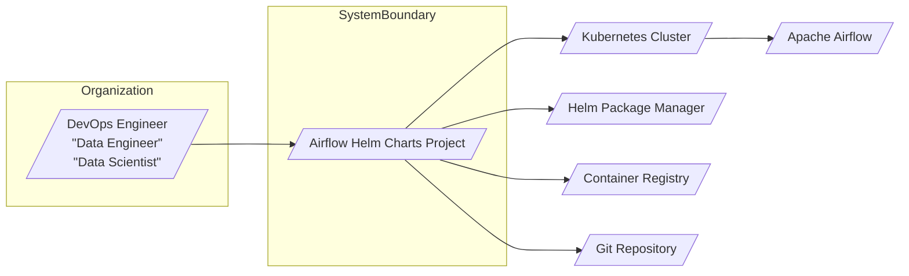
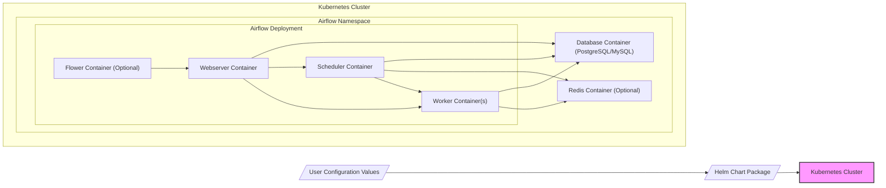

# BUSINESS POSTURE

This project, Airflow Helm Charts, aims to simplify and standardize the deployment of Apache Airflow on Kubernetes. Apache Airflow is a critical platform for orchestrating data pipelines and workflows. Providing well-maintained and configurable Helm charts directly addresses the operational challenges of deploying and managing Airflow in a Kubernetes environment.

Business Priorities and Goals:
- Goal 1: Simplify Airflow Deployment on Kubernetes: Reduce the complexity and effort required to deploy and manage Airflow clusters on Kubernetes.
- Goal 2: Provide Customizable Airflow Deployments: Offer flexible configuration options to adapt Airflow deployments to various use cases and organizational needs.
- Goal 3: Ensure Maintainability and Upgradability: Deliver Helm charts that are actively maintained, updated, and easy to upgrade, reducing operational overhead.
- Goal 4: Promote Adoption of Airflow on Kubernetes: Lower the barrier to entry for organizations wanting to leverage Airflow on Kubernetes.

Business Risks:
- Risk 1: Misconfiguration Vulnerabilities: Incorrectly configured Helm charts could introduce security vulnerabilities in deployed Airflow instances, leading to unauthorized access or data breaches.
- Risk 2: Service Disruption: Issues in the Helm charts or their deployment process could lead to unstable or unavailable Airflow services, impacting critical data pipelines.
- Risk 3: Supply Chain Vulnerabilities: Dependencies within the Helm charts or the container images they deploy could contain vulnerabilities, compromising the security of Airflow deployments.
- Risk 4: Data Integrity and Confidentiality: If not properly secured, Airflow deployments could expose sensitive workflow definitions, connection details, or data processed by workflows.

# SECURITY POSTURE

Existing Security Controls:
- security control: Kubernetes Role-Based Access Control (RBAC) - Implemented and managed by the underlying Kubernetes cluster.
- security control: Network Policies - Can be implemented in Kubernetes to control network traffic between Airflow components and other services.
- security control: Container Image Security Scanning - Container images used in the charts are assumed to be scanned for vulnerabilities (details not specified in input).
- security control: Helm Security Features - Helm's built-in security features, such as chart signing and provenance, might be used (details not specified in input).
- accepted risk: Reliance on User Configuration - Security heavily depends on how users configure the Helm charts and the underlying Kubernetes cluster.
- accepted risk: Dependency Vulnerabilities - Helm charts and container images may contain dependencies with known vulnerabilities.

Recommended Security Controls:
- security control: Helm Chart Security Scanning - Implement automated security scanning of Helm charts for misconfigurations and vulnerabilities before release.
- security control: Dependency Scanning - Implement automated scanning of container images and chart dependencies for known vulnerabilities.
- security control: Secure Defaults - Configure Helm charts with secure default settings, minimizing the attack surface out-of-the-box.
- security control: Security Documentation - Provide comprehensive security documentation for users, outlining best practices for configuring and deploying Airflow securely using the charts.
- security control: Vulnerability Management Process - Establish a clear process for identifying, reporting, and remediating security vulnerabilities in the Helm charts and related components.

Security Requirements:
- Authentication:
    - Requirement: Secure authentication mechanisms for accessing Airflow web UI, API, and other components.
    - Requirement: Integration with existing organizational identity providers (e.g., LDAP, OAuth 2.0) for authentication.
    - Requirement: Secure authentication for communication between Airflow components (e.g., Webserver to Scheduler, Scheduler to Workers).
- Authorization:
    - Requirement: Role-based access control within Airflow to manage permissions for DAGs, connections, variables, and other resources.
    - Requirement: Integration with Kubernetes RBAC to control access to Kubernetes resources used by Airflow.
    - Requirement: Principle of least privilege should be applied to all Airflow components and user roles.
- Input Validation:
    - Requirement: Validate all user inputs to Helm charts to prevent injection attacks and misconfigurations.
    - Requirement: Validate DAG definitions and configurations to prevent malicious or erroneous workflows.
    - Requirement: Input validation for Airflow API endpoints to protect against injection and other input-based vulnerabilities.
- Cryptography:
    - Requirement: Secure storage and handling of sensitive data such as Airflow connections, variables, and secrets.
    - Requirement: Encryption of sensitive data at rest and in transit within the Airflow deployment.
    - Requirement: Use of strong cryptographic algorithms and secure key management practices.

# DESIGN

## C4 CONTEXT



Context Diagram Elements:

- Element:
    - Name: User
    - Type: Person
    - Description: DevOps engineers, data engineers, and data scientists who use the Helm charts to deploy and manage Airflow on Kubernetes.
    - Responsibilities: Configure and deploy Airflow using Helm charts, manage Airflow workflows and infrastructure.
    - Security controls: User authentication to access Git repository and Helm repository, RBAC within the organization's infrastructure.

- Element:
    - Name: Airflow Helm Charts Project
    - Type: Software System
    - Description: The project providing Helm charts for deploying Apache Airflow on Kubernetes.
    - Responsibilities: Package and distribute Helm charts, maintain and update charts, provide documentation and examples.
    - Security controls: Helm chart security scanning, dependency scanning, secure development practices, version control.

- Element:
    - Name: Kubernetes Cluster
    - Type: Software System
    - Description: The Kubernetes cluster where Airflow will be deployed using the Helm charts.
    - Responsibilities: Run and manage containerized applications, provide infrastructure for Airflow components.
    - Security controls: Kubernetes RBAC, Network Policies, Pod Security Policies/Admission Controllers, infrastructure security controls.

- Element:
    - Name: Helm Package Manager
    - Type: Software System
    - Description: Helm is used to install, upgrade, and manage Airflow deployments using the charts.
    - Responsibilities: Package and deploy Kubernetes applications, manage chart repositories, handle chart installations and upgrades.
    - Security controls: Helm chart signing and provenance, secure access to Helm repositories.

- Element:
    - Name: Container Registry
    - Type: Software System
    - Description: Stores container images used by the Helm charts to deploy Airflow components.
    - Responsibilities: Store and serve container images, manage image versions and tags.
    - Security controls: Container image scanning, access control to container registry, image signing.

- Element:
    - Name: Git Repository
    - Type: Software System
    - Description: Hosts the source code of the Helm charts, including Kubernetes manifests and configuration files.
    - Responsibilities: Version control for Helm chart code, collaboration platform for developers.
    - Security controls: Access control to Git repository, code review process, branch protection.

- Element:
    - Name: Apache Airflow
    - Type: Software System
    - Description: The workflow orchestration platform deployed by the Helm charts.
    - Responsibilities: Orchestrate data pipelines, schedule and monitor workflows, manage connections and variables.
    - Security controls: Airflow security features (authentication, authorization, encryption), configuration security.

## C4 CONTAINER



Container Diagram Elements:

- Element:
    - Name: Helm Chart Package
    - Type: Container
    - Description: A packaged Helm chart containing Kubernetes manifests, templates, and default configurations for deploying Airflow.
    - Responsibilities: Define the deployment structure of Airflow on Kubernetes, provide configurable options for users.
    - Security controls: Helm chart security scanning, secure chart packaging process, version control.

- Element:
    - Name: User Configuration Values
    - Type: Configuration
    - Description: User-provided values to customize the Airflow deployment via Helm, overriding default chart configurations.
    - Responsibilities: Allow users to tailor Airflow deployments to their specific needs, configure security settings.
    - Security controls: Input validation of configuration values, documentation on secure configuration practices.

- Element:
    - Name: Webserver Container
    - Type: Container
    - Description: Airflow Webserver component, providing the user interface for Airflow.
    - Responsibilities: Serve the Airflow UI, handle user authentication and authorization, interact with Scheduler and Workers.
    - Security controls: Airflow authentication and authorization mechanisms, HTTPS configuration, input validation, secure session management.

- Element:
    - Name: Scheduler Container
    - Type: Container
    - Description: Airflow Scheduler component, responsible for scheduling and triggering DAG runs.
    - Responsibilities: Parse DAG definitions, schedule tasks, monitor task execution, communicate with Workers.
    - Security controls: Secure communication with database and other components, access control to DAG definitions, secure task scheduling logic.

- Element:
    - Name: Worker Container(s)
    - Type: Container
    - Description: Airflow Worker components, responsible for executing tasks defined in DAGs. Multiple workers can be deployed for scalability.
    - Responsibilities: Execute tasks assigned by the Scheduler, interact with external systems and data sources.
    - Security controls: Secure task execution environment, resource isolation, secure communication with Scheduler and database, input validation for task parameters.

- Element:
    - Name: Flower Container (Optional)
    - Type: Container
    - Description: Optional Flower component, providing a real-time monitor and administrative interface for Celery workers.
    - Responsibilities: Monitor Celery workers, provide task monitoring and management capabilities.
    - Security controls: Authentication and authorization for Flower UI, secure communication with Celery workers.

- Element:
    - Name: Database Container (PostgreSQL/MySQL)
    - Type: Container
    - Description: Database backend for Airflow, storing metadata, DAG definitions, and task execution state.
    - Responsibilities: Persist Airflow metadata, ensure data integrity and availability.
    - Security controls: Database access control, encryption at rest and in transit, regular backups, database hardening.

- Element:
    - Name: Redis Container (Optional)
    - Type: Container
    - Description: Optional Redis component, used as a message broker for Celery executor and for caching.
    - Responsibilities: Message queuing for task distribution, caching for performance optimization.
    - Security controls: Redis access control, secure configuration, network segmentation.

## DEPLOYMENT

Deployment Architecture: Kubernetes Cluster (Cloud Provider - e.g., AWS EKS, Azure AKS, GCP GKE or On-Premise)

```mermaid
flowchart LR
    subgraph "Cloud Provider / On-Premise Infrastructure"
        subgraph "Kubernetes Cluster"
            NodePool["Node Pool(s)"]
            ControlPlane["Control Plane"]
            NetworkInfra["Network Infrastructure\n(VPC, Subnets, Load Balancers)"]
            StorageInfra["Storage Infrastructure\n(Persistent Volumes)"]
        end
    end
    subgraph "Kubernetes Cluster"
        namespace["Airflow Namespace"]
        subgraph namespace
            WebserverPod["Webserver Pod"]
            SchedulerPod["Scheduler Pod"]
            WorkerPods["Worker Pod(s)"]
            DatabasePod["Database Pod"]
            RedisPod["Redis Pod"]
        end
    end

    NodePool --> namespace
    ControlPlane --> namespace
    NetworkInfra --> KubernetesCluster
    StorageInfra --> KubernetesCluster
    namespace --> NetworkInfra
    namespace --> StorageInfra

    style "Kubernetes Cluster" fill:#f9f,stroke:#333,stroke-width:2px
```

Deployment Diagram Elements:

- Element:
    - Name: Node Pool(s)
    - Type: Infrastructure
    - Description: Set of worker nodes in the Kubernetes cluster where Airflow pods are scheduled to run.
    - Responsibilities: Provide compute resources for Airflow containers, execute container workloads.
    - Security controls: Node security hardening, OS security patching, network segmentation, access control to nodes.

- Element:
    - Name: Control Plane
    - Type: Infrastructure
    - Description: Kubernetes control plane components (API server, scheduler, controller manager, etcd) managing the cluster.
    - Responsibilities: Cluster management, API access, scheduling pods, managing cluster state.
    - Security controls: Control plane security hardening, secure API access, RBAC, audit logging.

- Element:
    - Name: Network Infrastructure (VPC, Subnets, Load Balancers)
    - Type: Infrastructure
    - Description: Network components providing connectivity and isolation for the Kubernetes cluster and Airflow deployment.
    - Responsibilities: Network routing, load balancing, network security, isolation of network segments.
    - Security controls: Network segmentation, firewalls, network policies, secure load balancer configuration.

- Element:
    - Name: Storage Infrastructure (Persistent Volumes)
    - Type: Infrastructure
    - Description: Persistent storage volumes used by Airflow components (e.g., database, logs).
    - Responsibilities: Persistent data storage, data availability and durability.
    - Security controls: Storage encryption at rest, access control to storage volumes, backup and recovery mechanisms.

- Element:
    - Name: Airflow Namespace
    - Type: Kubernetes Namespace
    - Description: Kubernetes namespace dedicated to deploying Airflow components, providing logical isolation within the cluster.
    - Responsibilities: Resource isolation, access control within the namespace.
    - Security controls: Kubernetes RBAC for namespace access, network policies for namespace isolation.

- Element:
    - Name: Webserver Pod
    - Type: Kubernetes Pod
    - Description: Kubernetes pod running the Airflow Webserver container.
    - Responsibilities: Serve Airflow UI, handle user requests.
    - Security controls: Pod security context, resource limits, network policies.

- Element:
    - Name: Scheduler Pod
    - Type: Kubernetes Pod
    - Description: Kubernetes pod running the Airflow Scheduler container.
    - Responsibilities: Schedule and monitor DAG runs.
    - Security controls: Pod security context, resource limits, network policies.

- Element:
    - Name: Worker Pods
    - Type: Kubernetes Pod
    - Description: Kubernetes pods running Airflow Worker containers.
    - Responsibilities: Execute tasks from DAG runs.
    - Security controls: Pod security context, resource limits, network policies.

- Element:
    - Name: Database Pod
    - Type: Kubernetes Pod
    - Description: Kubernetes pod running the database container for Airflow metadata.
    - Responsibilities: Persist Airflow metadata.
    - Security controls: Pod security context, resource limits, network policies, database security configurations.

- Element:
    - Name: Redis Pod
    - Type: Kubernetes Pod
    - Description: Kubernetes pod running the Redis container (optional).
    - Responsibilities: Message broker and caching.
    - Security controls: Pod security context, resource limits, network policies, Redis security configurations.

## BUILD

```mermaid
flowchart LR
    subgraph "Developer Workstation"
        Developer[/"Developer"/]
        CodeChanges[/"Code Changes\n(Helm Charts, Values, etc.)"/]
    end
    subgraph "Git Repository (GitHub)"
        GitRepo[/"Git Repository\n(GitHub)"/]
        GitHubActions[/"GitHub Actions\n(CI/CD Pipeline)"/]
    end
    subgraph "Build Environment (GitHub Actions)"
        BuildProcess[/"Build Process\n(Helm Lint, Security Scan,\nPackage Chart, Publish)"/]
        ChartArtifact[/"Helm Chart Artifact"/]
    end
    subgraph "Container Registry (e.g., GitHub Packages, Docker Hub)"
        ChartRegistry[/"Helm Chart Registry"/]
    end

    Developer --> CodeChanges
    CodeChanges --> GitRepo
    GitRepo --> GitHubActions
    GitHubActions --> BuildProcess
    BuildProcess --> ChartArtifact
    ChartArtifact --> ChartRegistry

    linkStyle 0,1,2,3,4,5 stroke:#333,stroke-width:1px
```



Build Process Description:

1. Developer makes changes to the Helm charts, configuration files, or documentation on their local workstation.
2. Code changes are committed and pushed to the Git repository (e.g., GitHub).
3. Git push triggers the CI/CD pipeline defined in GitHub Actions.
4. Build Process in GitHub Actions:
    - Helm Linting: Checks Helm chart syntax and best practices.
    - Security Scanning: Scans Helm charts for potential security misconfigurations and vulnerabilities.
    - Dependency Scanning: Scans dependencies for known vulnerabilities.
    - Unit and Integration Tests: Executes automated tests to validate chart functionality.
    - Package Chart: Packages the Helm chart into a distributable artifact.
    - Versioning and Tagging: Versions and tags the chart artifact.
    - Publish Chart: Publishes the Helm chart artifact to a Helm chart registry (e.g., GitHub Packages, Artifact Hub).
5. Helm Chart Artifact is stored in the Helm Chart Registry, ready for users to download and deploy.

Build Security Controls:
- security control: Static Analysis Security Testing (SAST) - Helm linting tools are used to identify potential misconfigurations and vulnerabilities in Helm charts.
- security control: Dependency Scanning - Automated tools scan chart dependencies and container images for known vulnerabilities.
- security control: Automated Testing - Unit and integration tests are executed to ensure chart functionality and prevent regressions.
- security control: Secure Build Environment - GitHub Actions provides a secure and isolated environment for building and packaging charts.
- security control: Access Control - Access to the Git repository and CI/CD pipeline is controlled via GitHub permissions.
- security control: Chart Signing (Optional) - Helm chart signing can be implemented to ensure chart integrity and provenance (not explicitly mentioned in input, but recommended).
- security control: Version Control - Git is used for version control of the Helm charts, providing traceability and rollback capabilities.

# RISK ASSESSMENT

Critical Business Processes:
- Deployment and Management of Apache Airflow: The primary business process is enabling users to easily and securely deploy and manage Airflow on Kubernetes.
- Workflow Orchestration: Indirectly, the charts support critical business processes that rely on Airflow for workflow orchestration and data pipeline management.

Data to Protect and Sensitivity:
- Helm Chart Code: Source code of the Helm charts, including Kubernetes manifests and configuration templates. Sensitivity: Low to Medium (code is generally public, but unauthorized modifications could lead to malicious charts).
- Chart Configuration Values: Default and example configuration values included in the charts. Sensitivity: Low.
- Security Configurations within Charts: Security-related configurations within the charts (e.g., RBAC settings, network policies). Sensitivity: Medium (incorrect configurations could weaken security).
- Container Images Referenced in Charts: Container images used for Airflow components. Sensitivity: Medium (vulnerable images could compromise deployments).
- Helm Chart Artifacts: Packaged Helm charts stored in the chart registry. Sensitivity: Medium (compromised charts could be distributed to users).

# QUESTIONS & ASSUMPTIONS

Questions:
- What is the target risk appetite for users of these Helm charts? Are they primarily startups, enterprises, or a mix? This will influence the level of security rigor required.
- Are there specific Kubernetes distributions or cloud providers that are primarily targeted or need to be explicitly supported from a security perspective?
- What are the expected security skills and knowledge of the users deploying these charts? Should the charts be secure by default, or rely on users to implement security best practices?
- Are there existing security tools or processes within the user organizations that these charts should integrate with (e.g., vulnerability scanning, security monitoring)?
- Is Helm chart signing and provenance a requirement for users?

Assumptions:
- Users deploying these Helm charts are aiming to run production workloads of Apache Airflow on Kubernetes.
- Security is a significant concern for users, but ease of use and configurability are also important priorities.
- Users have a basic understanding of Kubernetes and Helm concepts.
- The project aims to provide reasonably secure defaults in the Helm charts, but users are ultimately responsible for securing their own deployments based on their specific requirements and risk tolerance.
- The project will be actively maintained and updated to address security vulnerabilities and incorporate security best practices.