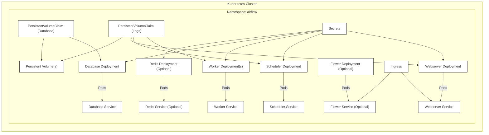
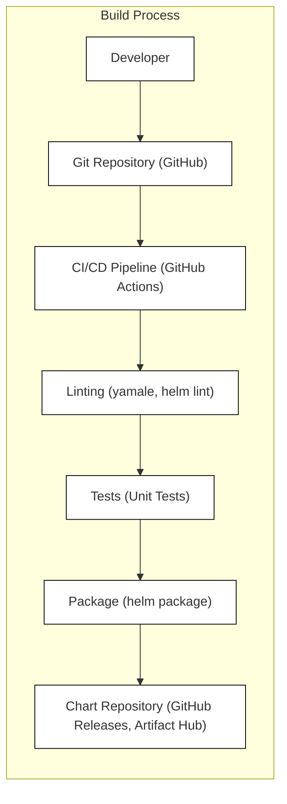

Okay, let's create a design document for the Airflow Helm Chart project.

# BUSINESS POSTURE

Business Priorities and Goals:

*   Provide a simplified and standardized way to deploy and manage Apache Airflow on Kubernetes.
*   Enable scalability and high availability for Airflow deployments.
*   Reduce the operational overhead of managing Airflow infrastructure.
*   Provide a customizable and configurable deployment solution to meet diverse user needs.
*   Foster community contributions and maintain an up-to-date, reliable Helm chart.
*   Support different Airflow versions and Kubernetes versions.

Most Important Business Risks:

*   Deployment failures or misconfigurations leading to Airflow downtime and disruption of data pipelines.
*   Security vulnerabilities in the Helm chart or its dependencies exposing sensitive data or allowing unauthorized access.
*   Lack of compatibility with specific Kubernetes distributions or versions, limiting adoption.
*   Inadequate documentation or support, hindering user adoption and troubleshooting.
*   Failure to keep up with updates in Airflow or Kubernetes, leading to outdated and potentially vulnerable deployments.
*   Inability to scale Airflow resources to meet growing data processing demands.

# SECURITY POSTURE

Existing Security Controls:

*   security control: Use of Helm, a package manager for Kubernetes, which allows for versioned releases and controlled deployments. (Described in Helm documentation and chart's `Chart.yaml`)
*   security control: Templating of Kubernetes resources, enabling parameterization and customization of security settings (e.g., resource limits, network policies). (Described in chart's `templates` directory)
*   security control: Support for configuring resource requests and limits for Airflow components, preventing resource exhaustion attacks. (Described in chart's `values.yaml`)
*   security control: Ability to configure network policies to restrict traffic flow between Airflow components and external services. (Described in chart's `values.yaml`)
*   security control: Option to enable TLS encryption for communication between Airflow components and the web interface. (Described in chart's `values.yaml`)
*   security control: Support for using existing secrets or creating new secrets for sensitive information (e.g., database passwords, API keys). (Described in chart's `values.yaml`)
*   security control: Ability to define Pod Security Context and Security Context Constraints (SCCs) for enhanced pod security. (Described in chart's `values.yaml`)
*   security control: Regular updates and releases to address security vulnerabilities in dependencies. (Tracked in GitHub repository and release notes)
*   security control: Community contributions and reviews, providing additional scrutiny and security improvements. (Visible in GitHub pull requests and issues)

Accepted Risks:

*   accepted risk: Reliance on third-party container images (e.g., `apache/airflow`, database images). Vulnerabilities in these images could impact the security of the deployment.
*   accepted risk: Default configurations may not be suitable for all environments and require customization for optimal security.
*   accepted risk: The complexity of Airflow and Kubernetes introduces a potential for misconfiguration, leading to security weaknesses.
*   accepted risk: Users are responsible for managing their own secrets and ensuring their confidentiality.

Recommended Security Controls:

*   security control: Implement a robust vulnerability scanning process for container images used in the chart.
*   security control: Integrate security linters and static analysis tools into the chart's CI/CD pipeline.
*   security control: Provide detailed security documentation and best practices for deploying the chart securely.
*   security control: Implement Role-Based Access Control (RBAC) within the Airflow deployment to limit user permissions.
*   security control: Enable audit logging for Kubernetes and Airflow to track security-relevant events.
*   security control: Regularly review and update network policies to ensure least privilege access.
*   security control: Provide examples and guidance for integrating with external authentication providers (e.g., LDAP, OAuth).

Security Requirements:

*   Authentication:
    *   The chart should support secure authentication mechanisms for accessing the Airflow web interface and API.
    *   Integration with external identity providers (e.g., LDAP, OAuth) should be possible.
    *   Support for strong password policies and multi-factor authentication is desirable.
*   Authorization:
    *   The chart should support role-based access control (RBAC) to restrict user permissions within Airflow.
    *   Fine-grained access control to specific DAGs and resources should be possible.
*   Input Validation:
    *   The chart itself does not handle user input directly, as it's a deployment tool. However, Airflow itself, once deployed, should implement proper input validation for DAG definitions and user-provided parameters to prevent code injection vulnerabilities.
*   Cryptography:
    *   The chart should support TLS encryption for all communication channels (web interface, API, inter-component communication).
    *   Sensitive data (e.g., passwords, API keys) should be stored securely using Kubernetes secrets.
    *   Support for encrypting data at rest (e.g., database encryption) should be configurable.

# DESIGN

## C4 CONTEXT

```mermaid
graph LR
    subgraph "Airflow Ecosystem"
      direction LR
      airflow["Apache Airflow (Helm Chart)"]
    end

    users["Users/Administrators"] --> airflow
    dags["DAGs & Plugins"] --> airflow
    external_systems["External Systems (Data Sources/Sinks)"] <..> airflow
    monitoring_tools["Monitoring Tools"] --> airflow
    k8s["Kubernetes Cluster"] <..> airflow

    classDef default fill:#fff,stroke:#000,stroke-width:1px;
    class airflow default
    class users,dags,external_systems,monitoring_tools,k8s default
```

Element Descriptions:

*   Element:
    *   Name: Users/Administrators
    *   Type: Person
    *   Description: Individuals who interact with Airflow to create, manage, and monitor data pipelines.
    *   Responsibilities: Define DAGs, configure Airflow settings, monitor pipeline execution, troubleshoot issues.
    *   Security controls: Authentication, Authorization (RBAC).
*   Element:
    *   Name: DAGs & Plugins
    *   Type: Software System
    *   Description: User-defined data pipelines and custom plugins that extend Airflow's functionality.
    *   Responsibilities: Define the workflow of data processing tasks, interact with external systems.
    *   Security controls: Code review, static analysis, input validation (within DAG code).
*   Element:
    *   Name: External Systems (Data Sources/Sinks)
    *   Type: Software System
    *   Description: External systems that Airflow interacts with, such as databases, cloud storage, message queues, etc.
    *   Responsibilities: Provide data to Airflow or receive data from Airflow.
    *   Security controls: Authentication, authorization, encryption in transit, encryption at rest (managed by the external system).
*   Element:
    *   Name: Monitoring Tools
    *   Type: Software System
    *   Description: Tools used to monitor the health and performance of Airflow and its components.
    *   Responsibilities: Collect metrics, logs, and alerts.
    *   Security controls: Authentication, authorization (managed by the monitoring tool).
*   Element:
    *   Name: Kubernetes Cluster
    *   Type: Infrastructure
    *   Description: The Kubernetes cluster where Airflow is deployed.
    *   Responsibilities: Provide the compute, storage, and networking resources for Airflow.
    *   Security controls: Kubernetes security best practices (RBAC, network policies, pod security policies, etc.).
*   Element:
    *   Name: Apache Airflow (Helm Chart)
    *   Type: Software System
    *   Description: The Helm chart that deploys and manages Airflow on Kubernetes.
    *   Responsibilities: Deploy Airflow components, configure settings, manage upgrades.
    *   Security controls: Helm security features, templating, resource limits, network policies, TLS encryption, secret management.

## C4 CONTAINER

```mermaid
graph LR
    subgraph "Apache Airflow (Helm Chart)"
      direction TB
      webserver["Webserver"]
      scheduler["Scheduler"]
      worker["Worker(s)"]
      database["Database"]
      redis["Redis (Optional)"]
      flower["Flower (Optional)"]

      webserver <..> scheduler
      scheduler <..> worker
      worker <..> database
      scheduler <..> database
      webserver <..> database
      worker --> external_systems["External Systems"]
      scheduler --> external_systems
      flower <..> worker
      redis <..> scheduler
      redis <..> worker

      dags["DAGs & Plugins"] --> worker
      dags --> scheduler
      users["Users/Administrators"] --> webserver
      users --> flower
      monitoring_tools["Monitoring Tools"] --> webserver
      monitoring_tools --> scheduler
      monitoring_tools --> worker
      monitoring_tools --> database
      monitoring_tools --> redis
      monitoring_tools --> flower
    end

    classDef default fill:#fff,stroke:#000,stroke-width:1px;
    class webserver,scheduler,worker,database,redis,flower,dags,users,external_systems,monitoring_tools default
```

Element Descriptions:

*   Element:
    *   Name: Webserver
    *   Type: Web Application
    *   Description: Provides the user interface for interacting with Airflow.
    *   Responsibilities: Serve the web UI, handle user authentication, display DAG status, allow triggering of DAG runs.
    *   Security controls: Authentication, authorization, TLS encryption, session management.
*   Element:
    *   Name: Scheduler
    *   Type: Application
    *   Description: Schedules and triggers DAG runs based on defined schedules and dependencies.
    *   Responsibilities: Monitor DAG status, schedule tasks, trigger worker processes.
    *   Security controls: Authentication (internal), authorization (internal), secure communication with workers and database.
*   Element:
    *   Name: Worker(s)
    *   Type: Application
    *   Description: Execute the tasks defined in DAGs.
    *   Responsibilities: Run tasks, interact with external systems, report task status.
    *   Security controls: Authentication (internal), authorization (internal), secure communication with scheduler and database, input validation (within DAG code).
*   Element:
    *   Name: Database
    *   Type: Database
    *   Description: Stores metadata about DAGs, tasks, and execution history.
    *   Responsibilities: Persist Airflow metadata.
    *   Security controls: Authentication, authorization, encryption at rest, encryption in transit, database security best practices.
*   Element:
    *   Name: Redis (Optional)
    *   Type: Cache/Message Queue
    *   Description: Used as a message broker for CeleryExecutor and/or as a result backend.
    *   Responsibilities: Facilitate communication between scheduler and workers, store task results.
    *   Security controls: Authentication, TLS encryption, access control.
*   Element:
    *   Name: Flower (Optional)
    *   Type: Web Application
    *   Description: Provides a web-based monitoring tool for Celery workers.
    *   Responsibilities: Display worker status, task details, and logs.
    *   Security controls: Authentication, authorization, TLS encryption.
*   Element:
    *   Name: DAGs & Plugins
    *   Type: Software System
    *   Description: User-defined data pipelines and custom plugins that extend Airflow's functionality.
    *   Responsibilities: Define the workflow of data processing tasks, interact with external systems.
    *   Security controls: Code review, static analysis, input validation (within DAG code).
*   Element:
    *   Name: Users/Administrators
    *   Type: Person
    *   Description: Individuals who interact with Airflow to create, manage, and monitor data pipelines.
    *   Responsibilities: Define DAGs, configure Airflow settings, monitor pipeline execution, troubleshoot issues.
    *   Security controls: Authentication, Authorization (RBAC).
*   Element:
    *   Name: External Systems
    *   Type: Software System
    *   Description: External systems that Airflow interacts with, such as databases, cloud storage, message queues, etc.
    *   Responsibilities: Provide data to Airflow or receive data from Airflow.
    *   Security controls: Authentication, authorization, encryption in transit, encryption at rest (managed by the external system).
*   Element:
    *   Name: Monitoring Tools
    *   Type: Software System
    *   Description: Tools used to monitor the health and performance of Airflow and its components.
    *   Responsibilities: Collect metrics, logs, and alerts.
    *   Security controls: Authentication, authorization (managed by the monitoring tool).

## DEPLOYMENT

Possible Deployment Solutions:

1.  Standard Kubernetes Deployment: Deploying Airflow components as standard Kubernetes Deployments and Services.
2.  StatefulSet Deployment: Using StatefulSets for components that require persistent storage (e.g., database).
3.  Helm Operator: Using the Helm Operator to manage the Airflow deployment as a custom resource.

Chosen Solution (Standard Kubernetes Deployment):



Element Descriptions:

*   Element:
    *   Name: Webserver Deployment
    *   Type: Kubernetes Deployment
    *   Description: Manages the Airflow webserver pods.
    *   Responsibilities: Ensure the desired number of webserver pods are running, handle updates and rollbacks.
    *   Security controls: Resource limits, pod security context.
*   Element:
    *   Name: Webserver Service
    *   Type: Kubernetes Service
    *   Description: Provides a stable endpoint for accessing the webserver.
    *   Responsibilities: Load balance traffic to webserver pods.
    *   Security controls: Network policies.
*   Element:
    *   Name: Scheduler Deployment
    *   Type: Kubernetes Deployment
    *   Description: Manages the Airflow scheduler pods.
    *   Responsibilities: Ensure the desired number of scheduler pods are running, handle updates and rollbacks.
    *   Security controls: Resource limits, pod security context.
*   Element:
    *   Name: Scheduler Service
    *   Type: Kubernetes Service
    *   Description: Provides a stable endpoint for accessing the scheduler.
    *   Responsibilities: Load balance traffic to scheduler pods (if multiple schedulers are deployed).
    *   Security controls: Network policies.
*   Element:
    *   Name: Worker Deployment(s)
    *   Type: Kubernetes Deployment
    *   Description: Manages the Airflow worker pods.
    *   Responsibilities: Ensure the desired number of worker pods are running, handle updates and rollbacks.
    *   Security controls: Resource limits, pod security context.
*   Element:
    *   Name: Worker Service
    *   Type: Kubernetes Service
    *   Description: Provides a stable endpoint for accessing the workers.
    *   Responsibilities: Load balance traffic to worker pods.
    *   Security controls: Network policies.
*   Element:
    *   Name: Database Deployment
    *   Type: Kubernetes Deployment (or StatefulSet)
    *   Description: Manages the database pods.
    *   Responsibilities: Ensure the desired number of database pods are running, handle updates and rollbacks.
    *   Security controls: Resource limits, pod security context, persistent volume claims.
*   Element:
    *   Name: Database Service
    *   Type: Kubernetes Service
    *   Description: Provides a stable endpoint for accessing the database.
    *   Responsibilities: Load balance traffic to database pods (if multiple database instances are deployed).
    *   Security controls: Network policies.
*   Element:
    *   Name: Redis Deployment (Optional)
    *   Type: Kubernetes Deployment (or StatefulSet)
    *   Description: Manages the Redis pods.
    *   Responsibilities: Ensure the desired number of Redis pods are running, handle updates and rollbacks.
    *   Security controls: Resource limits, pod security context, persistent volume claims (if persistence is enabled).
*   Element:
    *   Name: Redis Service (Optional)
    *   Type: Kubernetes Service
    *   Description: Provides a stable endpoint for accessing Redis.
    *   Responsibilities: Load balance traffic to Redis pods.
    *   Security controls: Network policies.
*   Element:
    *   Name: Flower Deployment (Optional)
    *   Type: Kubernetes Deployment
    *   Description: Manages the Flower pods.
    *   Responsibilities: Ensure the desired number of Flower pods are running, handle updates and rollbacks.
    *   Security controls: Resource limits, pod security context.
*   Element:
    *   Name: Flower Service (Optional)
    *   Type: Kubernetes Service
    *   Description: Provides a stable endpoint for accessing Flower.
    *   Responsibilities: Load balance traffic to Flower pods.
    *   Security controls: Network policies.
*   Element:
    *   Name: Ingress
    *   Type: Kubernetes Ingress
    *   Description: Exposes the webserver and Flower services to external traffic.
    *   Responsibilities: Route external traffic to the appropriate services based on hostnames or paths.
    *   Security controls: TLS termination, ingress controller security settings.
*   Element:
    *   Name: Persistent Volume(s)
    *   Type: Kubernetes Persistent Volume
    *   Description: Provides persistent storage for the database and logs.
    *   Responsibilities: Store data that needs to be persisted across pod restarts.
    *   Security controls: Storage class security settings, access modes.
*   Element:
    *   Name: PersistentVolumeClaim (Database)
    *   Type: Kubernetes PersistentVolumeClaim
    *   Description: Requests persistent storage for the database.
    *   Responsibilities: Bind to a PersistentVolume.
    *   Security controls: Access modes, storage class.
*   Element:
    *   Name: PersistentVolumeClaim (Logs)
    *   Type: Kubernetes PersistentVolumeClaim
    *   Description: Requests persistent storage for Airflow logs.
    *   Responsibilities: Bind to a PersistentVolume.
    *   Security controls: Access modes, storage class.
*   Element:
    *   Name: Secrets
    *   Type: Kubernetes Secret
    *   Description: Stores sensitive information (e.g., passwords, API keys).
    *   Responsibilities: Provide secrets to pods.
    *   Security controls: Kubernetes secret management best practices.

## BUILD



Build Process Description:

1.  Developers commit changes to the Helm chart source code in the GitHub repository.
2.  GitHub Actions (CI/CD pipeline) is triggered on push or pull request events.
3.  Linting: The pipeline runs linters (e.g., `yamale` for YAML validation, `helm lint` for Helm chart validation) to check for syntax errors and best practices.
4.  Tests: Unit tests are executed to verify the functionality of the chart templates and helper functions.
5.  Package: If linting and tests pass, the Helm chart is packaged using `helm package`.
6.  Chart Repository: The packaged chart is published to a chart repository (e.g., GitHub Releases, Artifact Hub).

Security Controls:

*   security control: Linting (yamale, helm lint) to enforce coding standards and prevent common errors.
*   security control: Unit tests to verify the functionality of the chart and prevent regressions.
*   security control: CI/CD pipeline (GitHub Actions) to automate the build and release process, ensuring consistency and reducing manual errors.
*   security control: Versioned releases of the Helm chart, allowing users to track changes and roll back to previous versions if necessary.
*   security control: Use of a well-defined release process (e.g., semantic versioning) to manage changes and communicate updates to users.

# RISK ASSESSMENT

Critical Business Processes:

*   Data pipeline execution and management.
*   Data ingestion, transformation, and loading.
*   Workflow orchestration and scheduling.
*   Monitoring and alerting of data pipeline status.

Data Sensitivity:

*   Metadata about DAGs, tasks, and execution history (stored in the database): Potentially sensitive, depending on the nature of the data pipelines. Could include information about data sources, destinations, and transformations.
*   DAG code and plugins: May contain sensitive information such as API keys, credentials, or business logic.
*   Logs: May contain sensitive data depending on what is being logged by the DAGs.
*   Configuration files: May contain sensitive information such as database connection strings, passwords, and API keys.

# QUESTIONS & ASSUMPTIONS

Questions:

*   What specific Kubernetes distributions and versions are targeted for support?
*   What are the expected resource requirements (CPU, memory, storage) for typical Airflow deployments?
*   Are there any specific security certifications or compliance requirements that need to be met?
*   What is the process for handling security vulnerabilities discovered in the chart or its dependencies?
*   What level of support and maintenance is provided for the chart?
*   What external authentication providers should be supported out of the box?
*   What are the requirements for audit logging?

Assumptions:

*   BUSINESS POSTURE: The primary goal is to provide a reliable and easy-to-use Helm chart for deploying Airflow on Kubernetes. Cost optimization is a secondary concern.
*   SECURITY POSTURE: Users are responsible for securing their Kubernetes cluster and external systems. The chart provides reasonable default security settings, but users may need to customize them based on their specific requirements.
*   DESIGN: The standard Kubernetes deployment model is sufficient for most use cases. The chart will support optional features like Redis and Flower. Users will manage their own DAGs and plugins.